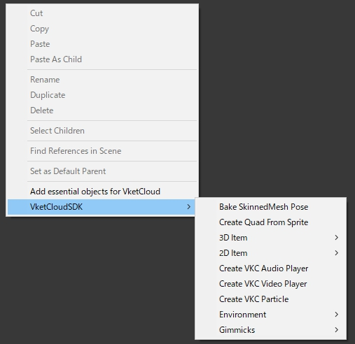

# Quick Menu for adding Vket Cloud objects

On installing VketCloudSDK, a quick menu for adding Vket Cloud world objects to the scene will be added on the Hierarchy's context (i.e. right-click) menu.

## Categories of objects and functions

| Category | Minor Category | Function |
|----|----|----|
| 3D Item | Create VKC Sphere | Creates a new GameObject in the scene, with [VKC Item Object](../VKCComponents/VKCItemObject.md) component attached which has a Sphere VKCItem setup. |
| | Create VKC Cube | Creates a new GameObject in the scene, with [VKC Item Object](../VKCComponents/VKCItemObject.md) component attached which has a Cube VKCItem setup. |
|| Create VKC Avatar |  Creates a new GameObject in the scene, with [VKC Item Object](../VKCComponents/VKCItemObject.md) component attached which has a Vket_Chan vrm setup. |
|| Create VKC Platform | Creates a Platform which allows the player to stand on (Similar to a Unity Plane with Box Collider attached) |
| 2D Item | Create VKC Plane | Creates a new GameObject in the scene, with [VKC Item Plane](../VKCComponents/VKCItemPlane.md) attached. |
|| Create VKC TextPlane | Creates a new GameObject in the scene, with [VKC Item Text Plane](../VKCComponents/VKCItemTextPlane.md) attached. |
| Create VKC Audio Player  ||Creates a new GameObject in the scene, with [VKC Item Audio](../VKCComponents/VKCItemAudio.md) attached. |
| Create VKC Video Player || Creates a new GameObject in the scene, with [VKC Node Video Trigger](../VKCComponents/VKCNodeVideoTrigger.md) attached. |
|  Create VKC Particle | | Creates a new GameObject in the scene, with [VKC Item Particle](../VKCComponents/VKCItemParticle.md) attached. |
| Environment | Create Sky box | Creates a skybox prefab in the scene, which is alike the prefab in the Tutorials > Tutorial -basic- scene.  |
|| Create Background texture | Creates a new GameObject in the scene, with [VKC Item Background Texture](../VKCComponents/VKCItemBackgroundTexture.md) attached. |
|| Create VKC Camera | Creates a new GameObject in the scene, with [VKC Item Camera](../VKCComponents/VKCItemCamera.md) attached. |
| Gimmics | Create VKC Action Trigger | Creates a new GameObject in the scene, with [VKC Attribute Action Trigger](../VKCComponents/VKCAttributeActionTrigger.md) attached. |
|| Create VKC AreaCollider | Creates a new GameObject in the scene, with [VKC Item Area Collider](../VKCComponents/VKCItemAreaCollider.md) attached. |
|| Create VKC Spot | Creates a new GameObject in the scene, with [VKC Item Spot](../VKCComponents/VKCItemSpot.md) attached. |
