# Overview

This article summarizes ways to improve usability when creating content in **Vket Cloud**, focusing on making it **enjoyable in any environment** and **easy to operate**.  
By keeping in mind the points mentioned on this page, your world may become even more enjoyable.

# Fundamental Principle

**Test on actual devices.**  
It's also beneficial to check the horizontal screen view when using a smartphone in landscape mode.

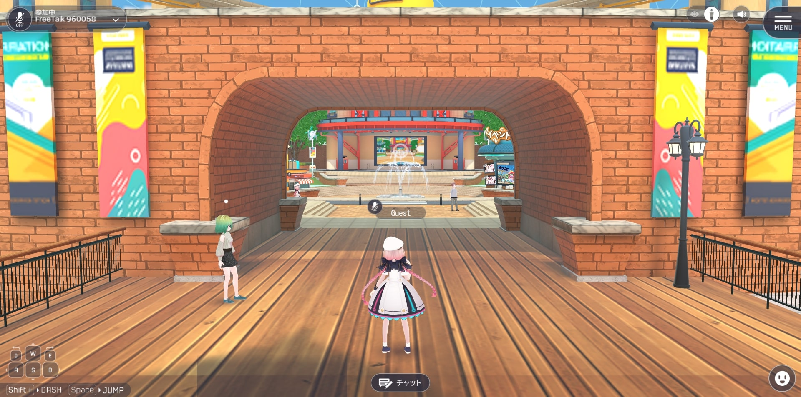

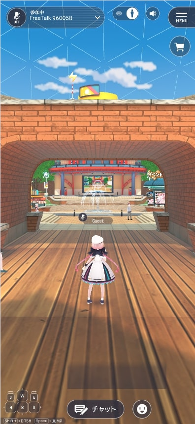

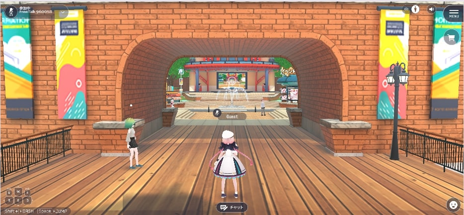

### Key Points

- In **landscape mode**, the area above the gate is not visible.
- In **portrait mode**, the NPC on the left side of the screen is not visible.
- The **fountain and monitor in the background center naturally draw attention**.

These insights can be derived from the three images above.  
Consider **where to place important information**.

## Definition

In this article, usability is defined as:

- **How easy it is for players to control their character in the world.**
- **How easily players can understand how to enjoy the world.**
- **How easily players can access information within the world.**

## Key Considerations

### ① Ensure Visibility in Both Portrait and Landscape Modes

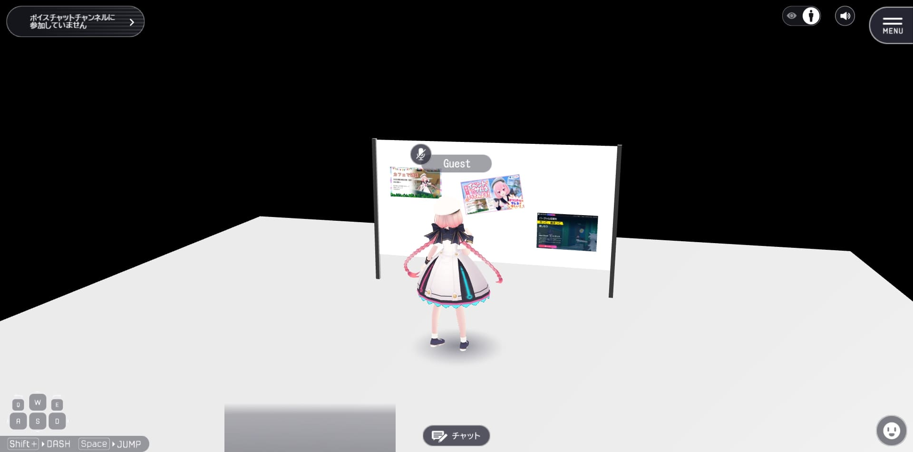

The above is a **poor example**.

- In the left image, when approaching the signboard, it occupies only about **10%** of the screen, while the player's character takes up more space.
- In the right image, both the signboard and model are visible, but their small size makes them less noticeable.

These examples share a common issue: **they are directly ported from VRChat**.

Since VRChat operates in **first-person view**, there’s no self-character on the screen, and the camera is positioned at **eye level**, making realistic object sizes and placements ideal.  
However, Vket Cloud primarily uses **third-person view**, where the camera is typically positioned **above and behind the character**, requiring **adjustments in size and placement** of information.

Additionally, as Vket Cloud supports both portrait and landscape modes, **the layout must be enjoyable in both screen orientations**.

#### **Good Example**

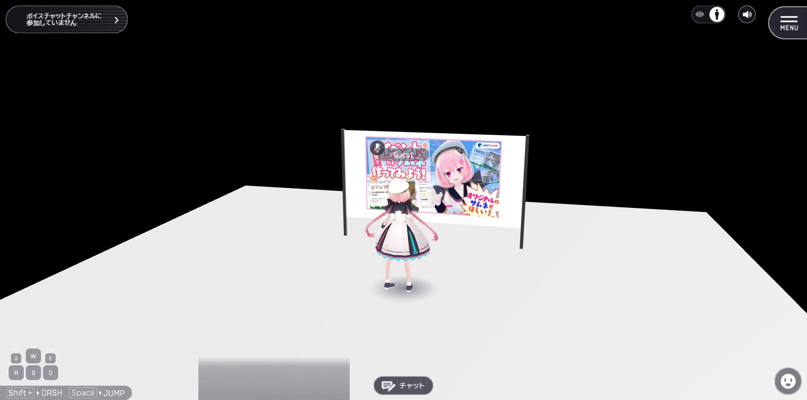

By increasing the size **about three times larger than real-world proportions**, the information becomes easier to see in **Vket Cloud**.  
Using **auto-switching images** allows for displaying additional images that couldn’t be included due to the larger size.

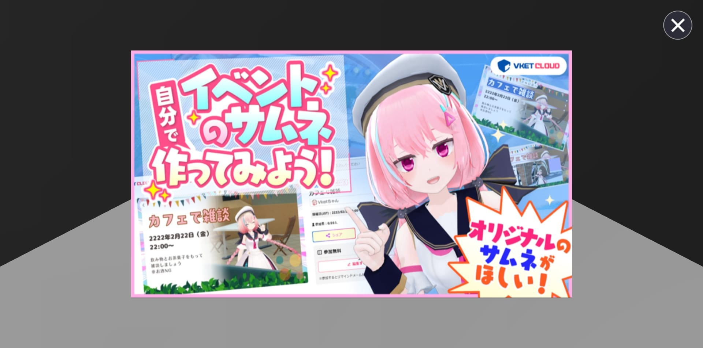

Using a **Comic Viewer Activity** to display images in full-screen mode when clicked is also an effective approach.

#### **How to Display 16:9 Images in Comic Viewer Activity**

Use an **image editing tool** and follow these steps:

1. **Split the image** into **left** and **right halves**.
2. Resize each half to **455×512 pixels**.
3. Place the resized images at the center of a **455×642 transparent image**.
4. Export the final image as **Compressed Texture**, resizing it to **512×512**.

The final image will look like this (left half only):

#### **Summary**

- **Vket Cloud is played in third-person view.**
- **Ensure essential information is visible in both portrait and landscape modes.**
- **Information doesn’t have to be life-sized—scaling it up improves readability.**  
  *(Scaling up on proximity is also a good idea!)*

#### **Caution**

Simply **increasing the size of everything isn’t always the best solution**.  
Keep the **amount of information on a single screen simple**.

Also, placing objects **too high** in the space can make them hard to notice, no matter how big they are.

### ② Ensure Access to Gameplay Features in One Click

Games with **one-click** interactions, such as pressing a **permanently visible button**, offer **higher satisfaction for first-time players**.

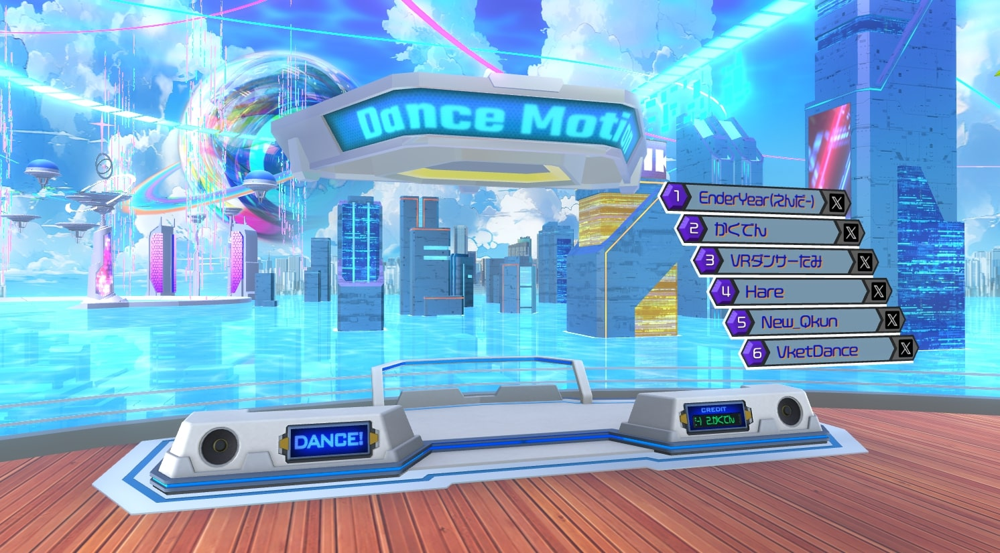

For example, in standard emote usage:
- Players must **click the face icon**, **open the emote list**, then **select an emote**.
- They may also need to **replace emotes manually**.

This can be a **high barrier for first-time users**.  
However, in the **Vket 2024 Summer: Entrance** dance gimmick, clicking **once** switches the camera and makes the avatar dance.  
This **simplifies access to the activity** and reduces the "I don’t know what to do" problem.

### ③ Add More "Moving Elements" to the Screen

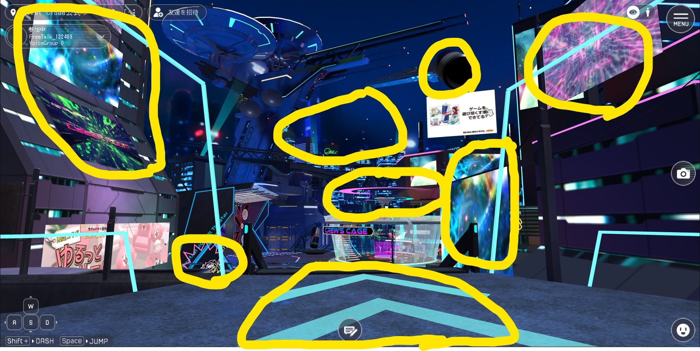

The areas marked with yellow circles contain **animated elements**, such as **UV scrolling textures, videos, and HeliScript-controlled objects**.

By including **animated objects**, the environment feels **more lively and engaging**.

### ④ Provide Immediate Gameplay Elements

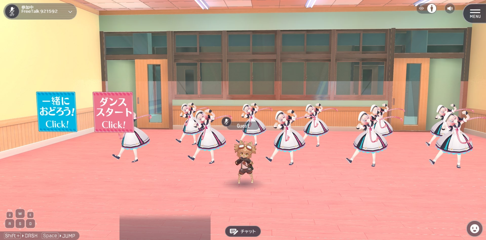

In the **“Vket Rack” Dance World**, interactive elements are **available immediately after entering**.

A short transition from **entry to gameplay** helps players quickly understand **what they can do**, improving usability.

#### **Poor Examples**

- **The main experience is located far beyond a long hallway.**
- **The spawn area is dull and uninteresting.**

While **long corridors and gradual reveals** can be effective in **VRChat**, they often lead to **a poor experience in Vket Cloud**.

#### **How to Fix These Issues**

- **Add interactive elements** within long hallways.
- **Provide subtle guidance** during long corridors to prevent boredom.
- **Ensure the main area is visible** from the spawn point.

#### **Make Key Features Visually Obvious from a Distance**

Even if an activity is not immediately accessible, designing it in a way that **players can recognize from afar what they can do** improves usability.

### ⑤ Provide Interactive Feedback

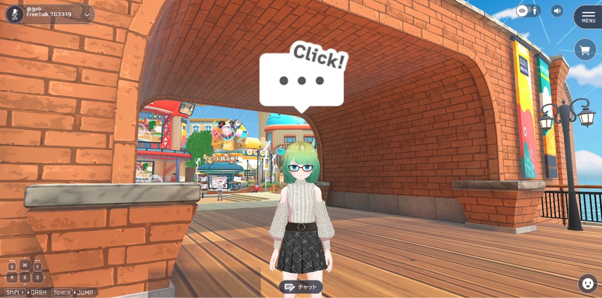

Effects such as **animations when approached, sound effects when clicked, and particle effects on movement** improve user experience.

These elements can help **guide players through the world**.

### ⑥ Optimize Camera Handling

In **third-person view**, the camera behaves as follows:

- **Affected by Box Colliders**.
- **Not affected by Mesh Colliders or other colliders**.
- **Not affected by Box Colliders with HEOCollider set to "Avatar Only"** *(Prevents camera clipping).*

#### **① Enable Camera Clipping for Large Objects Meant to Be Seen from Behind**

For large objects **placed within the playable area**, enable **camera clipping settings** to prevent **obstructing the view**.

This can be done by setting the **VKC Node Collider’s target to "Avatar Only."**

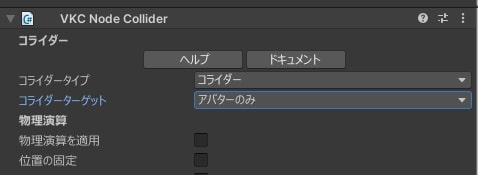
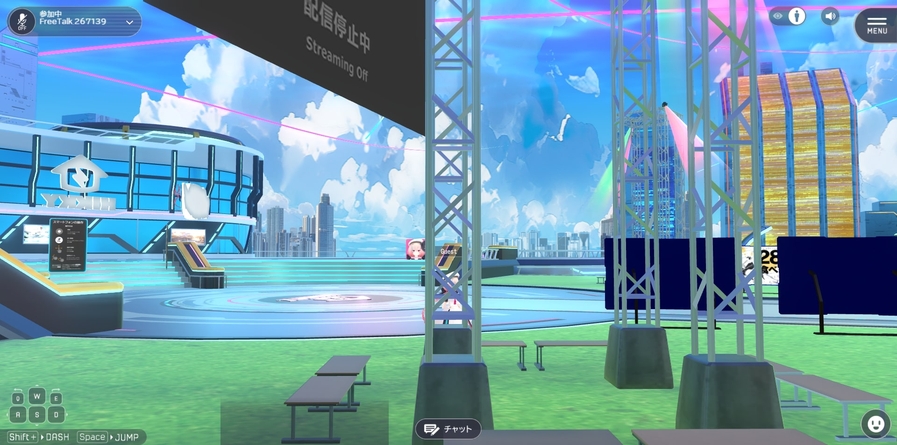

#### **② Avoid Using Mesh Colliders for Walls and Floors**

While **Mesh Colliders** make creating complex shapes easier, they can **negatively impact usability**.

- **Use Box Colliders** for walls and floors instead.

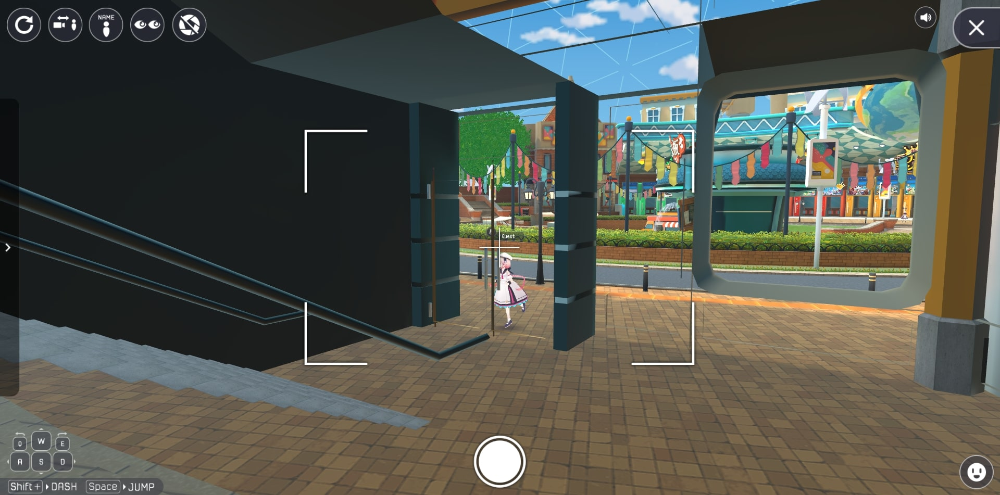

#### **③ Minimize Box Colliders for Transparent Walls**

Overuse of **non-transparent Box Colliders** in invisible barriers can cause **camera zoom-in issues**.

If **camera behavior feels unnatural**, try **enabling camera clipping**.

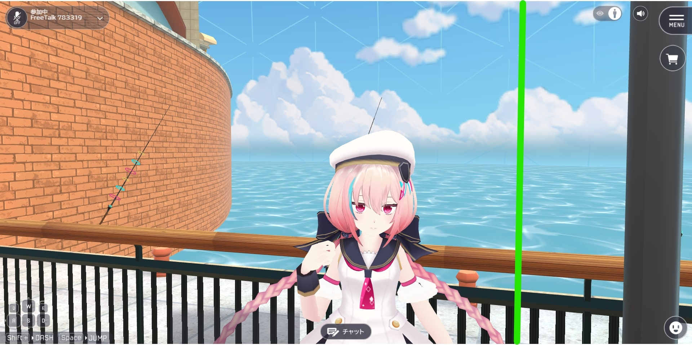

## Specific Usability Improvement Gimmicks

### **① Enlarging Information When Approached**

Making information **grow larger when approached or clicked** improves readability.

However, players **must be guided** to understand that information enlarges.

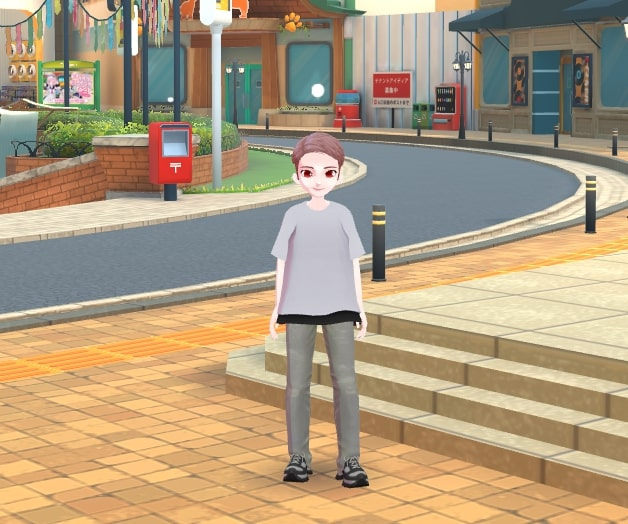
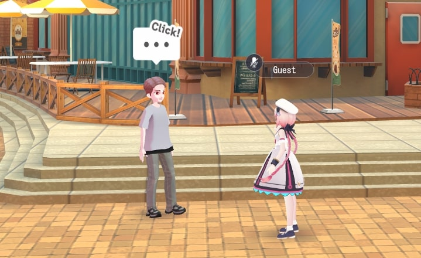
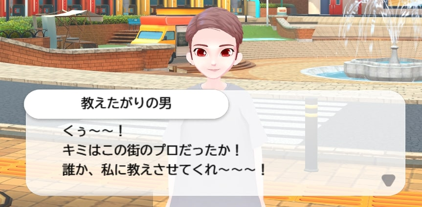

### **② Using Event Cameras for Fixed Angles**

Event cameras **fix the viewpoint**, ensuring a consistent **presentation of information**.

They also enable **dynamic angles**, making game worlds more immersive.

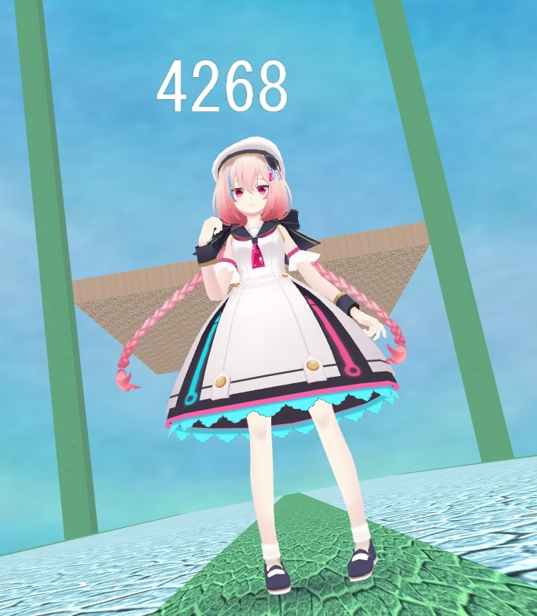

---

Usability isn’t just about object placement. **Gimmicks can enhance accessibility**, so feel free to discuss ideas in the **[Questions, Requests, and Bug Reports Forum](https://discord.com/channels/900943744575103017/1178582424003809280).**