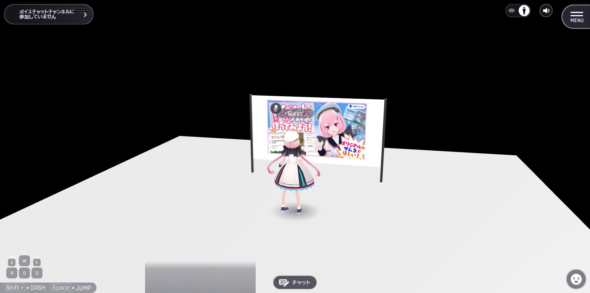
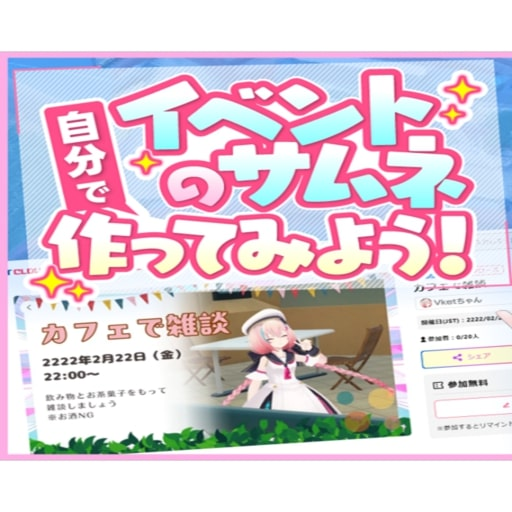
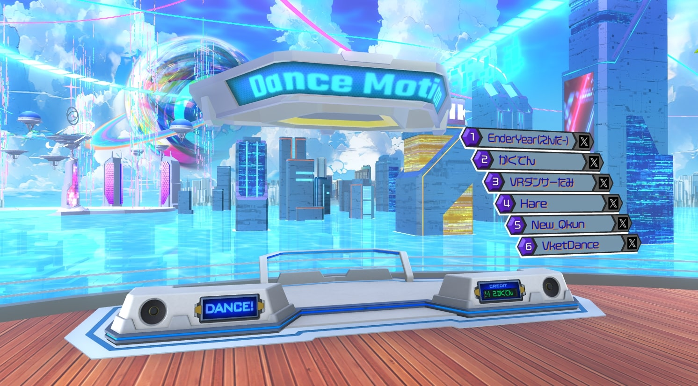
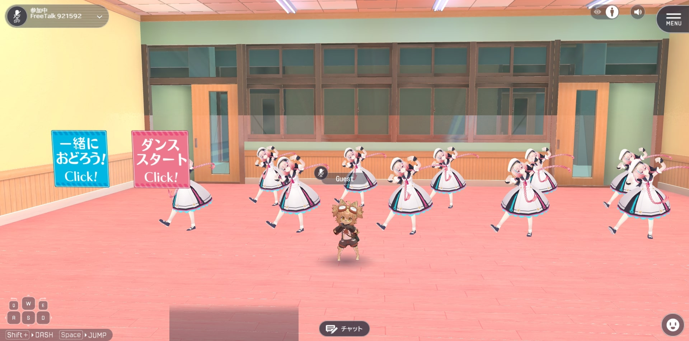
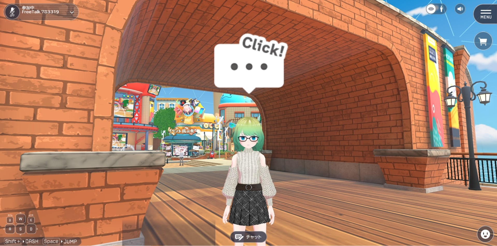
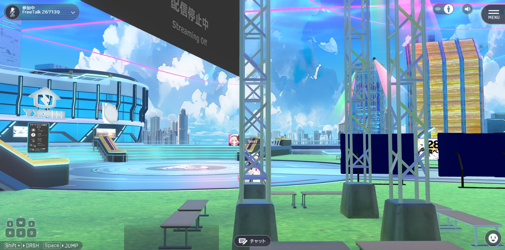
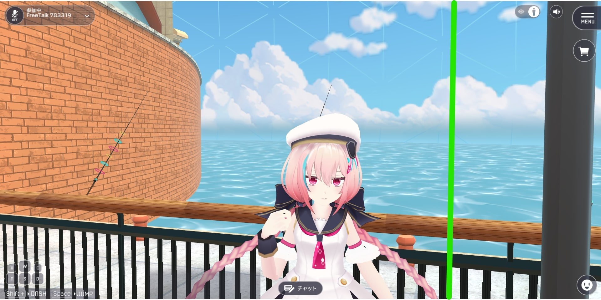
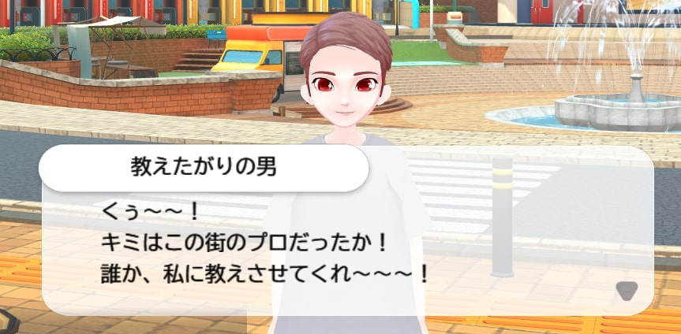

# 概要

Vket Cloudでのコンテンツ制作を行うにあたり、「どんな環境でも楽しめる」、「操作が楽」といった、ユーザビリティの向上方法についてまとめた記事です。
このページに書かれていることを意識することで、ワールドがより楽しみやすいものとなるかもしれません。

# 大前提

実機で触りましょう。スマホを横にしたときの横画面も見ておくとなお良いです。

### ポイント

横画面だとゲートより上が画面に入らない
縦画面だと画面左のNPCが画面に入らない
画面中央奥の噴水・モニターあたりに視線が誘導される

といったことがこの3枚の画像から読み取れるかと思います。
重要な情報をどこに配置するか、考えてみましょう。

## 定義

本ページでは、ユーザビリティを

- ワールド内でプレイヤーが操作しやすいかどうか

- ワールドの楽しみ方をプレイヤーが理解しやすいかどうか

- ワールド内の情報をプレイヤーが手に入れやすいかどうか

の度合いと定義します。

## 考慮すべきポイント

### ①縦画面・横画面共に情報を見やすくする

上記はあまり良くない例です。
左画像では、看板に近づいた際、画面の10%ほどしか占有しておらず、手前の自プレイヤーの方が情報占有率が高い状態となっています。
右画像では、看板とモデルが表示されていますが、一つ一つの大きさが小さいため、あまり目立ってはいません。

上記の共通点はVRChatからの移植である、という点です。

VRChatは一人称視点での操作が基本となるため、画面内に自分自身が映りこむことも無く、カメラも自分の目の位置にあるため、現実的な大きさ・配置のオブジェクトで適切な情報配置となります。

しかし、Vket Cloudは三人称視点での操作が基本となり、カメラ位置も自分の背後上部(から見下ろす位置)にあるのが一般的であるため、情報の大きさや配置を調整する必要があります。

さらに、Vket Cloudでは環境によって縦画面・横画面を選べるため、どちらの画面比でも楽しめる配置にする必要があります。

 

#### 良い例

現実のスケール感より3倍ほどサイズを大きくすることで、Vket Cloudでも情報が見やすくなります。
一定時間で画像が切り替わるようにすることで、画像を大きくすることにより配置できなくなった他の画像についても情報を表示することが出来ます。

コミックビューアアクティビティを使ってクリック時に全画面で画像が表示されるようにするのも良いでしょう。

#### 16:9の画像をコミックビューアアクティビティで表示する方法

画像編集ソフトを利用してください。

画像を左半分、右半分の2つに分けます。

2つに分けた画像それぞれを455×512の大きさにします。

455×642の透過画像の中央にリサイズした画像を配置します。

配置後の画像をExport Compressed Textureして512×512にします。

最終的に以下のような画像が出来上がります(左半分のみ)。

#### まとめ

Vket Cloudは三人称視点で遊ぶことを基本とする。
縦画面・横画面ともに必要な情報が映りこむ構成にするとよい。
原寸大にしなくても良い情報は大きくすると良い。近づいた時に大きくなる、も◎。

#### 注意

なんでもかんでも大きくしたら良い、という訳ではありません。
一画面に映り込む情報量はシンプルにしましょう。

また、空間内の高い位置に設置しまうと、どれだけ画像を大きくしても視線に入りづらく、
プレイヤーに情報が認知されにくくなってしまいます。

### ②遊びに必要な要素に1操作でアクセスできる

「常に画面上に表示されているボタンを押すだけ」など、1操作で可能な遊びは初見のプレイヤーからしても満足度が高いです。

通常のエモートの場合、顔アイコンをクリックし、エモートリストを開いたうえでボタンを押す必要があったり、「＋」を押してエモートを差し替えて使用する必要があるため、はじめてVket Cloudを触るユーザーにはハードルが高いですが、Vket 2024 Summer: Entranceに設置されていたダンスギミックでは1クリックでカメラが切り替わり、アバターが踊るといった作りになっており、遊びにアクセスするための手段が1操作で可能になっていました。
これにより、「何をしたらいいかわからない」を軽減することが可能です。

### ➂画面内に「動くもの」を多く配置する

黄丸で囲んだ部分はUVスクロールや動画、HeliScriptで動いているオブジェクトです。

動いているオブジェクトが画面を占有することにより、空間の楽しさを引き立てます。

### ④入ってすぐに遊べる要素がある 

「ブイブイ言わせるVケットラック！！」ダンスワールドでは、入ってすぐ遊べる要素がある構造となっています。

ワールド入室 → 遊びまでの導線を短くすることで、ユーザーが何をしたら何ができるのかがわかりやすいため、ユーザビリティは良くなります。

#### 悪い例

・長い廊下を抜けた先にメインとなる体験がある
・スポーン地点が地味で、興味が沸かない

VRCだとむしろ良いとされている点が、Vket Cloudでは悪い体験となってしまうことがあります。

#### 悪い例を克服するためには？

長い廊下にインタラクティブな要素がある、
長い廊下でユーザーを退屈させない程度に操作説明が入る、
スポーン地点からワールドのメインとなる部分が一望できる

といった仕掛けを入れることで、ユーザビリティを向上することが可能と考えられます。

#### 遠くからでも視覚的にわかりやすい、も◎

入ってすぐに遊べなくとも、遠くから見て「あそこでああいう事が出来るんだな」というのがわかる設計にすることで、「何をしたら何ができるか分かりやすい」に繋がります。

### ⑤随所でインタラクションが返ってくる

近づくとエフェクト付きのアニメーションが発生する、
クリックすると音が鳴る、動くとパーティクル演出が発生するなど、
インタラクション(操作に対する反応となる演出)が発生することで、
ユーザー体験を向上させることが可能です。

ワールドの導線づくりに活用しましょう。

### ⑥カメラを操作しやすくする

三人称視点の時、カメラは

・Box Colliderの影響を受ける
・Mesh Colliderなど、Box Collider以外のコライダーの影響を受けない
・HEOColliderでTargetがAvatarに設定されているBox Colliderの影響を受けない(カメラ貫通設定)

という特徴があります。
したがって、

#### ①背面に周ることが想定される、プレイヤーを物越しに見ることができるオブジェクトのBox Colliderにはカメラ貫通設定を行う

空間内の端以外に設置された大型のオブジェクトにはカメラ貫通設定を行うことを推奨します。
カメラ貫通設定は対象の当たり判定が持つVKC Node Colliderのコライダーターゲットを「アバターのみ」に設定することで可能です。

#### ②壁面や床にMesh Colliderを使用しない

複雑な形状の当たり判定を簡単に作ることが出来るMesh Colliderですが、ユーザビリティの向上に於いてこちらを過信しすぎるのは禁物です。
床や壁面は大雑把な形でもよいのでBox Colliderで作ることを推奨します。

#### ➂透明な壁にカメラ貫通設定を行っていないBox Colliderを使いすぎない

カメラが持つBox Colliderの影響を受ける性質により、透明な壁に貫通設定を行っていないBox Colliderを使用した場合、
該当のコライダーに近づくことでカメラが急接近してしまうことがあります。

操作して不便に感じたら、カメラ貫通設定を入れてみるとよいでしょう。

## 具体的なユーザビリティ向上ギミック例

### ①近づいたら情報が大きくなる

一定距離近づく・クリックすることで、情報を巨大化するといったギミックを入れることで、ユーザーが見たい情報を見やすく出来ます。

一方、「一定距離近づく・クリックすることで、情報が巨大化する」ということを伝えるための導線が必要となります。

### ②イベントカメラで画角固定

イベントカメラを使用することで、画角を固定した状態にすることが可能です。

画角を固定することで、情報量を固定した演出が簡単に作ることができます。
また、ゲームワールドでもダイナミックなアングルを作ることができ、体験を印象付けることが可能です。

ユーザビリティの向上はオブジェクトの配置だけがすべてではありません。
ギミック的アプローチで解決できるものもあるため、[質問・要望・不具合報告-forum](https://discord.com/channels/900943744575103017/1178582424003809280)にお気軽にお問い合わせください。
