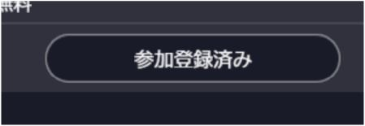
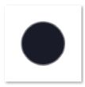
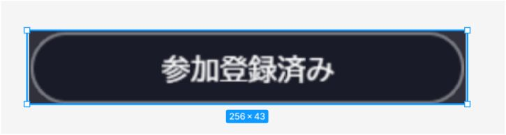
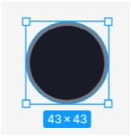
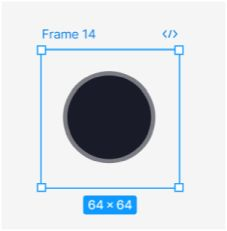
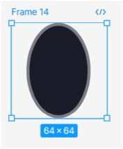

# Creating Capsule Rectangle Images Using 9-Slice

## Overview

A method to create capsule rectangles commonly seen in buttons.

We'll create them by scaling circular images using 9-Slice and Figma.



Capsule rectangle button

!!! note "Environment"
    SDK Version: 14.4.12  
    OS: Windows 11  
    Unity: 2022.3.6f1  
    Browser: Google Chrome

## Tools Used

Figma

## Prerequisites

### Textures Must Be Power-of-Two Sized

In vket cloud, textures need to be rectangles with power-of-two dimensions.

### Using 9-Slice

This reduces image file size, leading to shorter loading times.

The ability to scale makes it more adaptable to changes.

## Video

<video controls>
<source src="../../WorldMakingGuide/img/9slice.mp4" type="video/mp4">
</video>

Transcript:
```
This video will explain the procedure for creating a 256×43 capsule.

First, create a 43×43 circle aligned vertically.

Next, create a frame, and make sure the size of this frame is a power of 2 or greater. In this case, I will make it 64×64.

This way, when outputting, the size will be a power of 2.

However, if we leave it like this, the circle will appear squished, so we stretch it vertically. Set it so that the height is exactly 64.

Since it is not centered, we will move it to the center, and it will look something like this.

Change the name and export it.

[Exports to file]

In the JSON file, set the size to 256×43, which will be the final size.

For the 9-slice settings, specify 32 for both the left and right sides. This will split and draw the image at the half-point of the original material.
```

Source Material:



Completed Version:



Goal: Create a 256 × 43 capsule

## Procedure

We want to create a 256 × 43 capsule rectangle image.

## Case Without "Power-of-Two Size" Constraint

- Create a 43 × 43 circle in Figma
    


- By setting 9-Slice LTRB to [21.5, 0, 21.5, 0] and size to [256, 43], you can create the intended capsule rectangle.

## Case With "Power-of-Two Size" Constraint

### Prepare Power-of-Two Sized Image Using Frames

- In Figma, you can easily change only the size of the frame by setting it as the parent of the image.
    


- This allows you to output power-of-two sized images, but if you simply set 9-Slice LTRB to [32, 0, 32, 0] and size to [256, 43], it will appear squashed.

### Stretch the Circle Vertically in Advance

- To address this, stretch the circle in advance to match the scale.
    


- By setting 9-Slice LTRB to [32, 0, 32, 0] and size to [256, 43], you'll get an appearance with the dimensions shown in the image below.
    


Due to the margin size on the left and right, if you want the capsule rectangle's width to be exactly 256, the size should be [256+(64-43), 43].