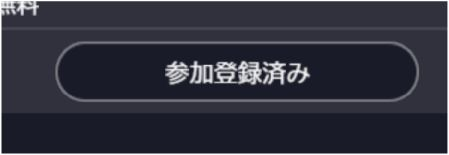
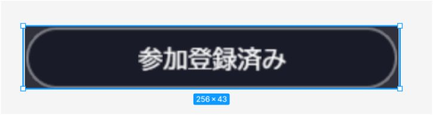
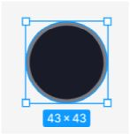
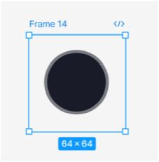
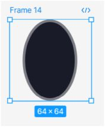

# カプセル長方形の画像を9sliceで作成する

## 概要

ボタンなどでよく見るカプセル長方形を作成する方法。

9SliceとFigmaを使い、円形の画像を拡縮させて作ります。

カプセル長方形のボタン

!!! note "検証環境"
    SDKバージョン : 14.4.12  
    OS : Windows 11  
    Unity : 2022.3.6f1  
    ブラウザ : Google Chrome

## 使用ツール

Figma

## 前提

## テクスチャは2の累乗サイズ

vket cloudでは2の累乗サイズの長方形である必要があります 

## 9Sliceをつかう

画像容量を小さくできるため、ローディング時間短縮につながります。

拡縮できるため変更に強くなります。

## 動画

<video controls>
<source src="./img/9slice.mp4" type="video/mp4">
</video>

素材

完成版

width 256, height 43のカプセルを作りたい

## 手順

256 x 43のカプセル長方形の画像を作りたいとします。

## 「2の累乗サイズ」制約を考えないケース

-   Figmaで43 x 43の円を作成する
    

-   9SliceのLTRBを\[21.5, 0, 21.5, 0\] 、sizeを\[256, 43\]と指定することで意図したカプセル長方形が作成できます。
    

## 「2の累乗サイズ」」の制約を守るケース

### フレームを利用して累乗サイズの画像を用意

-   Figmaでは画像の親にフレームを設定し、そのフレームのみのサイズを簡単に変更できます。
    

-   累乗サイズの画像を出力できるようになりますが、このまま9SliceのLTRBを\[32, 0, 32, 0\] 、sizeを\[256, 43\]と指定してもつぶれたようなみためになってしまいます。
    

### 予め縦に伸ばしておく

-   そこで、予め円を伸ばしておくと縮尺をあわせることができます。
    

-   9SliceのLTRBを\[32, 0, 32, 0\] 、sizeを\[256, 43\]と指定することで下記画像のようなサイズの見た目になります。
    

左右に余白サイズがあるため、カプセル長方形の横サイズを正確に256にしたい場合、サイズは\[256+(64-43), 43\]とする必要があります。