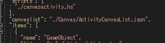
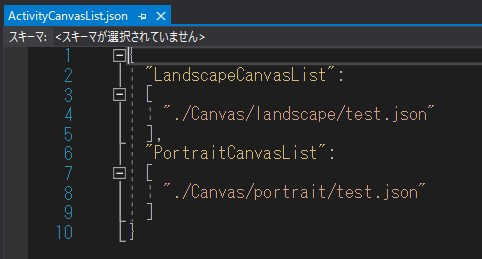
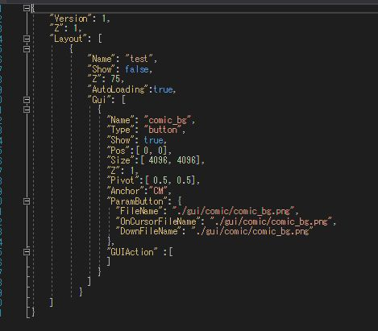
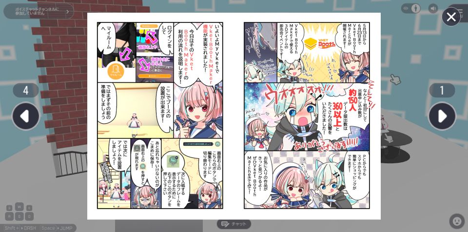

# Activity Class With CanvasUI
Since SDK12, it has become possible to set UI images inside activity classes, allowing general users to modify UI without editing the release folder after building.

This page explains how to create an activity class that shows a UI when clicked.

!!! info Verification Environment
    SDK Version: 12.1<br>
    OS: Windows 10<br>
    Unity: 2019.4.31.f1<br>
    Browser: Google Chrome

## Steps

### 1. Create a Folder for Canvas

Add a directory structure for Canvas-related files inside the activity class, similar to the usual release folder.  
The directory structure for the activity class with the added Canvas folder is shown below.  
*The added parts are highlighted in bold.*  

!!! info Folder Structure
    ActivityClassFile  
    ┣**📂Canvas**  
    ┃┣**📂HeliScript**  
    ┃┃┗**📄Canvas HeliScript**  
    ┃┣**📂landscape**  
    ┃┃┗**📄Landscape Canvas JSON**  
    ┃┣**📂portrait**  
    ┃┃┗**📄Portrait Canvas JSON**  
    ┃┗**📄Activity Canvas List JSON**  
    ┣**📂gui**  
    ┃┗**📄UI Image Files**  
    ┣📂HEO  
    ┃┗📄Objects  
    ┣📄Activity JSON  
    ┗📄Activity HeliScript  

    *📂...Folder, 📄...File.

---

## 2. Add CanvasList json Information to Activity json

Add the CanvasList information used by the activity to the activity JSON.

!!! info "Vket Cloud UI System"
    1. Load the necessary Canvas JSON information from CanvasList.  
    2. Load each Canvas JSON and the necessary HeliScripts and UI images.

    Therefore, you must first load the CanvasList.

    To write this, specify the path to the CanvasList JSON in the "canvaslist" item.



The name doesn't have to be CanvasList.json.  
It should be written with a relative path from the Activity json.

---

## 3. Edit the Activity CanvasList json



Create the CanvasList JSON for the activity.  
You should write it as shown in the code within the image above.

```
{
  "LandscapeCanvasList":
  [
    "./Canvas/landscape/(CanvasUIjson file name).json"
  ],
  "PortraitCanvasList":
  [
    "./Canvas/portrait/(CanvasUIjson file name).json"
  ],
}
```

The path should be relative from the Activity json.

## 4. Create the Activity Canvas JSON



Create the JSON file specified in step ③.

The path should be a relative path from the activity JSON.

---

## 5. Create Display Logic in Activity HeliScript

As with regular Canvas, you can use Canvas functions like hsSetLayerShow() and other [Canvas Functions](https://vrhikky.github.io/VketCloudSDK_Documents/latest/en/hs/hs_system_function_gui.html).

For each Canvas function, the layerName should correspond to the "Name" element of the "Layout" item,  
and the guiName should correspond to the "Name" element of the "Gui" item.  
In the image provided in "④ Create the Activity Canvas JSON",  
the layerName would be `test`, and the guiName would be `comic_bg`.

For actions when pressing Canvas buttons, please use the HeliScript on the Canvas side.

---

## Example

Comic Viewer Activity



Image and button displays are handled by the GUI activity.

## Additional Notes

If it doesn't work, try clearing the browser cache.
