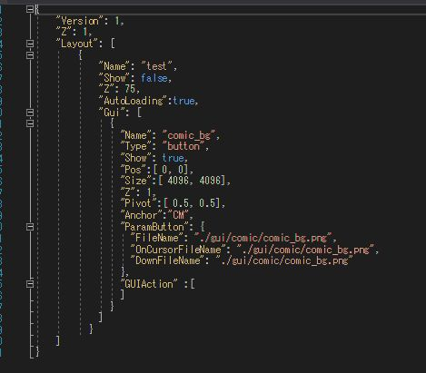
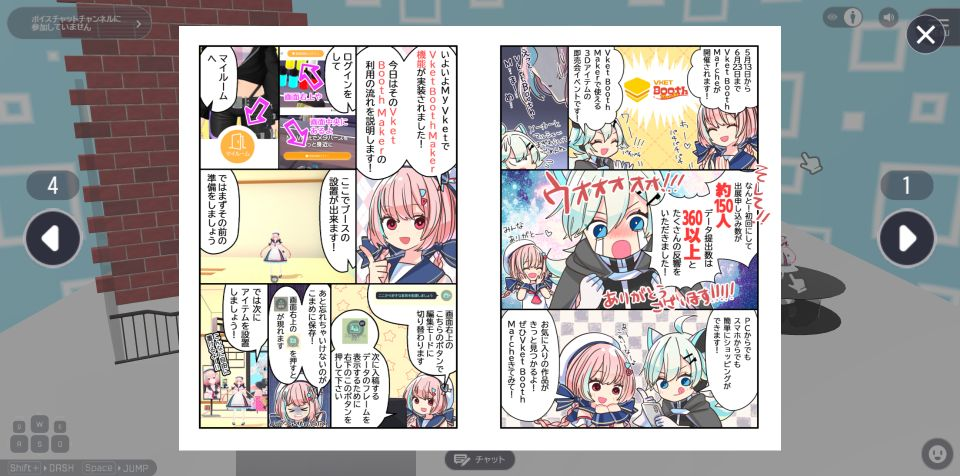

# CanvasUI表示機能付きアクティビティクラスを作る

SDK12から、アクティビティクラスの中にUI画像を設定することができるようになり、
ついにビルド後にreleaseフォルダを編集しないUI編集が一般に解禁されるようになりました。

本ページでは「クリックしたらUIを表示」するアクティビティクラスの作り方を解説しています

!!! info 検証環境
    SDKバージョン: 12.1 
    OS: Windows 10 
    Unity: 2019.4.31.f1 
    ブラウザ: Google Chrome 

## 手順

### ① Canvas用フォルダの作成

アクティビティクラス内に通常のreleaseフォルダのCanvas関連ディレクトリと同じ構造を追加します。  
Canvas用フォルダを追加したアクティビティクラス内ディレクトリの構成は下記の通りです。  
茶文字がフォルダ、黒文字がファイルです。  
※追加部分を太字にしています。

ActivityClassFile  
┣**Canvas**  
┃┣**HeliScript**  
┃┃┗**Canvas用HeliScript**  
┃┣**landscape**  
┃┃┗**横画面用Canvasjson**  
┃┣**portrait**  
┃┃┗**縦画面用Canvasjson**  
┃┗**アクティビティCanvasListjson**  
┣**gui**  
┃┗**UI用画像**  
┣HEO  
┃┗オブジェクト  
┣アクティビティHeliScript  
┗アクティビティjson

## ②アクティビティjsonにアクティビティCanvasListjsonの情報を記載する

アクティビティjsonに、アクティビティで用いるCanvasListの情報を記載します。

**Vket Cloud UIの仕組み**

①CanvasListで必要なCanvasjsonの情報を読み込む。  
②各Canvasjsonを読み込み、必要なHeliScriptやUI画像を読み込む。

したがって、まずはCanvasListを読み込む必要がある。

記載方法は”canvaslist”項目にCanvasListjsonのパスを書きます。

名前はCanvasList.jsonである必要はありません。  
アクティビティjsonからの相対パスで記載します。

## ③アクティビティCanvasListjsonを編集する

アクティビティ用のCanvasListjsonを作成します。  
[GUITools - 概要とセットアップ](https://vrhikky.github.io/VketCloudSDK_Documents/latest/GUITools/Setup.html) などを参照してください。

パスはアクティビティjsonからの相対パスです。

## ④アクティビティ用Canvasjsonを作成する

③で指定したjsonファイルを作成します。  

パスはアクティビティjsonからの相対パスです。

## ⑤アクティビティHeliScriptで表示処理を作成する

通常のCanvas同様、hsSetLayerShow()などのCanvas関数が使用できます。  
Layout層の名称記載ルールも通常と同じです。

Canvasボタンを押したときの動作については、Canvas側のHeliScriptをご利用ください。

---

## 使用例

コミックビューアアクティビティ

画像・ボタンの表示をGUIアクティビティで行っている。

## その他知見

動作しない場合は、ブラウザのキャッシュクリアもお試しください。
