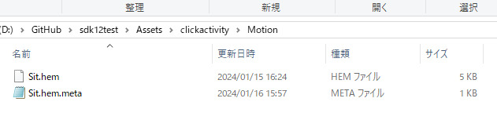
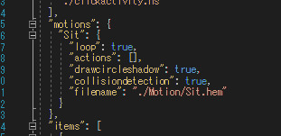
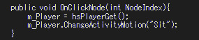

# Activity with Motion

Starting from SDK 12, motions can now be set within the activity class, allowing HeliScript to execute avatar motions that are not described in the scene JSON.

This page introduces the steps to implement something like "furniture that triggers a motion when clicked" using the activity class.

!!! info "Test Environment"
    SDK Version: 12.1 
    OS: Windows 10 
    Unity: 2019.4.31.f1 
    Browser: Google Chrome 

## Steps

### ① Add motion files to the activity class folder

Create a new "Motion" folder within the activity class folder and place the .hem files inside.  
*Note: As long as the .hem files are located within the activity class folder or its subfolders, there is no issue.*

### ② Add motion file information to the activity class JSON file

Just like with a standard scene JSON, create a "motions" section and define the motion behavior there.  
For the filename, specify the relative path from the activity class JSON file.

### ③ Create motion playback logic in HeliScript

You can use the `ChangeActivityMotion()` function in the Player class to play motions defined in the activity.  
Pass the motion name as an argument to this function.

!!! info
    In SDK 12, the HeliScript constructor is executed before the voice chat channel join process. Therefore, it is recommended to use `hsPlayerGet()` just before using functions from the Player class. 
    Avoid calling `hsPlayerGet()` every frame within the `Update()` function. Instead, use it in a function that executes only once when the Player class function is required.

By implementing the above steps, you can define and execute avatar motions in an activity class without needing to include them in the scene JSON.
