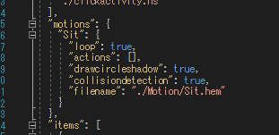
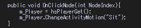

# モーション付きアクティビティ

SDK12から、アクティビティクラスの中にモーションを設定することができるようになり、HeliScriptからシーンjsonに記載していないアバターモーションを実行することができるようになりました。

本ページでは「クリックしたらモーションが発生する家具」のようなものをアクティビティクラスで実装する際の手順について紹介します。

!!! info 検証環境
    SDKバージョン: 12.1 
    OS: Windows 10 
    Unity: 2019.4.31.f1 
    ブラウザ: Google Chrome 

## 手順

### ① アクティビティクラスフォルダにモーションファイルを入れる

アクティビティクラスのフォルダに新しくMotionフォルダを作り、その中に.hemファイルを入れると良いでしょう。
※アクティビティクラスのフォルダ以下に.hemファイルがあれば問題ありません。

### ② アクティビティクラスのjsonファイルにモーションファイル情報を記載

通常のシーンjson同様、「motions」項目を作り、その中で動作定義を行います。
filenameは他と同様、アクティビティクラスのjsonからの相対パスを記載します。

### ③ HeliScriptでモーション再生処理を作成

Playerクラス関数ChangeActivityMotion()でアクティビティで定義されたモーションを使用することができます。
カッコ内引数はモーション名が入ります。

!!! info
    SDK12では、ボイスチャットチャンネル入室処理よりHeliScriptコンストラクタ処理の方が先に行われるため、hsPlayerGet()はプレイヤークラス関数を用いる直前に使うのが良いでしょう。 
    Update()関数内で毎フレームhsPlayerGet()するのは好ましくないため、Playerクラス関数を使いたい場面で一度だけ動作する関数内で用いるのがおすすめです。

上記の実装を行うことで、シーンjsonで定義されていないアバターモーションをアクティビティクラスで実装することができます。
