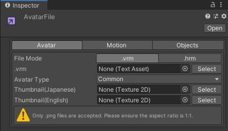
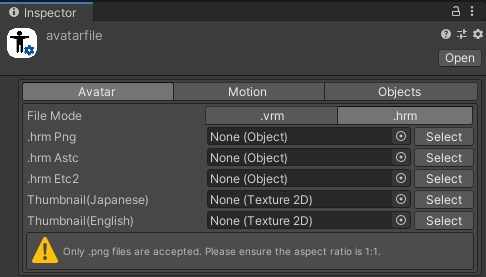
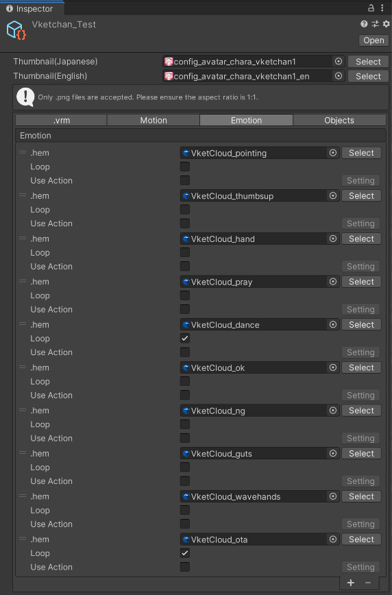
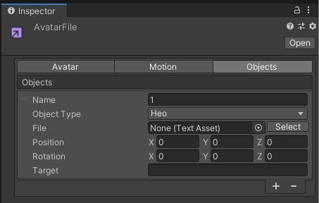

# AvatarFile

The AvatarFile is used in the VketCloudSDK for such as [Adding Preset Avatars](PresetAvatar.md). 
This file stores information to initiate avatars on Vket Cloud.

## General Information

| Label | Function |
| ---- | ---- | 
| Thumbnail(Japanese) | Sets the thumbnail image for the avatar when language is Japanese.   The thumbnail will be used in the preset avatar list. |
| Thumbnail(English) | Sets the thumbnail image for the avatar when language is English.   The thumbnail will be used in the preset avatar list. |

The ID and thumbnail image will be applied to the preset avatar list located in the in-world settings as below. 
Note that thumbnail image must be in png format and 1:1 square ratio.

## .vrm
This tab designates the VRM file / essential information of the avatar.

| Label | function |
| ---- | ---- |
| .vrm | Sets the model of the avatar. |
| height | Sets the avatar's camera reference position. If set to 0, the camera will follow the feet. |
| Hrm Png | Sets the [model_name]_png.hrm file generated by [Texture Compression](../heoexporter/he_TextureCompression.md). |
| Hrm Astc | Sets the [model_name]_astc.hrm file generated by [Texture Compression](../heoexporter/he_TextureCompression.md). |
| Hrm Etc 2 | Sets the [model_name]_etc.hrm file generated by [Texture Compression](../heoexporter/he_TextureCompression.md). |
| Hrm Dxt | Sets the [model_name]_dxt.hrm file generated by [Texture Compression](../heoexporter/he_TextureCompression.md). |

## Motion
This tab designates the motions used in the avatar. 
Vket Cloud allows you to add any motion and uses a unique file format called `.hem`.

| Label | Initial Value | function |
| ---- | ---- | ---- |
| Motion Name | Sets the motion name. |
| .hem | Sets the motion file. |
| Loop | true | Play the motion in a loop. Turn it on for walking and standby motions. |
| Use Action | false | Sets the action to call when the motion starts playing.   In particular, enable this setting and designate the action to be fired via `Setting`. |
| Draw Circle Shadow | true | Sets to draw a circle shadow on playing motion. |
| Collision Detection | true | Sets collision detection on playing motion. |

## Emotion 
This tab designates the emote animations used in the avatar.  
Vket Cloud allows you to add any Emotion and uses a unique file format called `.hem`.

|  Label | Initial Value | function |
| ----   | ---- | ---- |
| .hem | | Sets the motion file for emote. |
| Loop | true | Play the motion in a loop. Turn it on for walking and standby motions. |
| Use Action | false | Sets the action to call when the motion starts playing.   In particular, enable this setting and designate the action to be fired via `Setting`. |

## Objects
Avatars can have assets attached by designating as an object.
The object may be set in three formats: Heo, Hep, or Audio.

|  Label | Initial Value | function |
| ----   | ---- | ---- |
| Name | blank | Set the name of the object. |
| Object Type | Heo | Set the type of object.  `Heo`: [.heo file](../WorldMakingGuide/HEOExporter_Tutorial.md), `Hep`: particles, `Audio`: audio |
| File | blank | Set the file to be used as an object. |
| Position | 0,0,0 | Set the relative position from the Target. |
| Rotation | 0,0,0 | Set the relative rotation from the Target. | 
| Target | blank | Specifies the bone that serves as the coordinate origin.   The bone name is akin to the [VRM Humanoid](https://vrm.dev/en/univrm/humanoid/humanoid_overview), name in snakeCase (e.g. head, leftLowerLeg, leftThumbProximal...)|