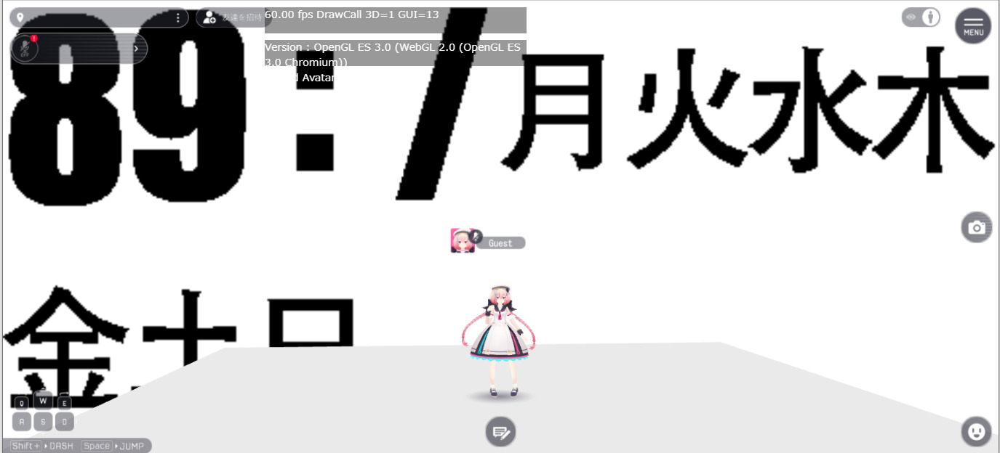
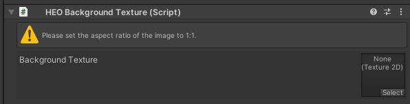
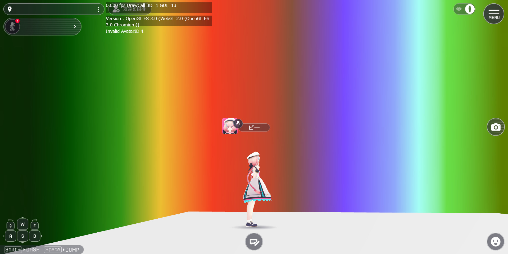
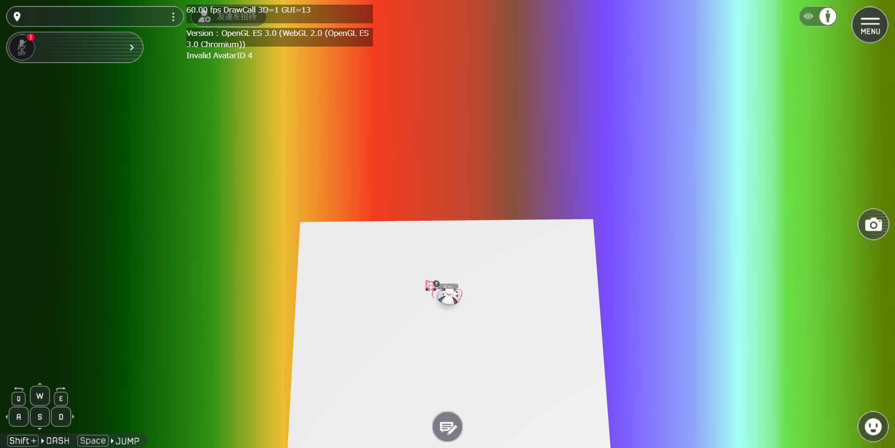
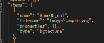
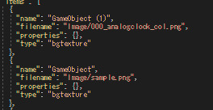
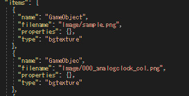

# VKC Item Background Texture/HEOBackgroundTextureの使い方

## 概要
VKC Item Background Texture/HEOBackGroundTextureを使うことで、ワールド背景を簡単に実装することができます。
ただし、制約があるので注意が必要です。



!!! info "検証環境"
    SDKバージョン : 9.3.0<br>
    OS : Windows 10<br>
    Unity : 2019.4.31.f1<br>
    ブラウザ : Google Chrome

!!! warning "VketCloudSDK13以降で名称が変化しています。"
    HEOBackgroundTexture → VKCItemBackgroundTexture <br>
    HEOScript → VKCAttributeScript <br>
    ※出来ることは変わっていないので、読み替えてください。

## 実装手順

### ①HEOBackgroundTextureを追加する
空のオブジェクトを作成し、その中にHEOBackGroundTextureを追加します。



既存のオブジェクトに追加しても正常に動作しますが、分かりやすいように空のオブジェクトを追加したほうが良いと思います。

単独のアイテムとして書き出されるので、HEOField配下にしなくても正常に動作します。

### ②画像を追加する
コンポーネント内に書いてある通り、アスペクト比1:1の画像が推奨されていますが、
アスペクト比が1:1でない画像も使用することができます。
※アスペクト比は適切なものに変更されます。



元画像


これで、ワールド背景が実装されます。



ただし、角度を変更しても見た目が変わらないため、Skyboxの代替として利用するのは厳しい部分もあります。

## その他知見

### ①Scene.jsonへの記載



type : bgtextureとして追加されます。
画像はImageフォルダに入ります。

### ②2つ以上HEOBackgroundTextureを追加した場合



下にある方が優先されます。

UnityのHierarcyビューの位置に関係なく、オブジェクト名がアルファベット順で早いほど下に出力され、優先されます。

優先度
GameObjec >  GameObject > GameObject (1)

### ③Actionとの連動
1.ShowItem：HideItem
連動します。したがって、複数枚の背景を切り替えることが可能です。
ただし、上記の表示優先度は適用されます。

2.HEOScript(直接アタッチ)



componentの項目が無いため、HEOScriptをHEOBackgroundTextureをアタッチしているオブジェクトにアタッチしてもcomponentが増えることはありませんが、Script一覧には記載が載ります。

3.HEOScript(hsItemGetで指定)

``` csharp
component BackgroundTest
{
    Item m_Item;
    float timer;
    bool back_show;
    public BackgroundTest()
    {
        m_Item = hsItemGet("GameObjec");
    }
    public void Update()
    {
        timer += hsSystemGetDeltaTime();
        if(timer>3){
            timer = 0;
            back_show = !back_show;
            m_Item.SetShow(back_show);
        }
    }
}
```

上記を実行したところ、3秒おきに画像が切り替わったので、Item指定することは可能。

ただし、SetPosしたところで画像に変化が出なかったため、ActionやHeliScriptを用いて使えるのは画像の切り替えのみ。
