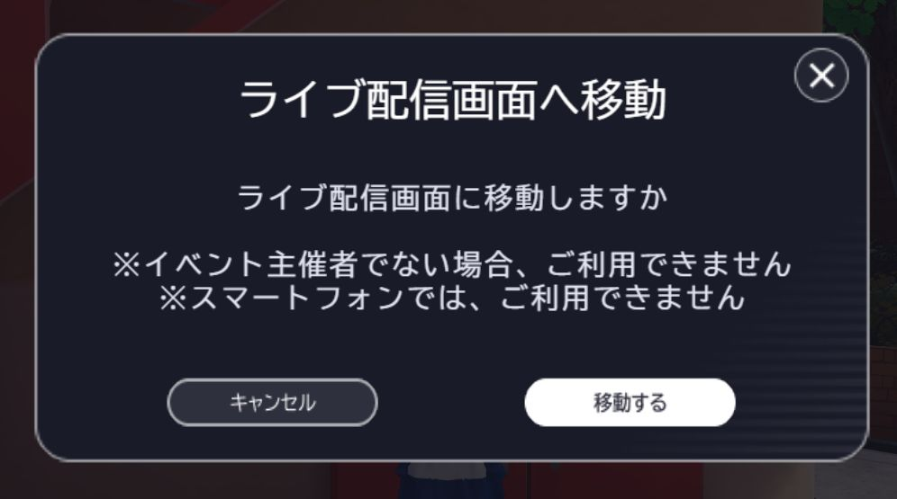

# Canvasでダイアログ外をクリック(タップ)したときにダイアログを閉じる機能を実装する

## 概要

Vket CloudのUI機能で「ダイアログ外をタップするとダイアログが閉じる」を実装する方法について紹介するページです。

ダイアログ外をタップすることでダイアログが閉じる動作を作るためには、ダイアログ外に見えない閉じるボタン判定を用意します。

!!! note "検証環境"
    SDKバージョン : 元々4.2だったが→7.0移行済み環境にて
    OS : windows10
    Unity : 2019.4.31.f1
    ブラウザ :Chrome

## 前提 - ダイアログとは

下記画像のような、画面上に表示されるウィンドウのことを「ダイアログ」と呼びます。  
下記画像の通り、ダイアログを画面上から消す方法として、「キャンセル」を押す、「×」を押すといった動作が考えらえれますが、ダイアログが表示されて閉じるための動作を模索する時間はユーザーにとってストレスとなります。

したがって、ダイアログとは関係のない場所をクリックすることでダイアログを閉じることが出来るようにすることで、ユーザーにとって親切なダイアログとなります。


Vket Cloud : エントランスにて確認できるダイアログの例

また、Vket Cloudでダイアログを新しく追加するためには、アクティビティクラスを使用する必要があります。
詳しくはこちらをご覧ください。[CanvasUI表示機能付きアクティビティクラスを作る](https://vrhikky.github.io/VketCloudSDK_Documents/latest/WorldMakingGuide/ActivityWithCanvasUI.html)

## 手順

### ①該当レイヤーにタップ判定用の透明なボタンを追加

```
{
  "Name": "popup_button_close_bg",
  "Type": "button",
  "Platform": "",
  "Language": "",
  "Portrait": "",
  "ParamButton": {
    "FileName": "",
    "OnCursorFileName": "",
    "DownFileName": ""
  },
  "GUIAction": [
    {
      "SetShowLayer": {
        "Name": "GameWindow",
        "Show": false
      }
    }
  ],
  "Show": true,
  "Pos": [
    0,
    0
  ],
  "Size": [
    6000,
    6000
  ],
  "Z": 0,
  "Pivot": [
    0.5,
    0.5
  ],
  "Anchor": "CM"
},
```

ダイアログを構成しているCanvasのJsonファイルに、透明な大きなボタンを追加します。  
画像が無い状態のボタンを作るため、画像ファイル名は空欄にします。

上記の例ではGameWindowレイヤーに対し閉じるを実行するアクションを入れています。  
これにより、ダイアログ外をクリックするとGameWindowレイヤーを閉じる動作が実装されています。

背景ボタンの大きさは適当に大きな値を入れていれば問題ないです。  
今回の例では6000*6000としています。

重要な点として、Zをレイヤー内の他のすべてのボタンより低い値に設定する必要があります。  
もしZが大きいと他のボタンの上に閉じる判定が存在してしまい、閉じる以外できなくなってしまいます。

## ②ダイアログ背景画像の大きさに合わせた、透明で何もしないボタンを追加する

画像を表示するためのimageタイプではボタンの判定を阻害する能力がないため、ダイアログ背景についてもbuttonとして設定し、クリックした際に何も起こらないようにします。  
これを行わないとダイアログ上でボタンがある箇所以外をクリックした際にダイアログが閉じてしまいます。

!!! warning "注意"
    ボタンに設定した画像の透明部分にもボタン判定があるため、ダイアログ背景の画像に余白となる透明部分がある場合、クリック可能な範囲はボタンの大きさより小さくする必要があります。


背景画像。Activityクラス内のguiフォルダ内に入れて使用する

上記の画像をimageとして、Canvasでは550*400で設置して用いる場合、  
判定阻害用の透明なbuttonは376*282に設定するとちょうど良くなります。

ClickAreaSizeにてクリック範囲の大きさを指定できるため、このように設定します。

```
{
          "Name": "dialog_bg",
          "Type": "button",
          "Platform": "",
          "Language": "",
          "Portrait": "",
          "ParamButton": {
            "FileName": ".\gui\common_dialog_bg.png",
            "OnCursorFileName": ".\gui\common_dialog_bg.png",
            "DownFileName": ".\gui\common_dialog_bg.png"
          },
          "GUIAction": [],
          "Show": true,
          "Pos": [
            0,
            0
          ],
          "Size": [
            550,
            400
          ],
          "ClickAreaSize" : [
            376,
            282
          ]
          "Z": 1,
          "Pivot": [
            0.5,
            0.5
          ],
          "Anchor": "CM"
        },
```

何もしないボタンなので、アクションは空にします。

以上で、ダイアログ外をクリック時に閉じるダイアログが出来上がります。