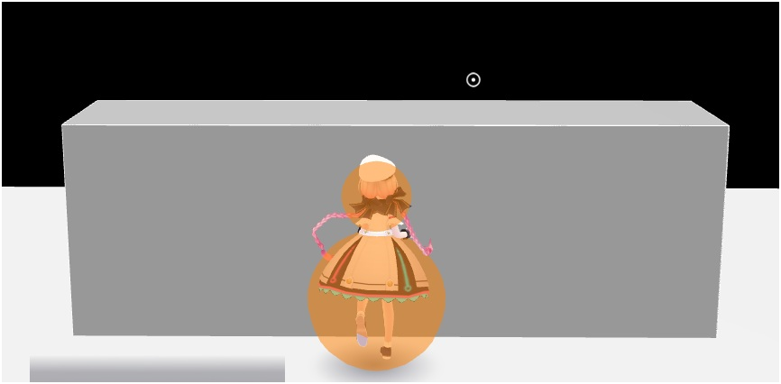

# コライダーの使い方 / Tips

## コライダーでできること
Vket Cloudでは、Unityの各種コライダーとVKCコンポーネントを組み合わせることで、以下のような機能や表現をつくることができます：

1. 基本的な環境構築: [壁や床などの作成](../VKCComponents/VKCNodeCollider.md#1-collider)
2. 表示の最適化: [オクルージョン機能](../WorldOptimization/OcclusionCulling.md) により見えない部分の処理を省略
3. 読み込みの効率化: [動的ローディング](../VKCComponents/VKCItemField.md) で必要な時だけコンテンツを読み込み
4. インタラクション: [クリック、エリア出入り、視野内判定](../VKCComponents/VKCNodeCollider.md#_2) などの検知
5. 物理演算: [落下や衝突などの動き](./PhysicsEngine.md)

## コライダー用コンポーネント

Vket Cloud SDKには、以下のコライダー関連コンポーネントがあります：

### 基本コンポーネント

**[VKC Node Collider](../VKCComponents/VKCNodeCollider.md)**-コライダーを表現する基本的なコンポーネントです。UnityのBoxColliderと併用することで例えば壁や床など衝突可能なノードを作成できます。また、他のVKCコンポーネントとの組み合わせで使用することで、さまざまな表現が可能になります。

### 基本コンポーネントと組み合わせて使うもの
これらをインスペクタービュー上でアタッチすると、VKC Node Colliderも自動で追加されます

**[VKC Item Area Collider](../VKCComponents/VKCItemAreaCollider.md)**-プレイヤーの特定エリアに出入りをトリガーとしたアクションを設定できます。

**[VKC Node Mesh Collider](../VKCComponents/VKCNodeMeshCollider.md)**-UnityのMesh Colliderと組み合わせて付与することで、メッシュ形状に合わせたコライダーを作成できます。

**[VKC Node Cylinder Collider](../VKCComponents/VKCNodeCylinderCollider.md)**- UnityのCapsuleColliderに物理演算を適用する際に使用します。詳細は[物理エンジン](./PhysicsEngine.md)を参照してください。

## コライダーとActionの連携

コライダーはアクションと組み合わせることで、多彩なギミックを作成できます。 
詳細は[アクションの概要](../Actions/ActionsOverview.md)を参照してください。

## コライダーとスクリプトの連携
HeliScriptのコールバック関数を活用することで、アクションだけでは実現できない複雑なギミックも作成可能です：

- [コールバック - Area Collider](../hs/hs_component.md#-areacollider)
- [コールバック - 物理衝突判定](../hs/hs_component.md#-_2)
- [コールバック - 視野内コライダー](../hs/hs_component.md#-_3)

## 実践のヒント

!!! tips "階段のコライダー設置テクニック"
    階段にコライダーを設置する場合、[VKC Node Mesh Collider](../VKCComponents/VKCNodeMeshCollider.md)あるいはBox Colliderをそのまま使うと、移動時にガタつきが生じたり、段差によってはジャンプが必要になったりして、プレイヤーにストレスを与えることがあります。
    
    
    より良い解決策として、Box Colliderを斜めに配置して坂状にすることで、プレイヤーがスムーズに登れる階段を作成できます。
    
    

!!! note "プレイヤーとの衝突判定の仕組み"
    プレイヤーは画像のオレンジ球に衝突判定を持ちます。 
    また、下記の操作でオレンジ球が可視化されます。  
    1. 予め[VketCloudSettings / BasicSettings](../VketCloudSettings/BasicSettings.md)の[デバッグモード](../WorldEditingTips/DebugMode.md#f3)を有効にしておく。  
    2. ビルド後、ゲーム中にF3キーを押すことで表示されます。  
    
