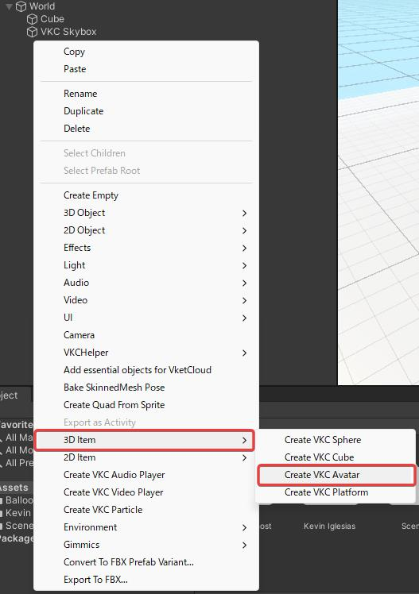
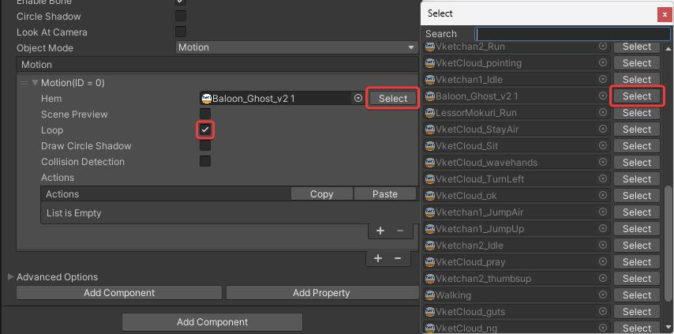

# How to convert animation from Unity assets

This page explains the process of downloading FBX files with animations (Humanoid or Prop type) from the Unity Asset Store and converting them to the .hem format usable in VketCloud.

## About Two Conversion Methods

VketCloud SDK provides two tools: MotionExport and HEMAnimationConverter. Each has different processing methods, so you need to choose the appropriate one depending on the model you want to convert.

### MotionExport

- Possible:
    - HEM conversion of animations
- Not possible:
    - Output of multiple animations
    - Output of IK animations

### HEMAnimationConverter

- Possible:
    - HEM conversion of Humanoid type animations
    - Batch output of multiple animations
    - Output of IK animations
- Not possible:
    - HEM conversion of Legacy and Generic type animations

### Comparison Table

| Tool Name | Legacy | Generic| Humanoid | Multiple Output | IK Support | 
| -- | -- | -- | -- | -- | -- |
| MotionExport | Yes | No | No | No | No |
| HEMAnimationConverter | No | No | Yes | Yes | Yes |

---

## Prerequisites

In this example, we'll use the following assets:

- [Balloon Ghost(with Breakable parts)](https://assetstore.unity.com/packages/3d/animations/balloon-ghost-with-breakable-parts-209499)

- [Basic Motions FREE](https://assetstore.unity.com/packages/3d/animations/basic-motions-free-154271)

Please add these to your project's Assets in advance.
Also, open the inspector for Assets/Balloon_Ghost/Animations/Attack.fbx and change the "Animation Type" to `Legacy`.

---

## HEM File Export Procedure

### HEMExporter

Select the model in the Project (in the image, `Balloon_Ghost_v2 1`) and drag and drop it into the Hierarchy.

Select the model's Object and confirm that the Animation component has been added. If not, add Animation from Add Component in the Inspector view and set the animation you want to output.

Select `Export Motion` from the VketCloudSDK tab at the top of the Unity screen.

A window to choose the save location for the .hem file will appear. Save it with any name at any location.
If the exporting successful, the message below will appear.

### HEMAnimationConverter

Confirm that the `Animation Type` is set to `Humanoid` in the inspector of the model you want to convert. (Only Humanoid type can be converted)

Launch HEMAnimationConverter by clicking VketCloudSDK tab > Tools > HEMAnimationConverter.

Drag and drop the animation file you want to convert to the left side of the HEMAnimationConverter screen.

Click the `+` button in the top right of the Model area on the right side of the screen. By default, Vket-chan's VRM will be specified.

Press Convert Animation and save the .hem file.
If the convertion successful, the message below will appear.

## HEO File Export Procedure

Place the `Balloon_Ghost_v2` 1 used in the previous example in the scene.

Select `Export Field` from VketCloudSDK with the object with the Animation component attached (in the figure showing the placed model, it's Balloon_Ghost_v2 1) selected. When saving the .heo, it's recommended to create a new folder and save it inside, as multiple assets will be created.

If the save is successful, the following popup window will be displayed.

## How to Display HEO with HEM in Browser

Right-click in the Hierarchy view and select 3D Item > Create VKC Avatar.

In the HEO Object component, open the .heo tab and press the `select` button. In the Select window that opens, choose the .heo file you created earlier. At this time, check the `Enable Bone` item.

Change Object Mode to `Motion`, click the plus button (+) to add a motion action.

Click the Select button for Hem in the motion action list, and in the Select window, click the Select button to apply the created Hem file.

!!! note "About Looping animation"
    If you want to loop the motion to be played, check the Loop box.   
    *It's recommended to check Loop when checking motions.

!!! warning "About model doesn't have Humanoid bones"
    Animations that cannot be recognized as Humanoid  
    cannot be played in the Editor even if Scene Preview is checked.

By building in this state, you can place objects with animations in the scene.

## Useful Tips

!!! note "How to check if the model is Humanoid type or not"
    

    If the Unity Model moves when played in the Inspector view, it's Humanoid type.

    

!!! note "How to extract and edit animations from FBX"
    Select the target fbx in the Project tab, then select Rig > Animation Type > Humanoid in the Inspector and click Apply (see an image below)

    

    Select the Animation file that has become Humanoid type and press ctrl + D (in the figure below, it's `BasicMotion@Idle01`)  
    The animation file will be duplicated, and the duplicated file can be edited

    

!!! warning "Cannot preview HEM in scene"
    Animations that cannot be recognized as Humanoid  
    cannot be played in the Editor even if Scene Preview is checked.

    