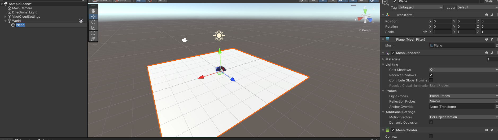
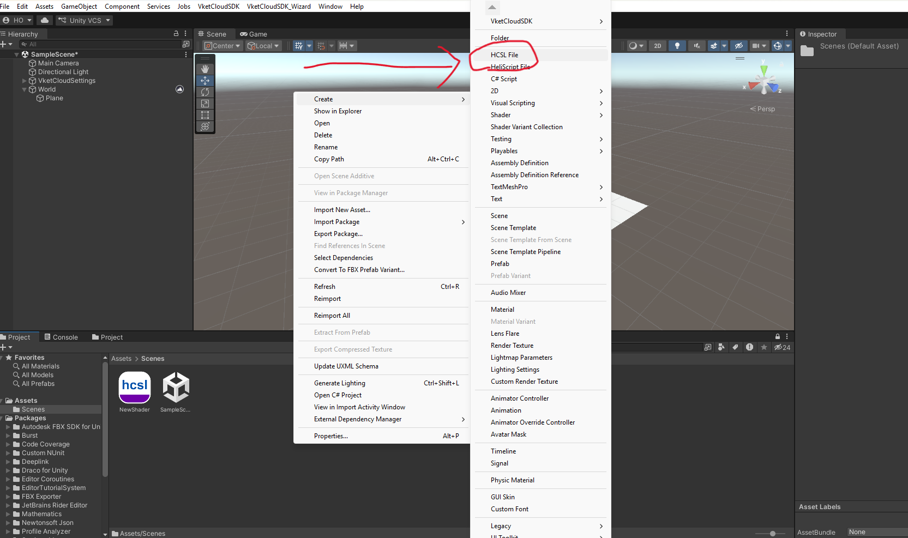
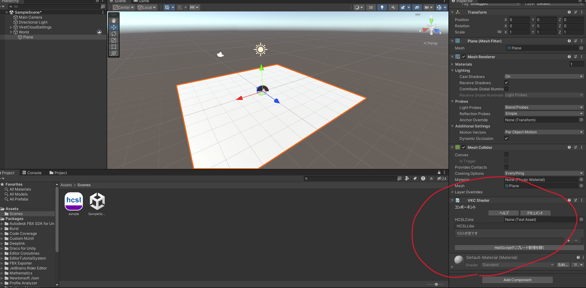
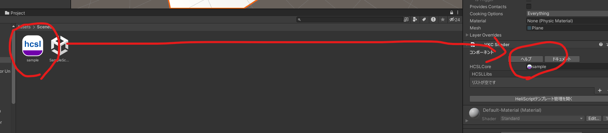
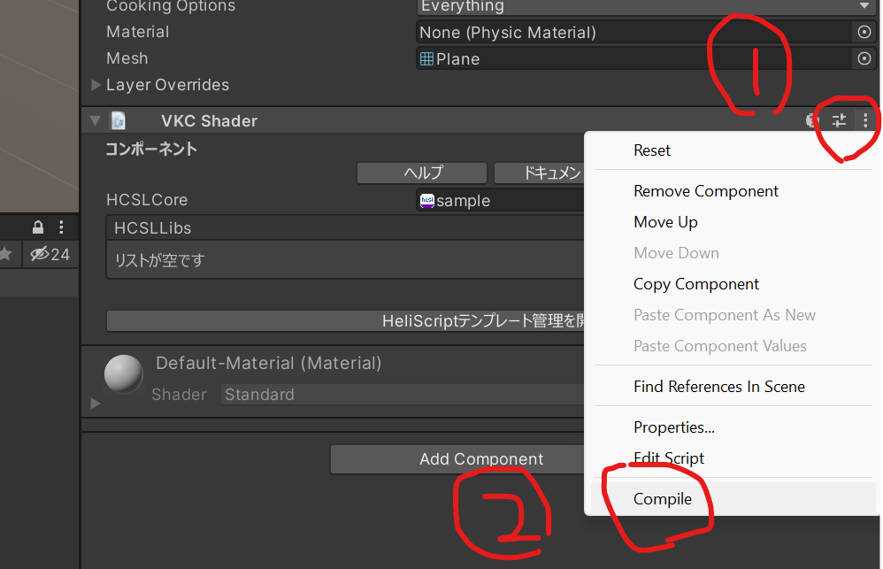
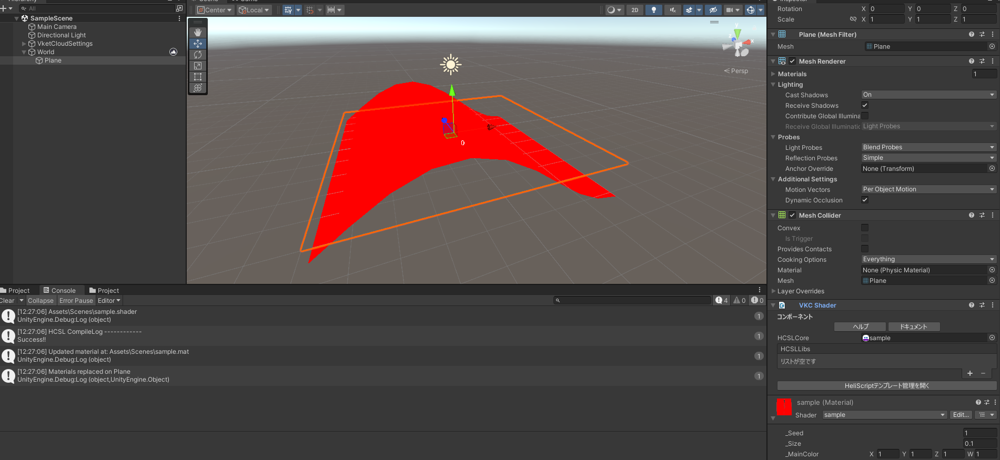
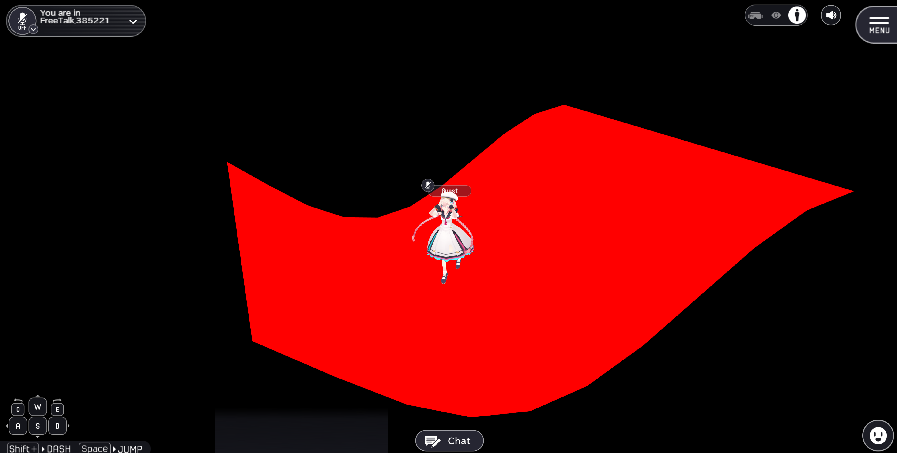

# HCSL (Heliodor Custom Shader Language)

## Overview
Heliodor now supports custom shaders.
HCSL (Heliodor Custom Shader Language) is a shader language unique to Heliodor.

## Implementation

### Shader Compilation

1 Add a Plane to the scene.

  

2 Right-click in the Project View and create an HCSL file via **Create → HCSL File**, then name it `sample`.

  

3 Double-click the generated `sample` HCSL shader to open it in the editor, then paste the following sample shader in its entirety.

```
#version 1

hcsl "sample"
{
    pass Geometry_Opaque
    {

      renderparam
      {
        bool hel_z_write = true;
        int  hel_cull_mode = HEL_CULL_BACK;
      }

      attribute
      {
        vec3 _Position : VS_POSITION;
        vec3 _Normal : VS_NORMAL;
        vec2 _TexCoord0 : VS_UV;
      }

      output vertex
      {
        vec4 outPos : VS_OUT_POSITION;
        vec3 WorldNormal;
        vec3 WorldPos;
        vec2 uv;
      }

      uniform vertex
      {
        float _Seed = 1.0;
        float _Size = 0.1;
      }

      shader vertex
      {
        float g_Offset;
        float wave(vec2 st)
        {
            return sin(st.x * 50.0 + HEL_TIME) * 1.5;
        }
        void main()
        {
          g_Offset = 10.0;
          vec4 pos = vec4(_Position, 1.0);
          pos.y += wave(_TexCoord0 * _Size + vec2(_Seed + g_Offset));
          outPos = HEL_MATRIX_P * HEL_MATRIX_V * HEL_MATRIX_W * pos;
          WorldNormal = (HEL_MATRIX_W * vec4(_Normal, 0.0)).xyz;
          uv = _TexCoord0;
        }
      }

      input fragment
      {
        vec3 WorldNormal;
        vec2 uv;
      }

      output fragment
      {
        vec4 outColor : FS_COLOR;
      }

      uniform fragment
      {
        vec4 _MainColor = vec4(1.0);
        sampler2D _MainTex;
        vec4 _MainTex_ST;
      }

      shader fragment
      {
        void main()
        {
          vec4 col = vec4(1.0, 0.0, 0.0, 1.0);
          outColor = col;
        }
      }
    }
}
```

4 Attach a **VKC Shader** component to the Plane.

  

5 Drag and drop the `sample.hcsl` file you just created into the **HCSL Core** field of the VKC Shader component.

  

6 Click the vertical three-dot menu in the upper-right corner of the VKC Shader component to open the menu, then click **Compile** at the bottom.

  

7 A rippling red Plane effect will now appear.

  

8 Finally, perform a **Build and Run** as usual to confirm that the shader is applied correctly in VketCloud.

  