# HCSL(Heliodor Custom Shader Language)

## 概要
Heliodorがカスタムシェーダーに対応しました。  
HCSL(Heliodor Custom Shader Language)というHeliodor独自のシェーダー言語です。

## 実装

### Shaderコンパイル

1. プロジェクトビューを右クリックし、「Create → Shader → UnlitShader」でShaderLabを作成し名前を「sample」とつけます

    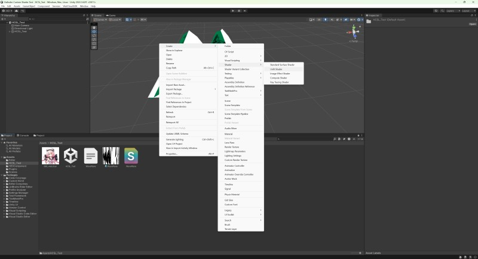

2. 生成されたsampleシェーダーを右クリックし、Materialボタンからマテリアルを作ります。同様に名前はsampleとします

    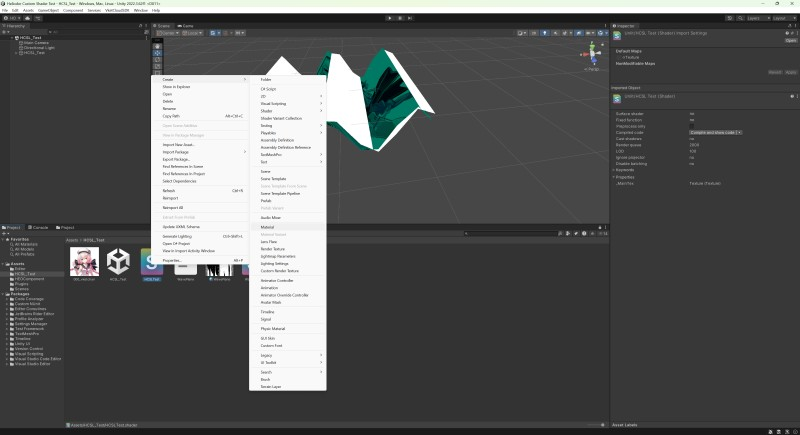

3. 次にUnityシーン上に1つ適当なPlaneをHCSL_Testの子要素として追加し、WavePlaneの横あたりに配置します

    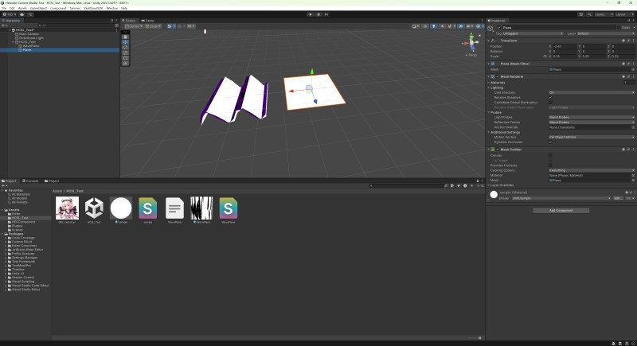

4. そして先ほどのsampleマテリアルをPlaneにアタッチします。また、メッシュコライダーは邪魔なので外しておきます

5. 次にWavePlane.hcslをCtrl + Dで複製し名前をsampleにリネームします

    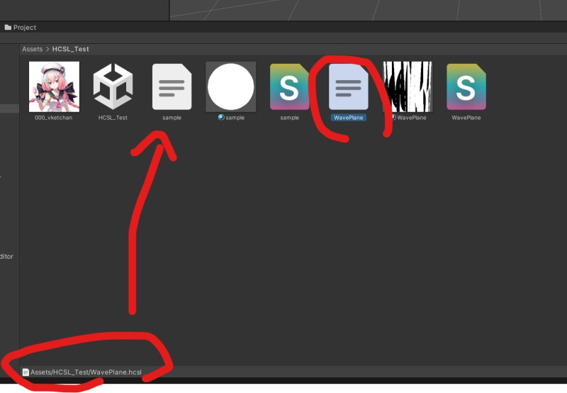

6. sample.hcslをダブルクリックして任意のエディタを開きます

    !!! note "注意"
        Shift JISで開きます

7. hcsl内のシェーダー名をsampleに変更し保存します

    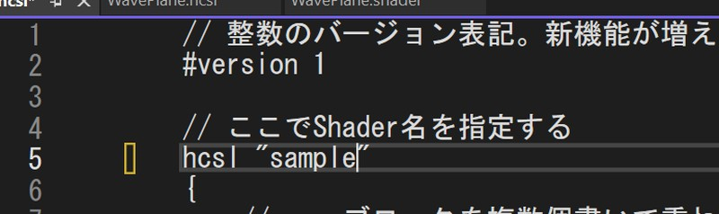

8. 次に、Planeに対してAddComponentよりHEOCustomShaderコンポーネントをアタッチします

    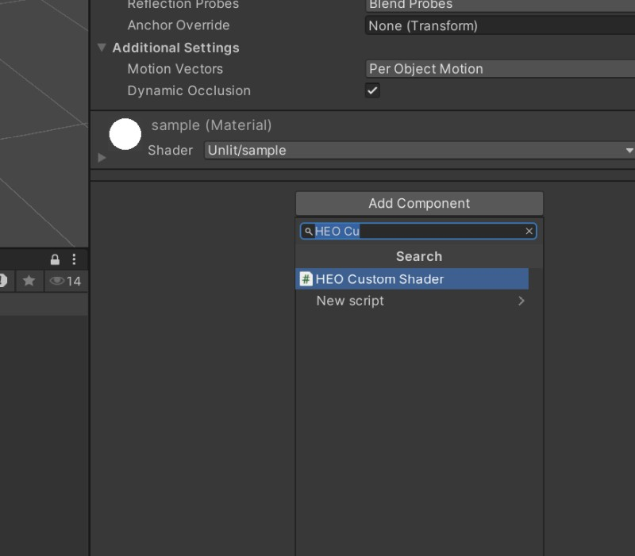

9. そしてsampleマテリアルとsample.hcslをアタッチします

    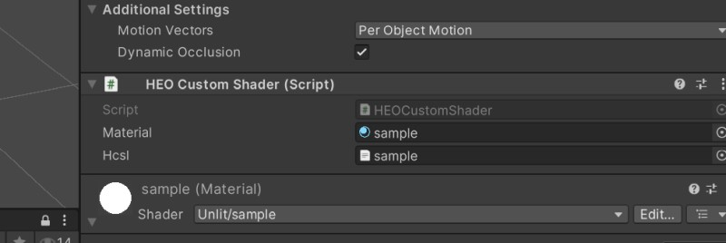

10. HEOCustomShaderの3点ボタンを押下しその中のCompileボタンを探して押下します

    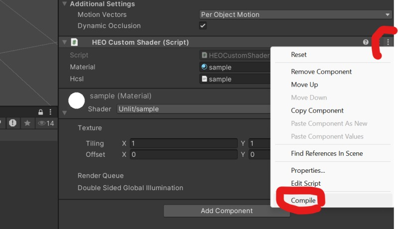

11. するとHCSLがShaderLabに変換されます。UnityコンソールにSuccess!!と出ていれば成功です

    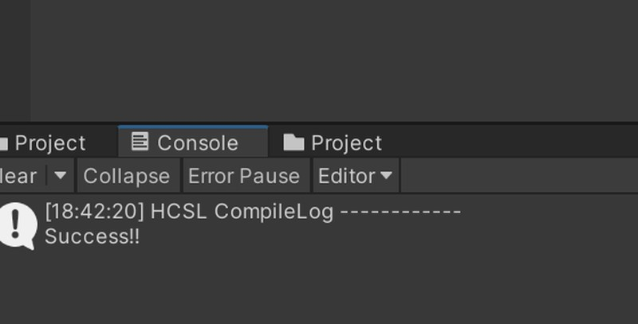

### インゲームでHCSLを使用する

1. HCSL_Testを選択しVketCloudSDK → Export FieldでHEOをエクスポートします

    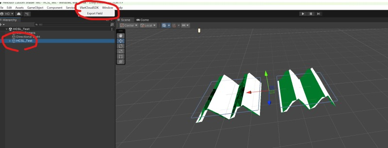

2. HEOは「release/data/Field/HCSL_Test」にエクスポートします

    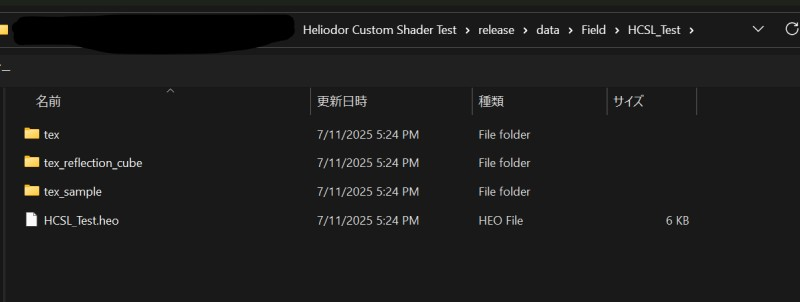

3. 作成したsample.hcslを「release/data/Shaders」にコピーします

    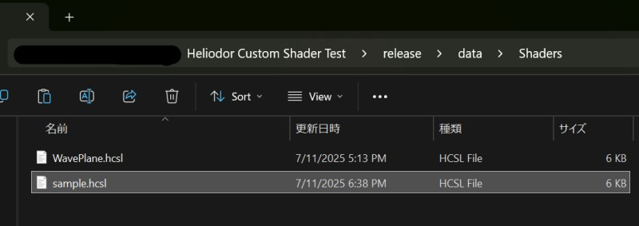

4. `release\data\Scene\streamingvideo.json` を何かしらのテキストエディタで開きます

    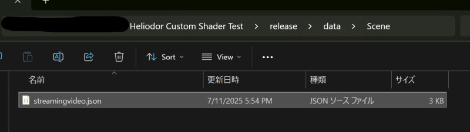

5. するとshadersというフィールドがあるのでそこに先ほど追加したsample.hcslのパスを追加します `"Shaders/sample.hcsl"`

    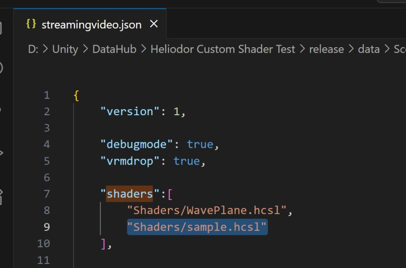

6. 最後に準備編でやった時と同じようにローカルホストを立ててインゲームに入室し、作成したシェーダーが反映されていれば完了です

    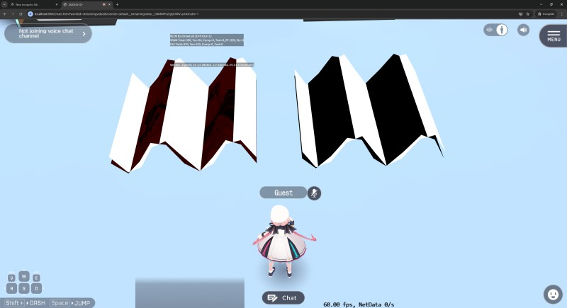
