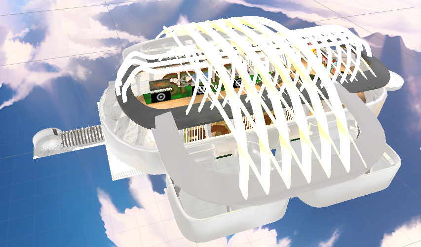
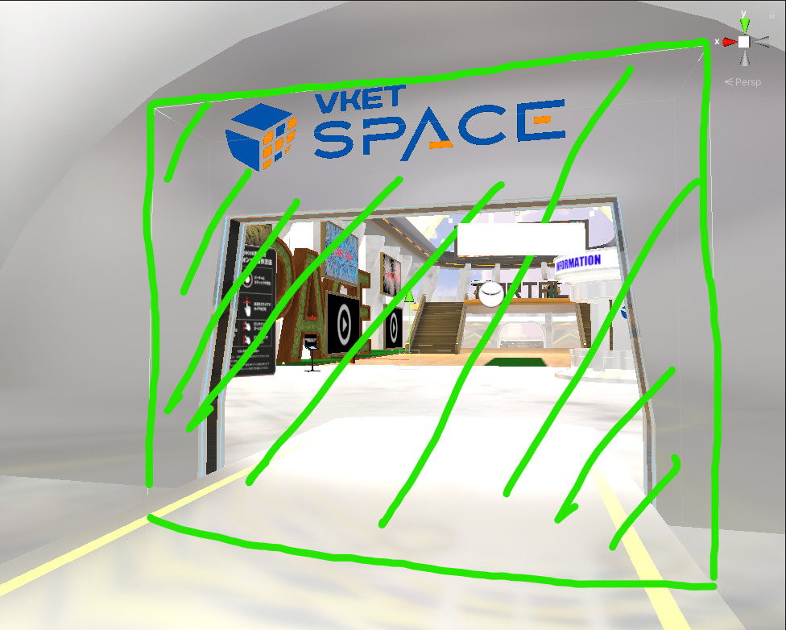

!!! info "Information on this page is for Vket Cloud SDK4.1.4."
    The names have been changed since Vket Cloud SDK13. 
    HEOField → VKCItemField  
    HEOAreaCollider → VKCItemAreaCollider  
    Please note that the functionality remains unchanged, so adjust your understanding accordingly.  

This is a way to create a gimmick that allows a world with dynamic loading to move from the spawn point once loading is complete.
This page presents an example of implementation in VketSpace.

## Implementation Method

1. When first entering the world, set up a collider to prevent entering the dynamic loading area.

2. Place an area collider to block the entrance to the area to be dynamically loaded.
The player's intrusion into the area collider will trigger the loading of the dynamic loading area.

3. After the dynamic loading area has been loaded, add an area collider that disables the roadblock hit detection and plays an animation to open the door.

Place a HEOAreaCollider in the HEOField (= autoloading : false) that is loaded dynamically. Set it so that when the area collider is entered, it will disable the collider set in step 1 that prevented entering the loading area, and play an animation to open the door.

## Principle
HEOAreaCollider is a stand-alone item, but the parent hit decision is managed by the HEOField to which each belongs.

At the start of the scene, the door remains closed and the dead end collider is still functioning because there is no parent hit decision for the HEOAreaCollider, but after the dynamic loading material is completed, the door opens and the dead end collider is deactivated.

Using this mechanism, a post-dynamic loading process can be created without any coding.
