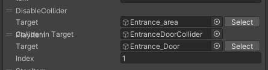

!!! info "Information on this page is for VketCloudSDK4.1.4."
    The names have been changed since VketCloudSDK13. 
    HEOField → VKCItemField  
    HEOAreaCollider → VKCItemAreaCollider  
    Please note that the functionality remains unchanged, so adjust your understanding accordingly.  

This is a way to create a gimmick that allows a world with dynamic loading to move from the spawn point once loading is complete.
This page presents an example of implementation in VketSpace.

## Mounting Method

1. install a hit point at the spawn point to prevent entering the dynamic loading loading area

Place a hit judgment to block the entrance to the part to be loaded by dynamic loading. The hit detection is placed in a HEOField that is loaded from the beginning (= autoloading : true). Basically, it is included in the HEOField around the spawn point.

2. put an area collider in the dynamic loading HEOField that disables the roadblock hit decision & animates the opening of the door

Put HEOAreaCollider in the HEOField (= autoloading : false) that is loaded in dynamic loading, disable the collider that prevents entering the loading area set in 1 for the action when the area collider enters and the door opens animation to play.

## Principle
HEOAreaCollider is a stand-alone item, but the parent hit decision is managed by the HEOField to which each belongs.

At the start of the scene, the door remains closed and the dead end collider is still functioning because there is no parent hit decision for the HEOAreaCollider, but after the dynamic loading material is completed, the door opens and the dead end collider is deactivated.

Using this mechanism, a post-dynamic loading process can be created without any coding.
