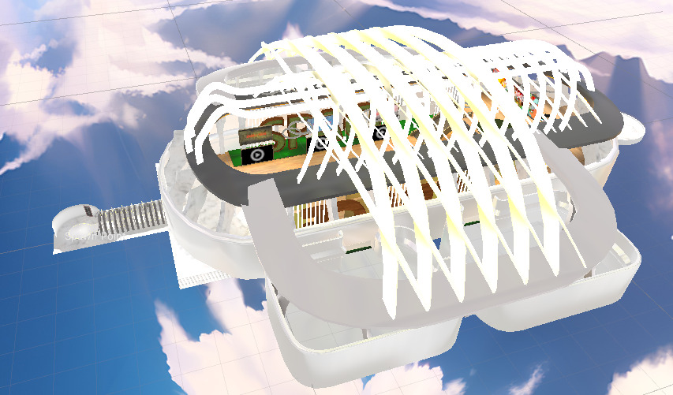
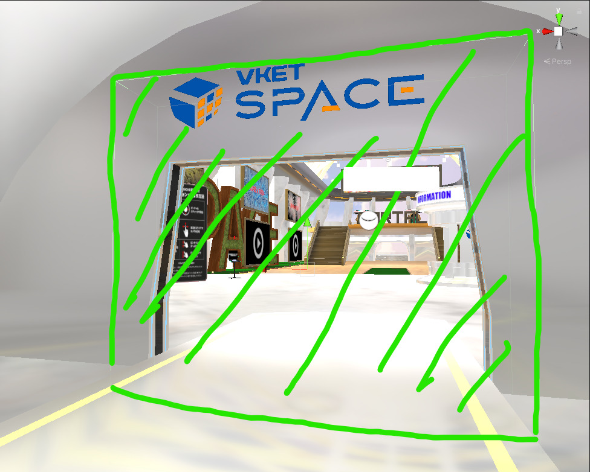
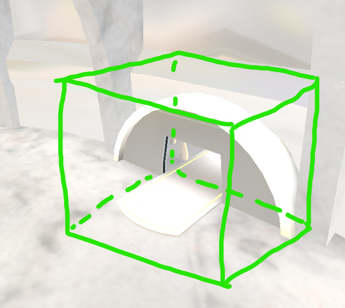
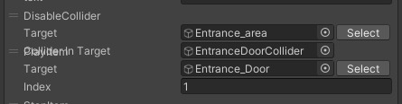

!!! info "本ページの情報はVket Cloud SDK4.1.4時点の情報です。"
    Vket Cloud SDK13以降で名称が変化しています。 
    HEOField → VKCItemField  
    HEOAreaCollider → VKCItemAreaCollider  
    ※出来ることは変わっていないので、読み替えてください。

動的ローディングを実装したワールドで、ローディングが完了したらスポーン地点から移動できるようにするギミックの作り方です。
本ページでは、VketSpaceでの実装事例を紹介します。

## 実装方法

1. ワールド入室直後に、動的ローディング読み込みエリアに入れないようにするためのコライダーを設置します。

2. 動的ローディングされるエリアへの入り口を塞ぐように、エリアコライダーを設置します。 
エリアコライダーへプレイヤーが侵入したことをトリガーとして、動的ローディングエリアの読み込みを行います。

3. 動的ローディングエリアの読み込み完了後に、通行止め当たり判定を無効可し、 扉を開けるアニメーションを行うエリアコライダーを入れる

動的ローディングで読み込まれるHEOField (= autoloading : false)にHEOAreaColliderを入れ、エリアコライダー侵入時のアクションに1で設定した読み込みエリアに入れないようにするコライダーを無効にし、ドアが開くアニメーションを再生するようにします。

## 原理

HEOAreaColliderは単体でアイテムとなりますが、母体となる当たり判定はそれぞれが所属するHEOFieldが管理しています。

シーン開始時点ではHEOAreaColliderの母体となる当たり判定が存在しないため、ドアは閉じたまま、行き止まりコライダーが機能した状態となりますが、動的ローディング資材の読み込みが完了した後はドアが開き、行き止まりコライダーが無効になります。

この仕組みを使用することにより、コーディング無しで動的ローディング後の処理を作成することができます。
