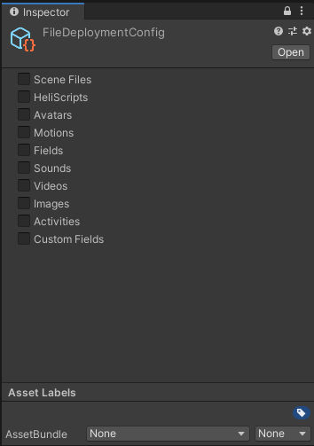
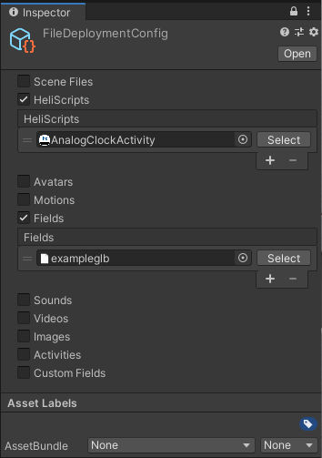
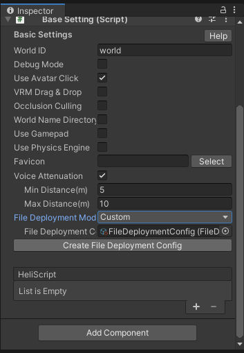
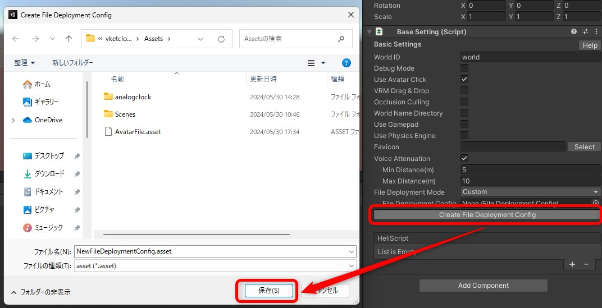

# ワールドに任意のファイルを保持させる

## 概要

ビルドもしくはアップロードするワールドへ、ユーザーが指定する任意のファイルをワールドデータ内に保持させることが可能です。 
当機能は、任意のファイルをシーンの設定以外に設定したい場合に便利です。 
たとえば、ブラウザでワールドをロード後、HeliScriptを用いて動的にスクリプトの処理や各種データの内容を差し替えたい場合などにお使い頂けます。

`Build And Run`時には保持対象のファイルやフォルダーは、`release/data/`配下に配置されます。  
`Upload to Remote Server`時には、保持対象のファイルやフォルダーは、`upload/data/`配下に配置されます。

| ラベル | 格納できるデータ |
| ----   | ---- |
| SceneFiles | data/Scene |
| HeliScript | data/HeliScript |
| Avatars (vrm) | data/Avatar |
| Motions (hem) | data/Motion |
| Particles (hep) | data/Particles |
| Fields (Heoもしくはglb) | data/Fields |
| Sounds (.mp3) | data/Sound |
| Videos (mp4) | data/Video |
| Images (.png) | data/Image |
| Activity json (json) | data/Activity |

## 使い方

1. Projectウィンドウで 右クリック > Create > VketCloudSDK > File Deployment Config を選択してください。

    

1. `FileDeploymentConfig.asset`が生成されます。

    

1. セットしたいファイルをカテゴリーごとにセットします。 
セットできる項目はページ上部の表を参照してください。

    

1. [BasicSettings](../VketCloudSettings/BasicSettings.md)の`File Deployment Mode`を`Custom`に変更したのち、3. にて設定したFileDeploymentConfigを設定します。

    

1. `Build And Run`を実行するか、もしくはワールドをアップロードすることで、保持したいデータが同時にビルドされます。

!!! note "ファイルの作成方法について"
    1.の手順の際、[BasicSettings](../VketCloudSettings/BasicSettings.md)の`Create File Deployment Config`を押し、`FileDeploymentConfig.asset`ファイルをAssets内に作成する方法でも作成可能です。
    
