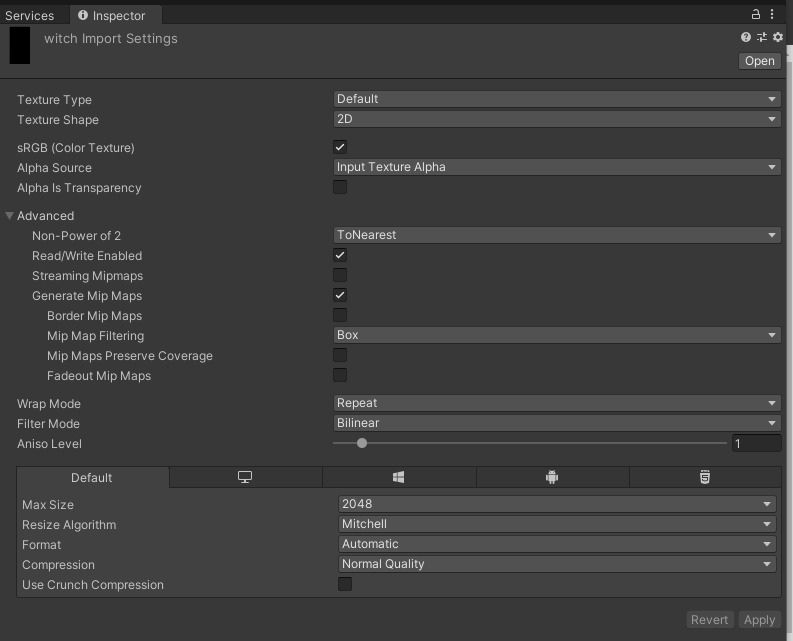
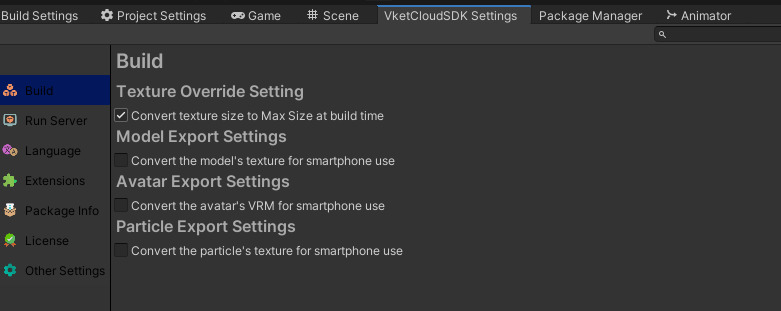

# Guide To Clear Textures

!!! info
    SDK Version: 13.1.0 
    OS: Windows 10 
    Unity: 2019.4.31.f1 
    Browser: Google Chrome

This page describes know-how for displaying dots on VketCloud without blurring, smearing, or missing dots.

## Import Settings

Since VketCloudSDK13.1, a function has been added to automatically convert non-png textures to png. However, please prepare a png file in advance because textures may be blurred when using this function.

### Advanced/Non-Power of 2
With NPOT textures, this option is available, as are various algorithms such as ToNearest and ToLarger. However, NPOT textures are always blurred or missing dots. Therefore, you should prepare a POT texture.

### Advanced/Read/Write Enabled
VketCloudSDK needs to be checked for Read processing in various places.

### FilterMode
Select Point; VketCloudSDK uses this algorithm to scale the texture.

### Compression
Set to None. Doing so may cause blurring of colors.

### Use Crunch Compression
Do not check the box.

## VketCloudSettings

## Conclusion

- Image format should be png
- Make the texture the size of a POT
- Set FilterMode to Point
- Compression should be None
