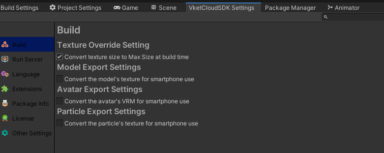

# テクスチャをぼやけさせない

!!! info
    SDK Version: 13.1.0 
    OS: Windows 10 
    Unity: 2019.4.31.f1 
    Browser: Google Chrome

このページはドット絵のぼやけ、にじみ、ドット欠けなどの現象を起こさずにVketCloudで表示させるためのノウハウを記載します。

## Import設定

Vket Cloud SDK13.1以降png以外のテクスチャは自動でpngへ変換する機能が追加されています。ですがこの機能を利用するとテクスチャがにじむ可能性があるため、あらかじめpngを用意してください。

### Advanced/Non-Power of 2
NPOTなテクスチャだとこのオプションが選択できます。ToNearestやToLargerなど各種アルゴリズムが選べます。がしかし、NPOTなテクスチャはどうやってもにじんだりドット欠けします。よってPOTなテクスチャを用意しましょう。

### Advanced/Read/Write Enabled
Vket Cloud SDKは各所でRead処理をするためチェックが必要です。

### FilterMode
Pointを選択してください。Vket Cloud SDKはテクスチャを拡大縮小させる際にこのアルゴリズムを使います。

### Compression
Noneにしてください。色のにじみの原因となります。

### Use Crunch Compression
チェックは入れてはいけません。

## VketCloudSettings

## 結論

- 画像形式はpngにしてください
- POTのサイズのテクスチャにしてください
- FilterModeをPointにしましょう
- CompressionはNoneにします
