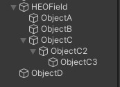

# Tips on using HEOField

By using [HEOField](../HEOComponents/HEOField.md), objects in the Unity scene will appear on the world after build, while unexpected errors and object misplacement may occur by misuse.

This article will explain the usage of [HEOField](../HEOComponents/HEOField.md).

## Basic Use

When attaching child objects ObjectA, ObjectB, ObjectC, ObjectC2, ObjectC3 to an object with [HEOField](../HEOComponents/HEOField.md) attached, these objects will be included within the "Item" generated by [HEOField](../HEOComponents/HEOField.md), and displayed in the scene. (See [Item](../hs/hs_class.md) for definition)

On the other hand, ObjectD will not be displayed in the scene, as it is not a child object of [HEOField](../HEOComponents/HEOField.md).

Also, ObjectA, ObjectB, ObjectC, ObjectC2, ObjectC3 are considered as "[Nodes](../hs/hs_overview.md#player-item-node)", which are subject to actions such as [Show/HideNode](../Actions/Node/ShowHideNode.md), [Enable/DisableCollider](../Actions/Node/EnableDisableCollider.md), and [Enable/DisableClickableNode](../Actions/Node/EnableDisableClickableNode.md).

As above, when putting ObjectD, ObjectE, ObjectF, and ObjectF2 as a child object of object HEOField2 with [HEOField](../HEOComponents/HEOField.md) attached, these objects will be included within the Item "HEOField2", and shown in the scene.

HEOField2 has ObjectD, ObjectE, ObjectF, and ObjectF2 as a node. 
Therefore, the action implementation for showing/hiding these nodes will be as below:

The first Target requires the Item including the target node, which parent object HEOField2 is in this case, while the second Target requires the target object subject to the action.

If the Item-Object combination is wrong, such as setting the first target object to HEOField and the second to ObjectE, the action will not function.

## Misuses and Errors

Below are misuses and errors, therefore avoid the following usages.

1\. Parent-child relations of HEOField

As above, placing an object with [HEOField](../HEOComponents/HEOField.md) within another object with [HEOField](../HEOComponents/HEOField.md) is an error.

Keep in mind as [HEOField](../HEOComponents/HEOField.md) objects should only be in the top-most objects.

2\. Attaching HEOField to every objects

As "attaching [HEOField](../HEOComponents/HEOField.md) will show the objects in the scene", this may seem correct, however [HEOField](../HEOComponents/HEOField.md) is required only once unless intended to implement [Dynamic Loading](../HEOComponents/HEOField.md#configure-dynamic-loading).

On build, .heo files will be generated based on the objects with [HEOField](../HEOComponents/HEOField.md) attached.
Therefore, implementations as above will cause multiple .heo files to be generated, resulting to unexpected resource bloating.

As much as possible, aim to reduce the count of [HEOField](../HEOComponents/HEOField.md).

3\. Attaching other Item-generating HEO components to the object with HEOField

As above, if [HEOField](../HEOComponents/HEOField.md) and [HEOAudio](../HEOComponents/HEOAudio.md) is attached to the same object on build, the same object will be counted redundantly as a separate object.

As objects with same names cause unexpected behavior, this implementation is discouraged.

### Allowed Combinations

1\. +[HEOScript](../HEOComponents/HEOScript.md)

[HEOField](../HEOComponents/HEOField.md) and [HEOScript](../HEOComponents/HEOScript.md) is allowed to be combined.

For instance, the Item defined by [HEOField](../HEOComponents/HEOField.md) can be used in [HEOScript](../HEOComponents/HEOScript.md).

2\. +[HEOReflectionProbe](../HEOComponents/HEOReflectionProbe.md)

[HEOField](../HEOComponents/HEOField.md)と[HEOReflectionProbe](../HEOComponents/HEOReflectionProbe.md) is allowed to be combined.

However, please make sure not to attach [HEOField](../HEOComponents/HEOField.md) on the ReflectionProbe itself.

## Wrap-up

!!! info "Usage of HEOField"
    - Generally 1 HEOField per scene
    - Attach to the top-most object (empty object if possible)
    - When using Dynamic Loading, use more than 2 HEOField components
