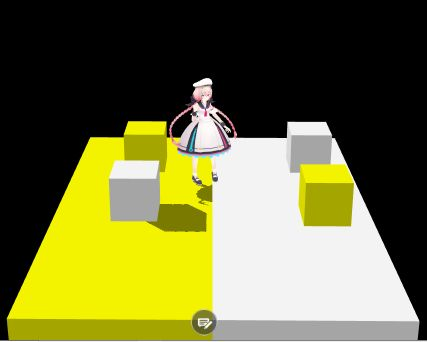
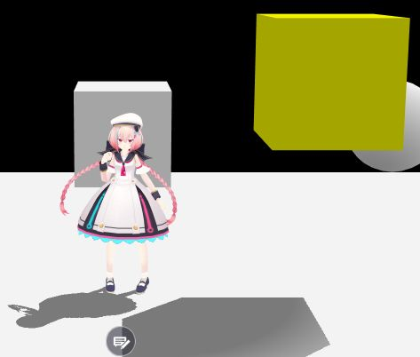
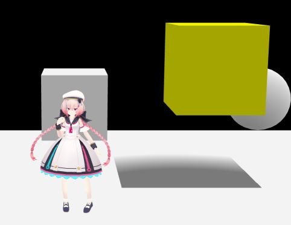
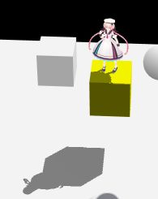

# How to Use VKC Node Shadow/HEO Shadow

## Overview

By using VKC Node Shadow / HEO Shadow, you can configure dynamic shadows (shadow maps).

!!! info "Test Environment"
    SDK Version : 4.1.4 
    OS : Windows 10 
    Unity : 2019.4.31.f1 
    Browser : Google Chrome

!!! warning "The names have changed since VketCloudSDK13."
    HEOShadow → VKCNodeShadow 
    The functionality remains the same, so please read accordingly.

## Implementation Steps

You can control the `Renderer` (`MeshRenderer` or `SkinnedMeshRenderer`) attached to the `HEOShadow` GameObject.

By adding this feature, you can easily check the shadow status in the Unity Editor.

- The **Shadow Caster** of `HEOShadow` controls the **Cast Shadow** field of the `Renderer`.

    - When **Shadow Caster** of `HEOShadow` is ON: Sets the **Cast Shadow** field of `Renderer` to ON.
    
    - When **Shadow Caster** of `HEOShadow` is OFF: Sets the **Cast Shadow** field of `Renderer` to OFF.
    
- The **Shadow Receiver** of `HEOShadow` controls the **Receive Shadow** checkbox of the `Renderer`.

    - When **Shadow Receiver** of `HEOShadow` is ON: Sets the **Receive Shadow** checkbox of `Renderer` to ON.
    
    - When **Shadow Receiver** of `HEOShadow` is OFF: Sets the **Receive Shadow** checkbox of `Renderer` to OFF.

### 1. Attaching HEOShadow

Attach HEOShadow to the object.

- Objects that cast shadows  
  → Check "Is Shadow Caster".

- Objects that receive shadows  
  → Check "Is Shadow Receiver".

It is also possible to set one object as both a Caster and a Receiver.

### 2. Change the ShadowType in VKC Setting Rendering

Change the Shadow Type to `Normal Shadow Map` in the Vket Setting Rendering configuration.  
※ This image uses a screen capture from Ver13.7.7.

### 3. Confirmation
By refreshing the browser, the HEOShadow settings will be loaded.

The shadows of the objects with HEOShadow applied will be rendered realistically.

Shadows have a display distance, and objects that are further away will have their shadows gradually fade, eventually disappearing.

Dynamic shadows will only be output for objects that have HEOShadow attached.  
Objects without HEOShadow will not display shadows and will not cast shadows.

In the image above, only the yellow object has HEOShadow applied. The cube in the air is set as a Caster, and the floor is set as a Receiver.

As you can see, objects without HEOShadow attached do not output or display shadows.

## Comparison of Shadows Generated by HEOShadow

HEOShadow is applied to the floor and the yellow cube at the top right of Vket-chan.  
The differences in shadow creation are shown when changing the Caster and Receiver settings for each HEOShadow.  
true: when checked, false: when unchecked.

No HEOShadow is applied to any other objects in the scene.  
If shadows are cast on the cube, it is photographed while the cube is placed on top.

| Floor Caster | Floor Receiver | Cube Caster | Cube Receiver | Image |
| ---- | ---- | ---- | ---- | ---- |
| false | false | false | false |  |
| true | false | false | false |  |
| false | true | false | false |  |
| true | true | false | false |  |
| false | false | true | false |  |
| true | false | true | false |  |
| false | true | true | false |  |
| true | true | true | false |  |
| false | false | false | true |  |
| true | false | false | true |  |
| false | true | false | true |  |
| true | true | false | true |  |
| false | false | true | true |  |
| true | false | true | true |  |
| false | true | true | true |  |
| true | true | true | true |  |

## Conclusion

Shadows will only be output from the player when there is at least one object set as both a Caster and a Receiver in the scene.

Shadows output from the player will only be cast onto objects set as Receivers.

If there are objects with HEOShadow attached within the range where shadows are cast onto objects set as Receivers, shadows may appear with unexpected shapes (refer to when the settings are false, true, false, false, or false, true, false, true).

## Other Insights

### 1. First-Person View Behavior

When in first-person view, even if you look directly down, your own shadow will not be displayed.

### 2. Camera Behavior

Even if the camera perspective is changed, the shadows will not change.  
As a result, objects that are farther away from the camera's starting point will have no shadows.  
This phenomenon (a potential bug?) occurs where shadows differ depending on the location where the camera is activated, even though the photo is taken from the same spot.

### 3. Dynamic Shadows in HEOMirror

The mirror image shadows in HEOMirror will be the same as the shadows cast based on the player's position.
### 4. Other Parameters Related to Dynamic Shadows

There are parameters to adjust dynamic shadows in the Vket Rendering Settings.

**shadowbias**  
Sets the shadow drawing bias.

**shadowareasize**  
Specifies the distance (in meters) for shadow drawing.

**shadowfadesize**  
Specifies the distance (in meters) for the fade-out effect at the edge of the shadow.

### 5. Influence of Directional Light

By changing the angle of the Directional Light, you can modify the angle of dynamic shadows.

By adjusting the angle, you can achieve effects like the sunset shown above.
