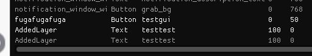

# Controlling Canvas Elements with HeliScript

## Overview

In Lib15, functions like hsSetLayerMask() have been added, enabling direct manipulation of Canvas elements in HeliScript.  
You can apply these functions to standard UI elements like HUDs, but creating your own custom Canvas elements requires a few extra steps.  
This article will walk you through those steps.  

If you'd like to try this out in a Lib15 environment right away, please jump to the "Template" section.

!!! note "Environment"
    Lib Version : 15.0 Beta  
    OS : Windows 10  
    Unity : 2022.3.6f1  
    Browser : Google Chrome

## Creating Custom Canvas Elements

The new Layer and GUI functions introduced in Lib15 are valid for the default Canvas elements, not Activities.  
To create your own Canvas elements, follow the steps outlined below.  

Custom Canvas elements are created using the 「[HSGUIModel](https://vrhikky.github.io/VketCloudSDK_Documents/latest/hs/hs_system_function_gui_HSGUIModel.html)」class.

*This method works from Lib13 onwards.  
Even if you execute it within an Activity, the custom element will be added to the main scene's Canvas.

---

## 1. Defining HSGUIModel

Since `HSGUIModel` is a custom class, it is instantiated using `new`.

```
HSGUIModel _sampleModel;
_sampleModel = new HSGUIModel();
```

## 2. Setting Common Parameters

Set the parameters for the GUI.  
**[Required] **- Must be added, or the element won't work.  
[Recommended] - Not strictly necessary, but recommended.  
[Optional] - Can be omitted unless required for specific environments.

### SetName(string name) [Recommended]

Sets the name of the GUI.  
If not set, the default name will be empty, so using `SetName` is recommended.

### **SetType(string type) [Required]**

Sets the GUI type.  
You must specify one of the following: `image`, `text`, `button`, `slider`, or `html`.  
*The GUI won't display without this setting.

### SetPlatform(string platform) [Optional]

Sets whether the GUI is intended for a mobile platform.  
If `_sp` is specified, the GUI will swap assets when viewed on a smartphone.

### SetLanguage(string language)  [Optional]

If `_en` is entered, it sets the behavior when accessed with an English version of the browser.

### SetShow(bool show) [Recommended]

Sets whether the GUI is visible or not.  
The default setting is `false` (hidden) if not specified.

### SetPos(HS2DI Pos) [Recommended]】

Sets the position of the GUI.  
The default setting is [0,0] if not specified.

### SetSize(HS2DI Size) [Recommended]

Sets the size of the GUI.  
The default size is [100,100] if not specified.

### SetZ(int z) [Recommended]

Sets the display priority of the GUI.  
A larger sum of the Z value in Layer and GUI will display the GUI higher.  
The default value is 0 if not specified.

### SetRotate(float radian) [Optional]

Sets the rotation angle of the GUI.  
If rotation is not required, this can be ignored.  
The default value is `0` if not specified.

### SetRaycastTarget(bool isRaycast) [Recommended]

Sets whether the GUI responds to mouse input.  
The default value is `true` if not specified.

### SetPivot(HS2D pivot) [Recommended]

Sets the pivot of the GUI.  
The default pivot is [0.5,0.5] if not specified.

The GUI's anchor (reference point) can be set to one of the following options:  
`LT` (Top Left), `CT` (Top Center), `RT` (Top Right), `LM` (Left Middle), `CM` (Center), `RM` (Right Middle), `LB` (Bottom Left), `CB` (Bottom Center), `RB` (Bottom Right).

!!! info "HS2DI, HS2D Overview"
    HS2DI and HS2D are custom classes used for setting positions, sizes, and pivots.  
    They contain two variables and can be defined using new and edited using the SetXY function.  
    HS2DI has integer variables, while HS2D has float variables.

```
// Prerequisite: HSGUIModel _guiModel is defined
HS2DI _guiSize;
_guiSize = new HS2DI();
_guiSize.SetXY(50,50); // Setted [50,50]
_guiModel.SetSize(_guiSize);
```

## 3. Setting Type-Specific Parameters

For types like text, image, and button, you need to use different custom classes and set type-specific parameters.

### For Text

Use the HSTextModel class.  
As with HSGUIModel, define it using new and set the parameters for the text.

```
HSTextModel _sampleTextModel;
_sampleTextModel = new HSTextModel();
```

### SetFontSize(int fontSize) [Recommended]

Sets the font size.  
The default size is `16` if not specified.

### SetFontFamily(string fontFamily) [Optional]

Sets the font family.  
You need to specify this in the CanvasList for type: Text as described.

### SetColor(HSColor color) [Optional]

Sets the font color.  
The default color is [0.0, 0.0, 0.0, 1.0] (black).

### SetURLColor(HSColor color) [Optional]

Sets the color for URLs.  
The default color is [0.0, 0.0, 1.0, 1.0] (blue).

### SetText(string text) [Optional]

Sets the initial text value.

### SetAlignment [Optional]

Sets the alignment of the text.  
Choose from the following: `LT`, `CT`, `RT`, `LM`, `CM`, `RM`, `LB`, `CB`, `RB`.  
The default value is `LT`.

### SetCharaSpace [Optional]

Sets the character spacing.  
The default value is `0`.

### SetLineSpace [Optional]

Sets the line spacing.  
The default value is `0`.

### SetOverflowWrap [Optional]

Sets whether the text should wrap.  
The default value is `false`.

### SetURLClickable [Optional]

Sets whether URLs in the text are clickable.  
The default value is `false`.

!!! info "HSColor Overview"
    HSColor is a custom class used to define color.  
    Use the following methods to set colors:  

    **SetRGB** : Sets the color using RGB values.  
    **SetRGBA** : Sets RGB values with an alpha (transparency) value.  Both are `float` types, with a max value of `1`.

```
HSTextModel _textModel;
HSColor _red, _alphaGreen;
_red.SetRGB( 1.0, 0, 0 ); // Red
_alphaGreen.SetRGBA( 0, 1.0, 0, 0.5 ); // Semi-transparent green
_textModel.SetColor(_red); // Set regular text color to red
_textModel.SetURLColor(_alphaGreen); // Set URL text color to semi-transparent green
```

### For Image

Use the `HSImageModel` class.
As with `HSGUIModel`, define it using `new` and set the image-specific parameters.

```
HSImageModel _sampleImageModel;
_sampleImageModel = new HSImageModel();
```

### **SetURI(string uri)  [Required]**

Sets the image URI.

### SetUVArea(HSRect UVArea) [Optional]

Sets the UV area for the image.

### SetLTRB(HSRectLTRB LTRB) [Optional]

Sets the LTRB for the image.

!!! info "HSRect, HSRectLTRB Overview"
    HSRect and HSRectLTRB are custom classes used for setting UV and LTRB areas.  
    You can use functions to set them using either HS2DI for setting coordinates or int for setting values.
    Here, I will introduce a function that sets the values using four int types.

```
HSRect _uvAreaRect;
HSRectLTRB _ltrbRect;
_uvAreaRect.SetXYWH(150,200,300,300);
_ltrbRect.SetLTRB(100,100,200,400);
```

### For Button

Use the HSButtonModel class.
As with HSGUIModel, define it using new and set button-specific parameters.

```
HSButtonModel _sampleButtonModel;
_sampleButtonModel = new HSButtonModel();
```

### **SetFileName(string fileUri) [Required]**

Sets the URI for the button's normal state image.

### SetOnCursorFileName(string fileUri) [Recommended]

Sets the URI for the image when the mouse cursor hovers over the button.

### SetDownFileName(string fileUri) [Recommended]

Sets the URI for the image when the button is pressed.

### SetClickAreaSize(HS2DI areaSize) [Recommended]

Sets the click area size for the button.

### SetUVArea(HSRect UVArea) [Optional]

Sets the UV area for the button image.

### SetLTRB(HSRectLTRB LTRB) [Optional]

Sets the LTRB area for the button image.

!!! info 
    For details on HS2DI, refer to the common parameter settings at the bottom. For HSRect and HSRectLTRB, refer to the "Image" section.

### 4. Reflecting Type-Specific Parameters in HSGUIModel

Use `SetTextModel`, `SetImageModel`, or `SetButtonModel` functions in `HSGUIModel` to register the type-specific parameters.

### 5. Adding the GUI to the Layer

To add the GUI to the Layer, use the `hsCanvasAddGUI(string Layername, bool isPortrait, HSGUIModel GUIModel) `function.

These are the steps for creating a GUI element.

---

## [Lib15+ Exclusive] Adding Layers

You can create a new Layer using the `hsAddLayer(string LayerName, bool IsPortrait, bool IsShow, int Z)` function.

!!! note "Arguments Overview"
    **LayerName**: The name of the layer to add.  
    **IsPortrait**: Specifies whether the layer is for portrait or landscape mode.  
    **IsShow**: Sets whether the layer is initially visible.  
    **Z**: Specifies the display priority for the layer.

By combining these, you can define custom Canvas elements in HeliScript.
---

## Template

Setting up custom Canvas elements in HeliScript requires several steps and can be quite cumbersome.  
Therefore, we've provided a template code that you can use to quickly check the required steps and test your setup.

!!! warning
    This is meant to verify basic functionality only.
    For more advanced customization, please refer to the methods explained earlier.

The template includes examples for Text, Image, and Button.

#### Template - Text

```
void AddTextGUI(string guiName, string layerName, string guiText, int posX, int posY, int sizeX, int sizeY, int z){
    HSGUIModel guiModel;
    HS2DI guiPos, guiSize;
    HSTextModel textModel;
    
    guiModel = new HSGUIModel();
    guiPos = new HS2DI();
    guiPos.SetXY(posX, posY);
    guiSize = new HS2DI();
    guiSize.SetXY(sizeX, sizeY);
    textModel = new HSTextModel();
    
    // Define common parameters for HSGUIModel
    guiModel.SetName(guiName);
    guiModel.SetType("text");
    guiModel.SetShow(true);
    guiModel.SetPos(guiPos);
    guiModel.SetSize(guiSize);
    guiModel.SetZ(z);
    guiModel.SetRotate(0);
    
    // Define type-specific parameters for HSTextModel
    textModel.SetText(guiText);
    textModel.SetOverflowWrap(true);
    textModel.SetURLClickable(true);
    
    // Register type-specific parameters in HSGUIModel
    guiModel.SetTextModel(textModel);
    
    // Create Layer for adding GUI
    hsAddLayer(layerName, false, true, 10);
    hsAddLayer(layerName, true, true, 10);
    
    // Add GUI to Layer
    hsCanvasAddGUI(layerName, false, guiModel);
    hsCanvasAddGUI(layerName, true, guiModel);
}

// Example Usage
AddTextGUI(
    "textTemplate",
    "textTempGUI",
    "Template Text",
    0, 100,
    200, 50,
    5
);
```

#### Template - Image

```
void AddImageGUI(string guiName, string layerName,string fileUri, int posX, int posY, int sizeX, int sizeY, int z){
    HSGUIModel guiModel;
    HS2DI guiPos, guiSize;
    HSImageModel imageModel;
    
    guiModel = new HSGUIModel();
    guiPos = new HS2DI();
    guiPos.SetXY(posX, posY);
    guiSize = new HS2DI();
    guiSize.SetXY(sizeX, sizeY);
    imageModel = new HSImageModel();
    
    // Define common parameters for HSGUIModel
    guiModel.SetName(guiName);
    guiModel.SetType("image");
    guiModel.SetShow(true);
    guiModel.SetPos(guiPos);
    guiModel.SetSize(guiSize);
    guiModel.SetZ(z);
    guiModel.SetRotate(0);
    
    // Define type-specific parameters for HSImageModel
    imageModel.SetURI(fileUri);
    
    // Register type-specific parameters in HSGUIModel
    guiModel.SetImageModel(imageModel);
    
    // Create Layer for adding GUI
    hsAddLayer(layerName, false, true, 10);
    hsAddLayer(layerName, true, true, 10);
    
    // Add GUI to Layer
    hsCanvasAddGUI(layerName, false, guiModel);
    hsCanvasAddGUI(layerName, true, guiModel);
}

// Example Usage
AddImageGUI(
    "imageTemplate",
    "imageTempGUI",
    "./Image/sample.png",
    50, 50,
    200, 200,
    5
);
```

#### Template - Button

```
void AddButtonGUI(string guiName, string layerName, string normalUri, string onCursorUri, string onCursorUri, string downUri, int posX, int posY, int sizeX, int sizeY, int z){
    HSGUIModel guiModel;
    HS2DI guiPos, guiSize;
    HSButtonModel buttonModel;
    
    guiModel = new HSGUIModel();
    guiPos = new HS2DI();
    guiPos.SetXY(posX, posY);
    guiSize = new HS2DI();
    guiSize.SetXY(sizeX, sizeY);
    buttonModel = new HSButtonModel();
    
    // Define common parameters for HSGUIModel
    guiModel.SetName(guiName);
    guiModel.SetType("button");
    guiModel.SetShow(true);
    guiModel.SetPos(guiPos);
    guiModel.SetSize(guiSize);
    guiModel.SetZ(z);
    guiModel.SetRotate(0);
    
    // Define button-specific parameters for HSButtonModel
    _buttonModel.SetFileName(normalUri);
    _buttonModel.SetOnCursorFileName(onCursorUri);
    _buttonModel.SetDownFileName(downUri);
    _buttonModel.SetClickAreaSize(guiSize);
}

AddButtonGUI(
    "buttonTemplate",
    "buttonTempGUI",
    "./Image/buttonsample.png",
    "./Image/buttoncursorsample.png",
    "./Image/buttondownsample.png",
    -100, 50,
    150, 150,
    5
);
```

---

## Additional Insights

The GUI created using this method will appear in the GUI list in debug mode (F2).
Note: This only applies when a Layer and GUI are created, and the GUI is registered to the Layer.



GUI created in Activity will not appear here.