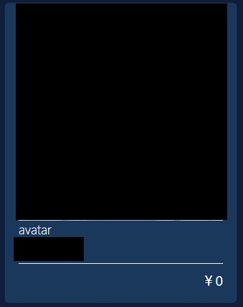
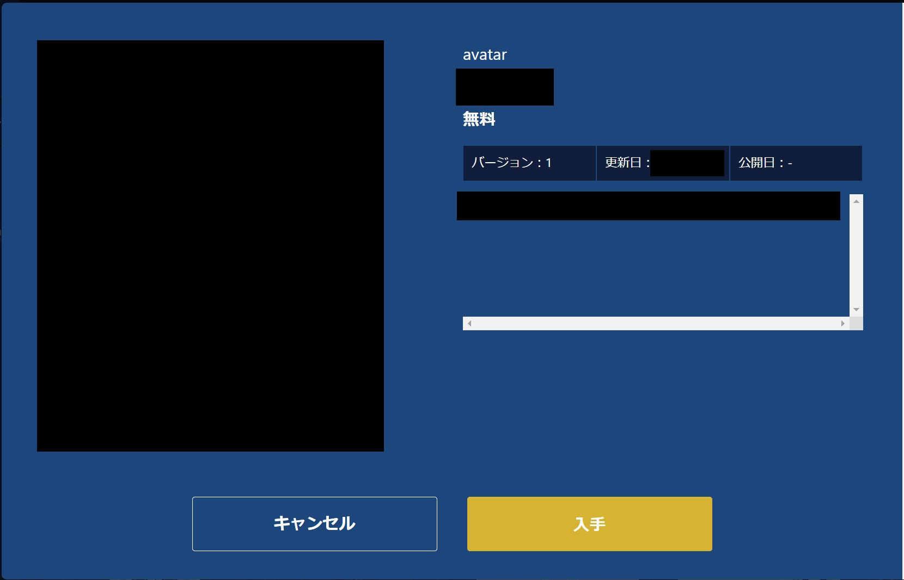
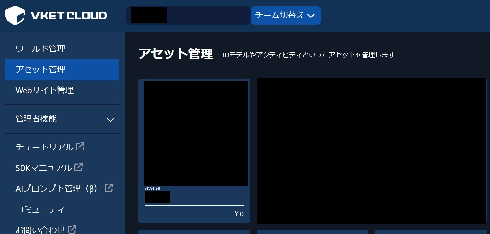
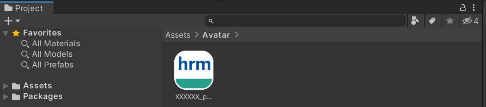
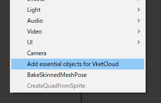
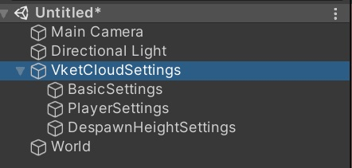
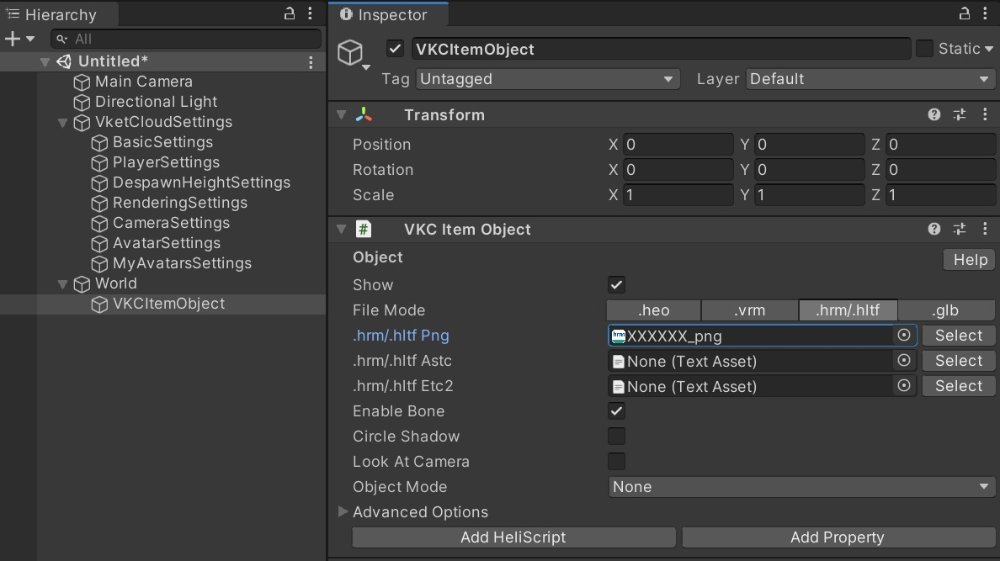

# How to Set Up an Avatar Downloaded from the Asset Store

## How to Use the Asset Store
To use the Asset Store, you must first create a Vket Cloud account. If you have not yet created an account, please refer to [this guide](../AboutVketCloudSDK/SetupAccount.md) to create one.

1. After logging in, click the following link to access the Asset Store:
   - [Asset Store](https://cloud.vket.com/account/asset/store){target=_blank}
2. Select an asset with the (avatar) category label as shown below. When selecting an asset, details such as the asset’s name, version, description, and price will be displayed.

3. After reviewing the details, click "Obtain."

4. You can check and download the acquired assets on the [Asset Management page](https://cloud.vket.com/account/asset){target=_blank}. Once downloaded, let's try placing them in your world using VketCloudSDK.

## Placing the Obtained Avatar in the World

### Step 1: Download and Unpack the Asset
Download the avatar (.hrm) from the Asset Store. Then, place the file in Unity's Assets folder.

### Step 2: Create Required Objects in Unity's Hierarchy
In the Hierarchy window, create the required objects.

Once created, the configuration objects will be displayed as shown below.

### Step 3: Add VKC Item Object
- Place the VKC Item Object as shown below and specify the avatar file (.hrm).
- Additionally, enable the "Enable Bone" option.

### Step 4: Place and Build the Preset Avatar
- If you wish to place the avatar as a preset, please refer to the following page:
   - [Placing a Preset Avatar](../WorldMakingGuide/PresetAvatar.md)

### Step 4: Adjust and Build the Avatar
Finally, edit the Transform of the VKC Item Object to adjust the position and rotation of the avatar. Once this is done, build the world. After the build is complete, verify that the avatar is correctly placed in the world.
