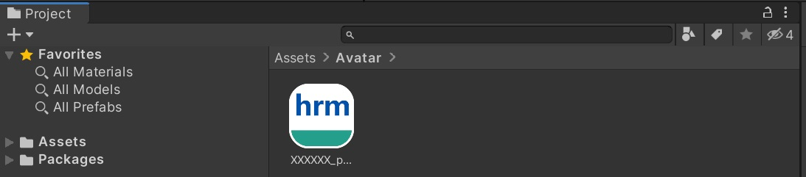

# アセットストアからダウンロードするアバターの設定方法

## アセットストアの使い方
アセットストアを使うには、初めにVket Cloudのアカウントを作成する必要があります。もしアカウントが未作成の場合は、[こちら](../AboutVketCloudSDK/SetupAccount.md)を参照してアカウントを作成してください。

1. ログインしたうえで以下のリンクをクリックし、アセットストアにアクセスします。
   - [アセットストア](https://cloud.vket.com/account/asset/store){target=_blank}
2. 以下のような(avatar)とのカテゴリ表記のあるアセットを選択してください。アセットを選択すると、アセットの名前、バージョン、説明、価格などが表示されます。

3. ここでは、詳細を確認した上で「入手」を選択します。

4. 入手したアセットはマイページの[アセット管理画面](https://cloud.vket.com/account/asset){target=_blank}にて確認とダウンロードができます。続いてダウンロードしたら、VketCloudSDKを使用してワールドに配置してみましょう。

## 入手したアバターをワールドに配置する

### ステップ1: アセットのダウンロードと解凍
アセットストアから入手したアバター(.hrm)をダウンロードします。次に、ファイルをUnityのAssetsフォルダ内に配置します。

### ステップ2: UnityのHierarchyに必須オブジェクトを作成
Hiearchyウィンドウで必須オブジェクトを作成します。

作成すると以下の様な設定オブジェクトが表示されます。

### ステップ3: VKC Item Objectの追加
- 以下のようにVKC Item Objectを配置し、アバターのファイル（.hrm）を指定します。
- またEnable Boneを有効化してください

### ステップ4: プリセットアバターの配置とビルド
- またプリセットアバターとして配置する場合は、以下ページをご参照ください。
   - [プリセットアバターの配置](../WorldMakingGuide/PresetAvatar.md)

### ステップ4: アバターの配置とビルド
最後に、VKCItemObjectのTransformを編集し、アバターの位置、角度を調整します。これが完了したら、ワールドをビルドします。ビルドが終われば、ワールド内にアバターが正しく配置されているか確認しましょう。