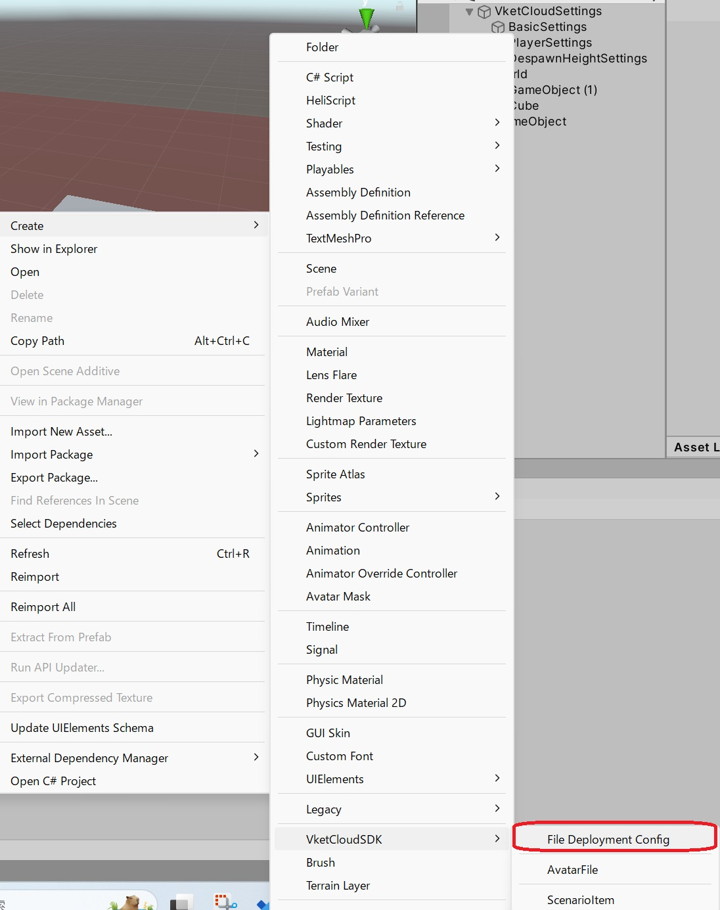
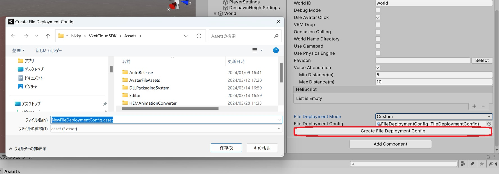
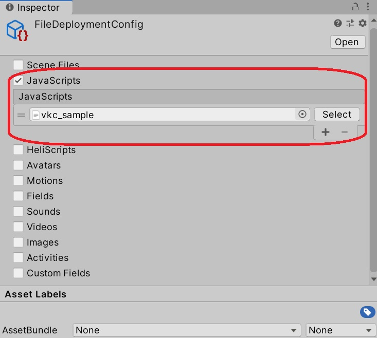
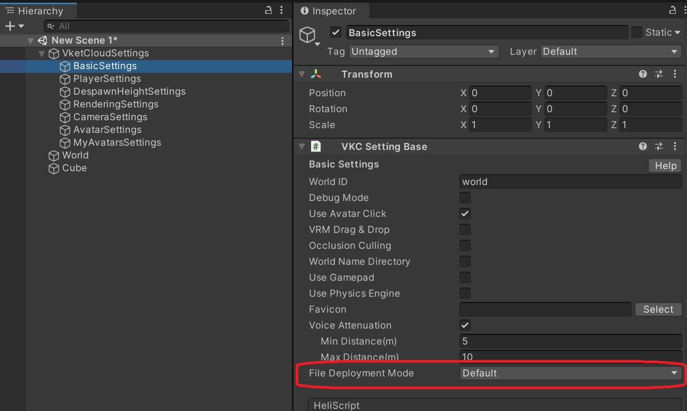
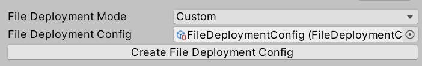

# Enabling JS Upload Feature in SDK 13.7 (Paid Plans Only, SDK 13.7 and Later)

## Purpose

By uploading JavaScript (aka JS), you can execute JS in your world. 

You can implement various gimmicks using JS in Vket Cloud, such as "browser games," "3D websites," and "online events."

JS is a programming language that is commonly used in the development of web browser-based applications. JS is often used in combination with HTML and CSS, making it easy for beginners to start developing on the web browser. JS is also characterized by its rich library support.

With this feature, Vket Cloud developers can achieve the following:

- **Implementation of Game World Save Functionality**: Implement a full-fledged online game with server synchronization and game world save functionality.

- **Weather Animation in the World Using Public Weather APIs**: Change the weather animation in the world using publicly available weather APIs.

- **Operation of a Membership-based Web Metaverse Space Linked to Your Own Database**: Operate a membership-based web metaverse space linked to your own database.

## Sample JS Upload World

We have prepared a sample world for uploading JS. By uploading the sample JS, you can display the state of the keyboard (pressed/released) as text in the world.

For more information, refer to [Introducing Sample JS Upload](../WorldMakingGuide/JsUpload_Sample.md).

## Prerequisites

- **SDK 13.7 and Later**
- You must have read and agreed to the terms of service and submitted the application form ([Terms of Service](https://account.vket.com/terms?locale=en#vket-cloud){target=_blank}, [Application Form](https://forms.gle/uEwNtVvMWvf4SqZV8){target=_blank}).
      - When applying, please prepare your Team ID and VketID. Please check [Team and Plan Management](https://cloud.vket.com/en/account/admin/team){target=_blank} and [Account Management](https://cloud.vket.com/en/account/admin/member){target=_blank} in Vket Cloud.

## JS Submission Procedure

1. **Right-click in the Project Window** and create the `File Deployment Config` item.

   

2. **Access Base Setting** and change `File Deployment Mode` to `Custom`. Then, create the file in your Asset by clicking the `Create File Deployment Config` button.

   

3. Set the JavaScript you want to include in the target `File Deployment Config`.

   **Sample JS**: `vkc_sample.js`

   

   (Note: When specifying multiple files, the loading order during `Build and run` follows the order of this setting. However, in the Vket Cloud production environment, the files will be loaded in alphabetical order. To control the loading order, for example, you can prefix file names with a letter like "z" for files that you want to be loaded later.)

4. Set the target `Scriptable Object` in the **Base Setting's File Deployment Config**.

   
   

5. Finally, perform **Build And Run** or **Upload**.

This completes the procedure for setting up the JS upload feature in SDK 13.7.
