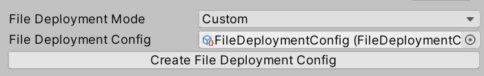

# JS入稿機能をSDK13.7にてOnにする方法 (有償プランのみ、SDK13.7以降)

## 用途

JavaScript(以下、JS)をアップロードすることで、ワールド内でJSを実行することができます。
例えば、JSを使用して、外部のAPI（天気情報、ニュース、SNSフィードなど）と連携し、VR内でリアルタイムの情報を表示します。

その他の用途としては以下が挙げられます。

- **データ収集と解析**: 収集されたユーザーデータをリアルタイムで解析し、JSを利用して分析結果を表示する機能をVR空間内に埋め込む。ユーザーの行動データを基にした即時のフィードバックを提供し、体験の最適化に役立てることができます。

- **外部APIとの連携**: JSを使用して、外部のAPI（天気情報、ニュース、SNSフィードなど）と連携し、VR内でリアルタイムの情報を表示します。コンテンツの動的な更新や、外部情報のインポートが可能になり、よりインタラクティブな体験を提供します。

- **インタラクティブなコンテンツの実装**: JSを使って、ユーザーがクリックやジェスチャーを行うたびにリアルタイムで反応するインタラクティブなエフェクトやイベントを追加します。コンテンツに対するユーザーの没入感を高め、より深い体験を提供します。

- **ゲームロジックのカスタマイズ**: JSを使用して、VR内でのゲームロジック（得点システム、敵の挙動、アイテムの動作など）をカスタマイズし、独自のゲーム体験を構築します。ゲーム開発者が独自のルールやシステムを簡単に実装できるため、クリエイティブなゲームデザインが可能になります。

## 対応可能SDKバージョン

- **SDK13.7以降**

## 前提条件
- SDK13.7.7以降であること
- アカウントがFreePlan以外であること(Basic, Enterprise, Business等）
- 利用規約と申請フォームを確認していること（[利用規約](https://cloud.vket.com/term)、[申請フォーム](https://forms.gle/7Q7Q7Q7Q7Q7Q7Q7Q7)）
- 申請フォームを申請していてかつ、承認されていること。

## 対象者

以下の有償プランを利用しているユーザーでしたら、JS入稿機能をSDK13.7以降、Onにし、アップロードできます。無料プランの場合は、強制的にJSをアップロード対象ファイルから排除いたしいます。

- ベーシックプラン
- ビジネスプラン
- ビジネスプラスプラン
- エンタープライズプラン

料金プランについて知りたい際は、[こちら](https://cloud.vket.com/plan){target=_blank}をご確認ください。

## JS入稿手順
1. **Project Window右クリック**で、`File Deployment Config`項目を作成します。

   

2. **Base Settingにアクセス**し、`File Deployment Mode`を`Custom`に変更します。次に、`Create File Deployment Config`ボタンでファイルをAsset内に作成します。

   

3. 対象の`File Deployment Config`にセットしたいJSをセットします。

   **サンプルJS**: `vkc_sample.js`

   

4. **Base SettingのFile Deployment Config**に対象の`Scriptable Object`をセットします。

   
   

5. 最後に、**Build And Run**もしくは**Upload**を行います。

これで、SDK13.7におけるJS入稿機能の設定手順が完了です。

## サンプルJS入稿手順
### 前提条件
- SDK13.7.7以降であること
- アカウントがFreePlan以外であること(Basic, Enterprise, Business等）
- 利用規約と申請フォームを確認していること（[利用規約](https://cloud.vket.com/term)、[申請フォーム](https://forms.gle/7Q7Q7Q7Q7Q7Q7Q7Q7)）
- 申請フォームを申請していてかつ、承認されていること。
- 

