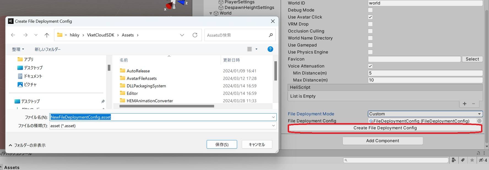
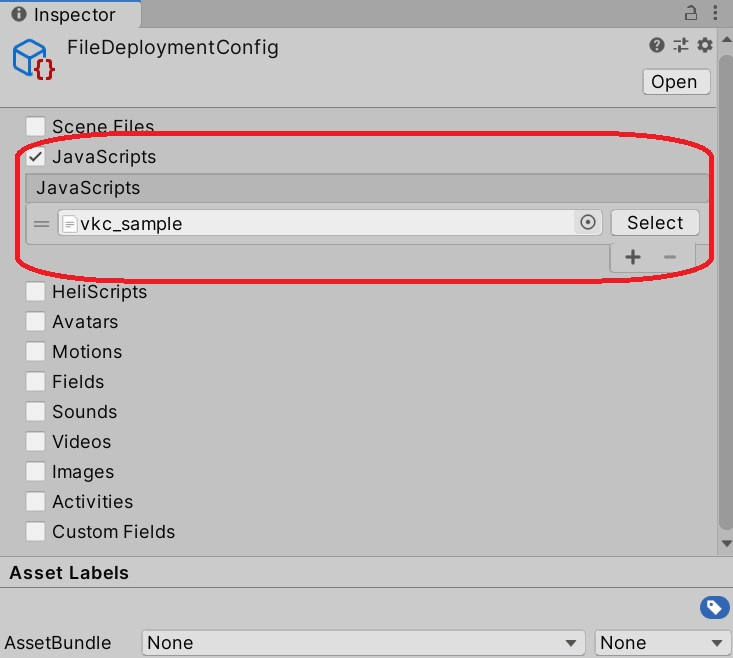
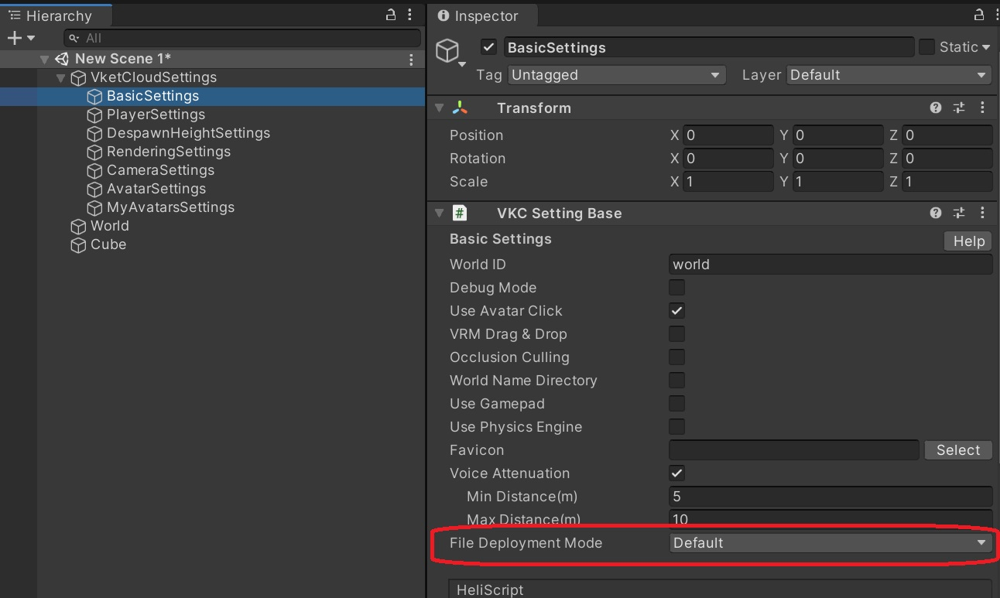

# JS入稿機能をSDK13.7にてOnにする方法 (有償プランのみ、SDK13.7以降)

## 用途

JavaScript(以下、JS)をアップロードすることで、ワールド内でJSを実行することができます。

Vket Cloud で実現ができる「ブラウザゲーム」「3Dウェブサイト」「オンラインイベント」などにJavascirptベースのスクリプト（プログラミング）を使用した様々なギミックを実装できるようになります。

プログラミング言語「JavaScript（以下、JS）」は、一般的にWebブラウザベースのアプリケーションの開発で利用されることが多い言語です。HTMLやCSSと組み合わせてJSもよく利用されており、Webブラウザ上での開発をはじめたばかりの人も学びやすく、ライブラリが豊富な点も特徴的です。

今回の機能提供により、Vket Cloudの開発者は具体的に下記のようなことが実現できるようになります。

- **ゲームワールドのセーブ機能の実装、サーバーとの同期を実現した本格的なオンラインゲーム制作**

- **一般公開されているお天気APIを活用したワールド内の天候アニメーションの変化**

- **自社のデータベースと連携した会員制のWebメタバース空間の運用**

## 前提条件

- **SDK 13.7 以降**
- 利用規約を読み、同意した上で、申込フォームを提出する必要があります。([利用規約](https://account.vket.com/terms?locale=ja#vket-cloud){target=_blank}, [申込フォーム](https://forms.gle/4iUWipYhWMYCgsds7)){target=_blank}
   - 申請の際に、チームIDやVketIDをご準備ください。それぞれ、Vket Cloudの[チームとプランの管理・変更](https://cloud.vket.com/account/admin/team){target=_blank}と[所属アカウントの管理](https://cloud.vket.com/account/admin/member){target=_blank}をご確認ください。

## JS入稿手順
1. **Project Window右クリック**で、`File Deployment Config`項目を作成します。

   

2. **Base Settingにアクセス**し、`File Deployment Mode`を`Custom`に変更します。次に、`Create File Deployment Config`ボタンでファイルをAsset内に作成します。

   

3. 対象の`File Deployment Config`にセットしたいJSをセットします。

   **サンプルJS**: `vkc_sample.js`

   

4. **Base SettingのFile Deployment Config**に対象の`Scriptable Object`をセットします。

   
   

5. 最後に、**Build And Run**もしくは**Upload**を行います。

これで、SDK13.7におけるJS入稿機能の設定手順が完了です。

## サンプルJS入稿手順
### テスト手順

1. 