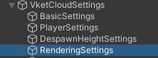
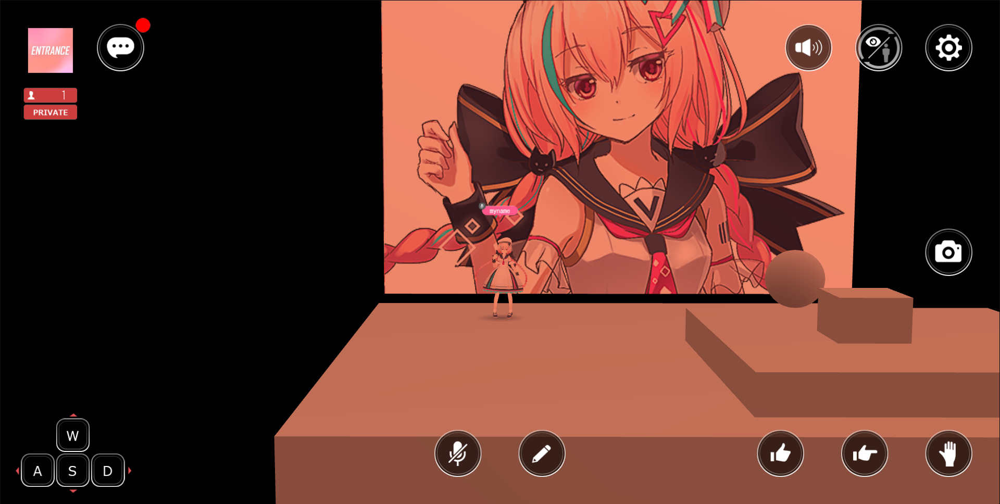
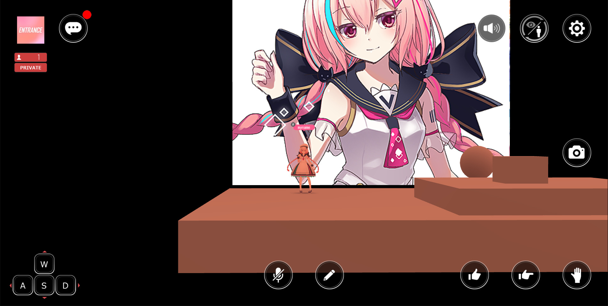

# Light Scattering

By configuring light scattering settings, you can achieve effects such as fog-like expressions or distant scenery appearing hazy and blue.

!!! info Test Enviroment
    SDK version: 4 
    OS: Windows 10 
    Unity: 2019.4.31.f1 
    Browser: Google Chrome 

!!! info The location of settings has changed in Vket Cloud SDK version 12 and later
    HEOWorldSetting →  It is located in RenderingSettings in VketCloudSettings 
     
    Also, in order to display RenderingSettings, you need to set the setting mode to Advanced in VketCloudSettings. 
    

## Difference between with and without light scattering

With light scattering (cloudy expression)

No light scattering

## How to check the light scattering settings

In HEOWorldSetting, with Debug Mode checked, press the F2 key during execution to open the debug window, select the Renderring tab, expand the LightScattering item, and check the light scattering settings while adjusting them. You can.

!!! info 
    Before Vket Cloud SDK9, the UI looks different, but the functions that can be used are roughly the same.

By reducing the Distance, you can express deep fog,

By adjusting LightColor/SunColor, it is possible to create a sunset-like effect. However, I think it will look more natural if it matches the reflection probe.

After checking the setting values, check the Light Scattering of Rendering in WorldSetting,
Enter the numerical value in the input field that appears.

By building in this state, you can create a world that reflects the light scattering settings.

## Exclude light scattering by material

You may want to exclude light scattering for each material, such as SkyBox. In that case, use "VketChanUnlit.shader" included in the SDK,

Build with the "UseLightScattering" checkbox unchecked.

## Other findings

If you click the "Use" checkbox if Light Scattering was set during build, it will switch to a state where Light Scattering is not applied.
