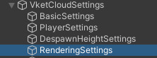
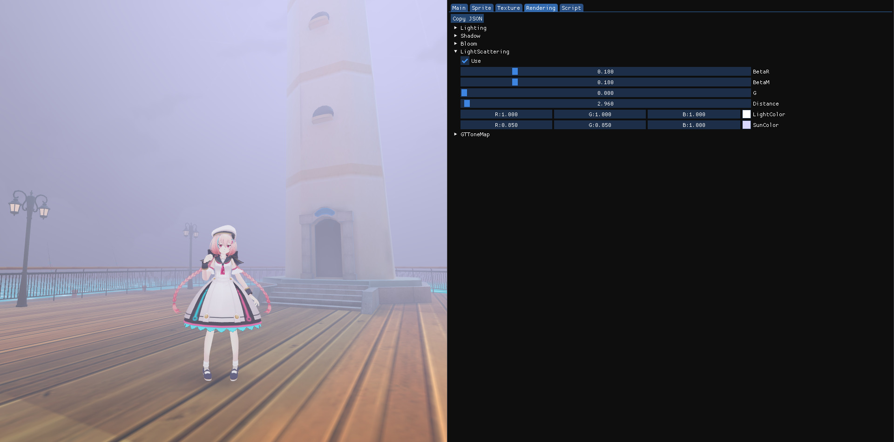
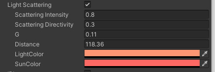
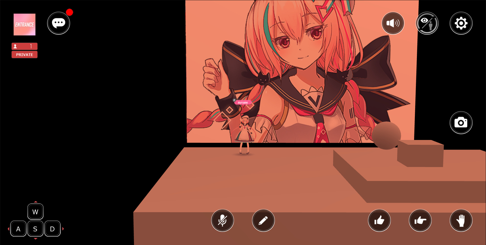
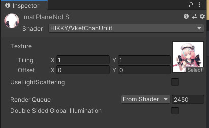
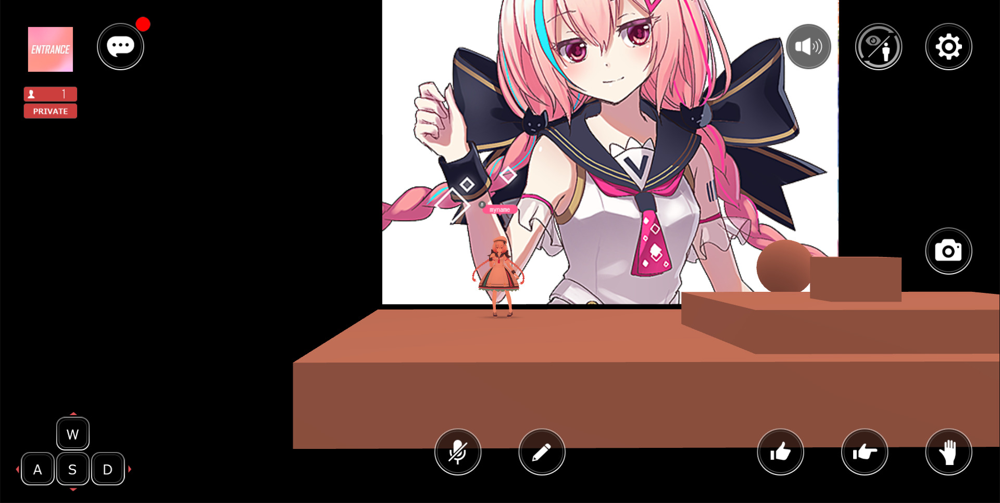
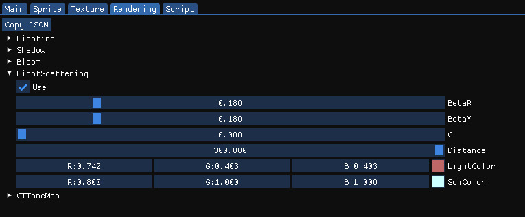

# ライトスキャタリング

ライトスキャタリングの設定をおこなうことで、フォグのような表現や、遠景が青く霞むような表現が出来ます。

!!! info 検証環境
    SDKバージョン: 4 
    OS: Windows 10 
    Unity: 2019.4.31.f1 
    ブラウザ: Google Chrome 

!!! info VketCloudSDK12以降で設定の場所が変化しています
    HEOWorldSetting → VketCloudSettings内RenderingSettings内にあります。 
     
    また、RenderingSettingsを表示するためには、VketCloudSettingsにて、設定モードを詳細(Advanced)にする必要があります。 
    

## ライトスキャタリングがある時とない時の違い

ライトスキャタリングあり(曇り表現)

ライトスキャタリングなし

## ライトスキャタリング設定の確認方法

HEOWorldSettingにて、Debug Modeにチェックが入っている状態で実行時にF2キーを押してデバッグウィンドウを開き、Renderringタブを選択し、LightScatteringの項目を展開すると、ライトスキャタリングの設定を調整しながら確認することが出来ます。

!!! info 
    VketCloudSDK9以前はUIの見た目が異なりますが、使える機能はおおよそ同じです。

Distanceを小さくすることで深いフォグを表現したり、

LightColor/SunColorを調整することで夕焼けのような表現も可能です。ただし、リフレクションプローブと見た目を合わせる方が違和感がない見た目になると思います。

設定数値を確認したら、WorldSettingのRenderingのLight Scatteringにチェックを入れ、
表示された入力欄に数値を入力しましょう。

この状態でビルドすることで、ライトスキャタリング設定が反映された状態のワールドを作り出すことができます。

## ライトスキャタリングをマテリアルごとに除外する
SkyBoxなどライトスキャタリングをマテリアル単位で除外したい場合があります。その場合は、SDKに含まれている「VketChanUnlit.shader」を使用し、

「UseLightScattering」のチェックボックスをオフにしてビルドします。

## その他知見

「Use」チェックボックスはビルド時にLight Scatteringを設定していた場合にクリックすると、Light Scattering未適用状態に切り替わります。
つまり、UseボタンはLight Scatteringの適用/未適用の切り替えボタンです。
