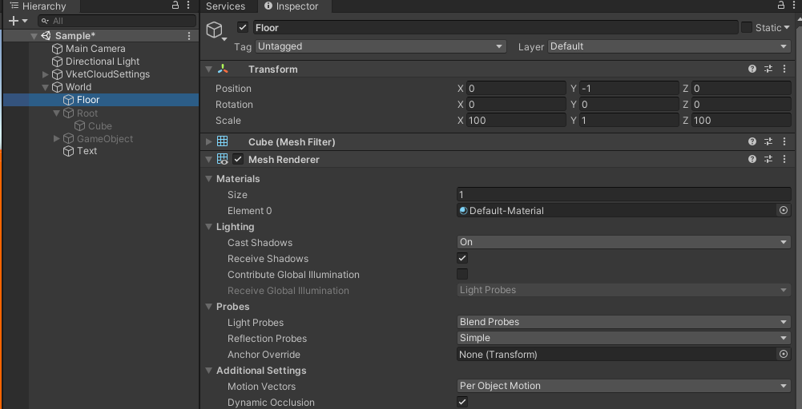
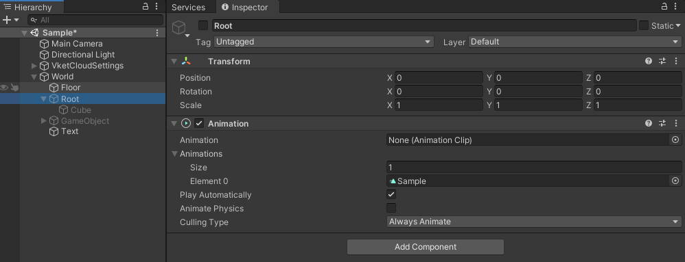
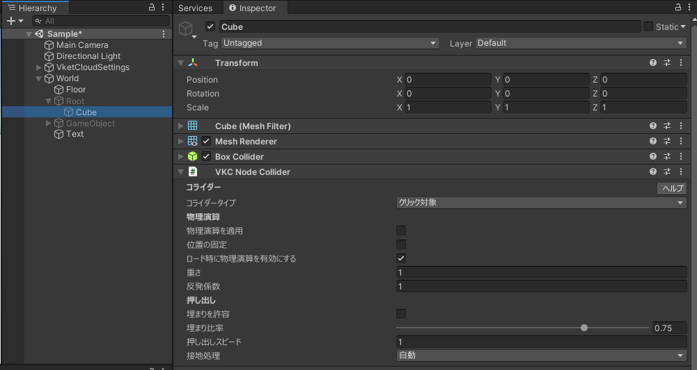
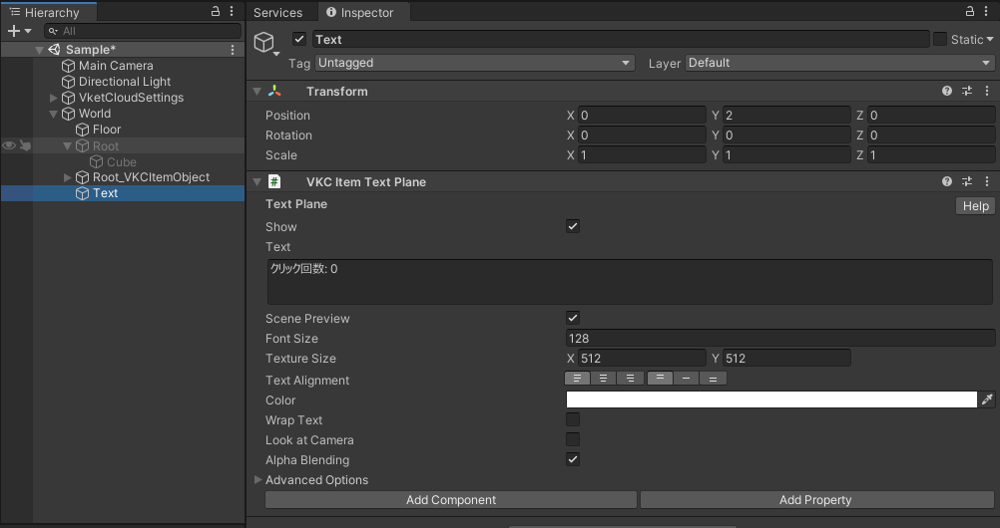
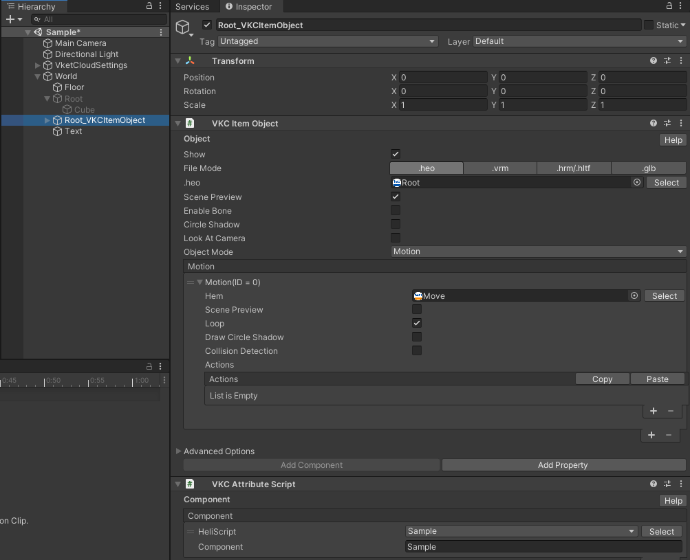

# クリック判定できる可動オブジェクトの作り方

VKCItemObjectはItemでありNodeではないため、 [こちら](../hs/hs_overview.md) のマニュアルにあるクリック判定の方法のGetNodeIndexByNameが使用できません。ですが別のアプローチでクリック判定をもちながら移動するオブジェクトはVketCloudで実現可能です。下記の手順を行います。

## Floorの設定



1. Cubeを作成、名前をFloorに
2. Scaleを `100, 1, 100` に設定
3. Positionを `0, -1, 0` に設定

## HEOとHEMの出力





1. Rootと名前をつけた空のGameObjectを作成します
2. Rootの子供にCubeを作成します
3. Rootに `Animation` のコンポーネントをAddします
4. Cubeが左右に移動するAnimationClipを作成します
5. Rootを右クリックし、 `VKCHelper>Export Motion` 
6. 作成されたHEMファイルをAssetsフォルダ以下に保存します
7. CubeにVKCNodeColliderをAddし、`ColliderType` を `Clickable` にします
8. Rootを右クリックし、 `VKCHelper>CrateVKCObject`
9. Root_VKCItemObjectが生成されます。Rootは不要になったので削除します
10. 生成されたRoot_VKCItemObjectの `ScenePreview` をONにします
11. オブジェクトモードを `Motion` にします
12. Hemに作成したHEMファイルをドラッグアンドドロップします
13. LoopをONにします

## Click確認用TextPlaneの配置



1. Textと名前をつけた空のGameObjectを作成
2. VKCItemTextPlaneをAdd
3. そのままだと確認しづらいのでPositionを`0, 2, 0`に設定します
4. テキストに `クリック回数: 0` を設定

## HeliScriptの設定



1. Projectのペインで右クリック>HeliScriptでHeliScriptを新規作成します
2. 下記HeliScriptをペースト

```
component Sample
{
    Item target;
    int count;

    public Sample()
    {
        target = hsItemGet("Text");
    }

    public void OnClickNode(int NodeIndex)
    {
        count = count + 1;
        target.WriteTextPlane("クリック回数: " + count.ToString());
    }
}
```

3. Root_VKCItemObjectにVKCAttributeScriptをAdd
4. VKCAttributeScriptの+ボタンを押し、選択ボタンからSampleを選択します

## BuildAndRun


BuildAndRunをすると上記のようになります。移動するCubeをクリックするとTextのクリック回数が増えていきます。
