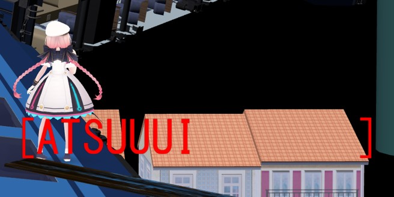
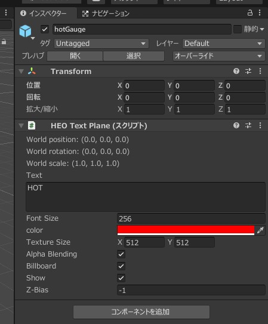

# Text that follows player

## Overview

Here's how to implement text that follows the player.



!!! info "Environment"
    SDK Version : SDK5.4.0  
    OS : Windows 10  
    Unity : 2019.4.31.f1  
    Browser :Google Chrome  

!!! warning "The names have changed since VketCloudSDK13."
    HEOTextPlane → VKCItemTextPlane  
    The functionality remains the same, so please read accordingly.

## Implementation Steps
        
### 1. Prepare the HEO Text Plane



Attach the HEO Text Plane component to the GameObject in the scene that you want to follow the player.

Since you will later retrieve the GameObject using its name in HeliScript, it is recommended to give the GameObject a clean name, such as “textPlane_1”.

If you want the text plane to always face towards the player, enable the Billboard option.

Make sure that the "Show" option is enabled.

Set the Z-Bias to a negative value to prevent the text from being hidden behind objects. A recommended value is -0.05 or lower.

### 2. Prepare the HeliScript

```
component FollowPlayer
{
    Item m_textPlane_1;
    public FollowPlayer
    {
        m_textPlane_1 = hsItemGet("textPlane_1");
    }
    public void Update()
    {
        m_textPlane_1.SetPos(m_player.GetPos());
    }
}
```

Use hsItemGet() to obtain the HEO Text Plane by the name of the GameObject from step 1, and in the Update() method, move the position of the HEO Text Plane to the player's position every frame.

## Other Notes
With the implementation as described on this page, the text will follow the player's origin. If you want to display it offset, such as above the player's avatar's head, you can add an offset vector to the player's origin position, like this: `m_textPlane_1.SetPos(m_player.GetPos() + offSet);`