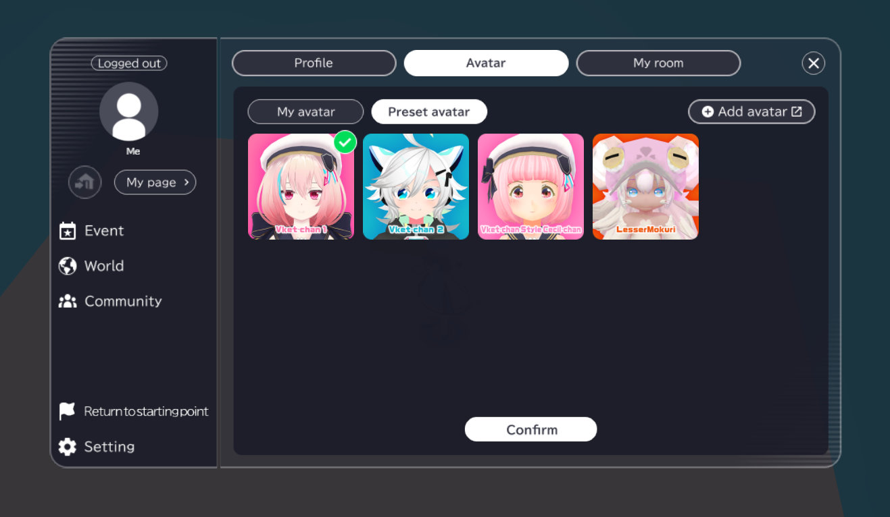

# Adding Preset Avatars

In VketCloudSDK, the world may provide a variety of preset avatars in addition to the users' own avatars. 
The preset avatar list can be accessed via "Setting"-->"Mypage"-->"Avatar"-->"Preset Avatar".

Before setting a preset avatar, the character model must be converted to the [VRM format](https://vrm.dev/en/vrm/how_to_make_vrm/index). 

## 1. Create an avatar with its texture compressed

For optimising avatars to appear on smartphones, texture compression is essential. 
The AvatarFile will not be deleted even if the list article is deleted.

!!! note
        There may be edge cases where the AvatarFile list won't appear and the "CreateAvatarFileForOldData" will appear. 
        This is due to old avatar data remaining when using older SDK projects by newer versions. 
        By pressing the button, the old avatar data will be converted to an AvatarFile list.

### 2.2 Setting content in the AvatarFile

By selecting an AvatarFile in the project, the content will be displayed on the Inspector View. 
The settings are divided by category tabs.

Each category details are on the [AvatarFile](AvatarFile.md) page.

#### 2.2.1 .vrm

The avatar's .vrm may be registered here. 
The .hrm files of the compressed avatar data can be designated as well.

#### 2.2.2 Motion

The motion may be registered here. 

#### 2.2.3 Emotion

The emote animation may be registered here. 

#### 2.2.4 Objects

The objects to be held by the avatar may be registered here. 

## 3. Implementing AvatarFile to the WorldSettings

Put the AvatarFile into the AvatarFile list of the WorldSettings. 
This will add the avatar to the preset avatar view.

The AvatarFile can also be edited by selecting on the AvatarFile list. 
As this view does not show the entire settings, we recommend to select the AvatarFile on the project view, then editing it on the Inspector view.