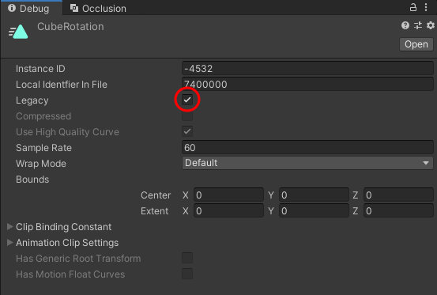
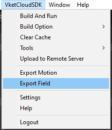

# How to Animate Objects


VketCloudSDK allows you to place animated objects in world using the [HEOAnimation](../HEOComponents/HEOAnimation.md) component or .heo files and .hem.
Placing moving objects on the world will greatly improve the appearance.

If you stumble on each step, please refer to [How to Animate Objects - Troubleshooting](PropAnimation_TroubleShooting.md).

## Animation by attaching HEOAnimation

Please refer to [HEOAnimation](../HEOComponents/HEOAnimation.md) for usage instructions.

## How to add animation to HEOObject

By exporting the object to .heo, exporting the animation to .hem, and placing it on the scene, you can create objects that move freely from [HEOAnimation](../HEOComponents/HEOAnimation.md).

Note that the only animation parameter that can be used here is **Transform value change**.

### Export .hem file (Heliodor Export Motion file)

1\. Create a new empty parent object (Named as AnimationBase in the image below) for setting animation, and a new Cube object (CubeRotation in the image below) subject of animation, configure the parent-child relationship in a hierarchy, and then set them both to Position(0,0,0). <br>


2\. Select the empty object and add Animation by `Add Component` in the Inspector view. <br>
     Be careful not to accidentally add animation to the Cube object.


!!! note
    There is a similar component called Animator, but please note that this is not used.

3\. Open the animation tab by selecting `Window > Animation > Animation` or Ctrl+6.


4\. Create an Animation Clip. <br> Display the Animation tab with the **Empty Parent Object** selected and click `Create` as shown on the image to create a .anim file.


Make sure that the animation you created is set in the Animations property of the Inspector of the empty parent object.


5\. Check the created animation file in the Project view. <br>
If the Inspector view looks like the image below, the setting is going OK!


If contents of the Inspector view differs from the above image and is shown like below, additional work is required.


Select the vertical “…” in the upper right corner and select `Debug`.


Check Legacy.



Select "..." again and select Normal to complete the task.


6\. Select the item you want to move using `Add Property` in the Animation window. <br>
When opening the Animation window, please make sure the empty object is selected. When you select `Add Property`, you can check the Cube object. <br>

Here, select Rotation and Scale from `CubeRotation - Transform`. You can add items by pressing the + button, so please add each.


!!! note
    When adding Animation using `Add Component` in step 2, make sure that you have not accidentally added Animation to the Cube object. <br>
    Proceeding as is will cause `KeyNotFoundException: The given key was not present in the dictionary.` to occur.

We will not explain in detail how to create an animation here, but follow the points below:

- Keyframes must be entered for all items for the start and end points.
- The object to which the Animation component is attached (empty object) is not moving

Add some keyframes and create an animation at your choice!


Once setting animation is complete, select the object with Animation (empty object) on the Inspector view and select `"Export Motion"` on the VketCloudSDK tab at the top of the screen. <br>
After selecting, the explorer will appear to designate a .hem save location, so save it in any location with a name at your choice.


After saving, the export is complete when `"Exported"` appears on the Unity console (console is located on bottom left by default).


!!! note
    If an error occurs, please refer to [How to Animate Objects - Troubleshooting](PropAnimation_TroubleShooting.md).

!!! warning "warning on Export Motion"
    When using Export Motion, if multiple animations are allocated in Animation component / Animations on exporting a hem file as the image below, it may lead to unintended animation behavior.<br>
    When exporting an animation, be sure that the component only has **one** animation allocated at a time.

    

### Export .heo file (Heliodor Export Object file)



Select the object containing the Animation component (empty object) above and select `Export Field` on the VketCloudSDK menu.


The same save screen as .hem will appear, but multiple objects will be created when saving .heo, so we recommend creating a new folder and saving it there. <br>
(In the image above, a new CubeRotation folder is created in the Assets folder)<br>
If the save is successful, the following pop-up window will appear.


To confirm that the file was saved correctly, open the console tab to see if the  when message below appears. <br>


Create a new empty object, select the Inspector tab, press Add Component, and add [HEOObject](../HEOComponents/HEOObject.md).


Click the circle button to the left of “select” for .heo or .vrm and select the .heo file created previously.


Insert a .heo file and select `"Show Preview"`, the preview of the selected heo file will appear at the empty object position. <br>
Set the empty object's Transform to the position where you want the object to be generated.


Change the Object Mode to Motion, select Add (circle button), and enter the created .hem file in .hem in the displayed field.


For enabling loop animation, check loop. <br>
By committing build at this point, you can display animated objects on the scene.


!!! warning "Notes when exporting .heo"
    - If you export the original object without setting its Position to (0,0,0), the placement position will be the [HEOObject](../HEOComponents/HEOObject.md) Position added with the Position value at the time of export. <br>
    - If the original object has collision detection enabled, the exported object will also have collision detection. <br>
    - Even if you move an object in .hem, the collision detection information of the object will not be moved. <br>
    - The first animation in the Motion column will be automatically played when the world starts. <br>
    If you do not want animations played on world start, please leave the first Motion entry blank.

## Controlling animation set to HEOObject

### Control using Actions

You can play the animation added to [HEOObject](../HEOComponents/HEOObject.md) by using the  [PlayItem](../Actions/Item/PlayStopItem.md) action. <br>

!!! note "About PlayItem Action"
    [PlayItem](../Actions/Item/PlayStopItem.md): Plays the designated item. The Index setting is the Motion number to be played. <br>
    PlayItem is valid for HEO objects containing Motion, as well as Audio and Particles.

Set the animation of the animated Cube to be the second one with loop disa, and click “Add” at the top of BeginActions to add the Motion field. <br>
Delete the motion specified in .hem in the first Motion, and specify the .hem file in the second Motion.


Create a new Sphere object, place it to the right, select Add Component from the Inspector tab, and add a HEOActionTrigger. <br>


Under Actions, press the + button at the bottom right where it says List is Empty and select [PlayItem](../Actions/Item/PlayStopItem.md). <br>


Select the object to which .heo and .hem have been added in the Target field, and enter the index number of the target Motion. <br>
Earlier, the first Motion (Index 0) has been left empty, while the Motion we want to activate is in the second Motion (Index 1), so enter 1 for Index.


On world build, the Cube will rotate (play Motion) when clicked.


!!! note "About [StopItem](../Actions/Item/PlayStopItem.md)"
    [StopItem](../Actions/Item/PlayStopItem.md) is a companion action to [PlayItem](../Actions/Item/PlayStopItem.md). <br>
    Although this action might seem to stop the playing animation, but the effect of StopItem is to stop beginaction, which the playing animation does not fall under BeginActions and will not stop. <br>
    StopItem can be used to stop particles or sounds.<br>
    As a substitute implementation to stop an animation, PlayItem can be used to [call an empty Motion](../Actions/Item/PlayStopItem.md#_3).

### Control using HeliScript

Animation can be controlled using HeliScript. <br>
As an example, you can create a HeliScript that repeats animation playback every 3 seconds as shown below.

Here, ChangeMotion() of [Item class](../hs/hs_class_item.md) is used to control the motion in [HEOObject](../HEOComponents/HEOObject.md). <br>

``````
component SwitchAnimation
{
    // rotating cube
    Item m_RotationCube;
    float m_ParseTime;

    bool isMotionChangeTriggered;

    public SwitchAnimation() //constructor
    {
        m_RotationCube = hsItemGet("CubeRotation_HEO"); //Enter the object name to which HEOObject is attached
    }

    public void Update()
    {
        m_ParseTime += system.GetDeltaTime();

        if (m_ParseTime >= 3.0f)
        {
            if (isMotionChangeTriggered)
            {
                m_RotationCube.ChangeMotion("0");
                isMotionChangeTriggered = false;
            }
            else
            {
                m_RotationCube.ChangeMotion("1");
                isMotionChangeTriggered = true;
            }
            m_ParseTime = 0.0f;
        }
    }
}
``````

Place the created HeliScript in the world using HEOScript.


On world build, the corresponding HeliScript will run and control the animation.


