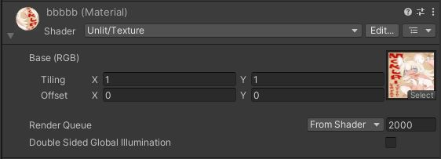

# ReplaceTexture Unexpectedly Replaces Other Textures

## Issue

When using `Item.ReplaceTexture()` to replace a texture on a material, other textures are also replaced unexpectedly.

!!! info "Environment"
    SDK Version : 14.4.12 
    OS : Windows10 
    Unity : 2019.3.6f1 
    Browser : Google Chrome

---

## Conclusion

### 1.Create a Folder for Canvas

If the texture of the target material being replaced is also used in another material, the texture of that other material will also be replaced.

!!! note "Solution"
    Make sure the texture being replaced is not used by any other material.

When using `ReplaceTexture()`, it's important to be careful with the material and the corresponding texture files.