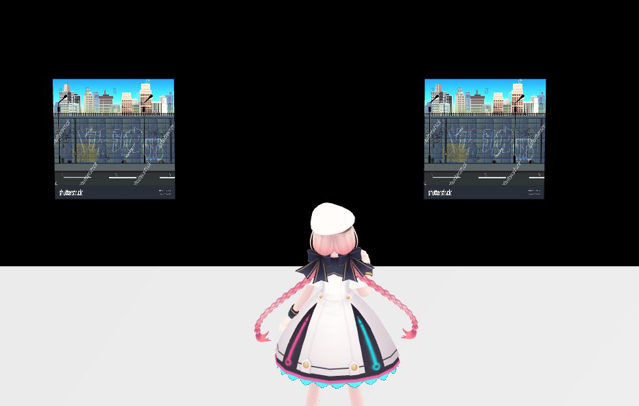

# Texture Replacement Issues with ReplaceTexture

## Problem 1: Textures not being replaced with ReplaceTexture
### Issue
When using `Item.ReplaceTexture()` to specify a texture for a particular material, the texture is not being replaced.

!!! info "Environment"
    SDK Version: 14.5 
    OS: Windows 11 
    Unity: 2022.3.6f1 
    Browser: Google Chrome

### Cause
The issue occurs because no texture has been set on the target material beforehand.

### Solution
Please set a texture on the material before using `Item.ReplaceTexture()`.

---

## Problem 2: Multiple textures being replaced simultaneously
### Issue
When replacing a texture on one material, textures on other materials are unexpectedly being replaced at the same time.

!!! info "Environment"
    SDK Version: 14.4.12 
    OS: Windows 10 
    Unity: 2019.3.6f1 
    Browser: Google Chrome

### Cause
If the same texture is used by multiple materials and you replace it in one material, it will be replaced in all materials using that texture.

### Solution
Use textures that aren't shared with other materials for materials you plan to replace textures on.

!!! note
    When using `Item.ReplaceTexture()`, it's important to pay careful attention to the relationships between materials and texture files.