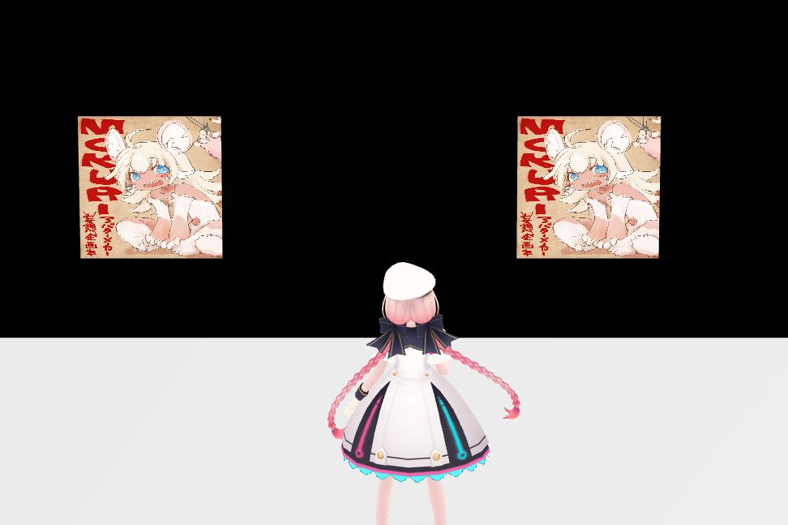
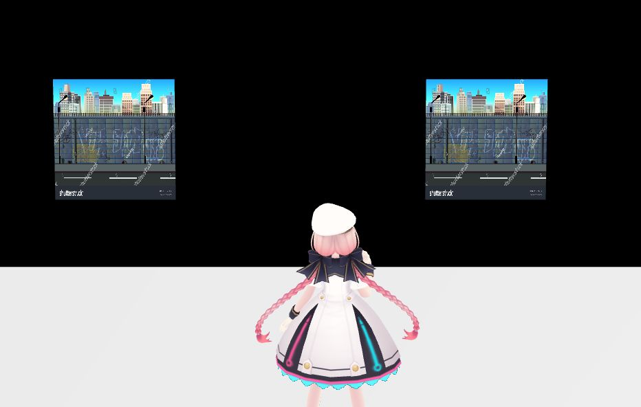
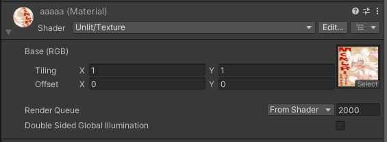
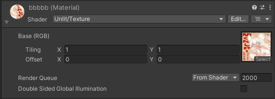

# ReplaceTextureでテクスチャの差し替えが正常に出来ない

## 現象

`Item.ReplaceTexture()`を使用し、あるマテリアルに対しテクスチャの差し替えを行った際、他のテクスチャも差し替わってしまう。

!!! info "発生環境"
    SDKバージョン : 14.4.12 
    OS : Windows10 
    Unity : 2019.3.6f1 
    ブラウザ : Google Chrome

---

## 結論

### ① Canvas用フォルダの作成

差し替え対象のマテリアルが持つテクスチャと同じテクスチャが別のマテリアルで使用されていた場合、そのマテリアルのテクスチャの差し替えも発生する。

!!! note "解決方法"
    差し替え対象のマテリアルで使用されているテクスチャを別のマテリアルで使われていないものにする。

`ReplaceTexture()`を使用する場合は、マテリアルと対応するテクスチャのファイルに注意が必要。