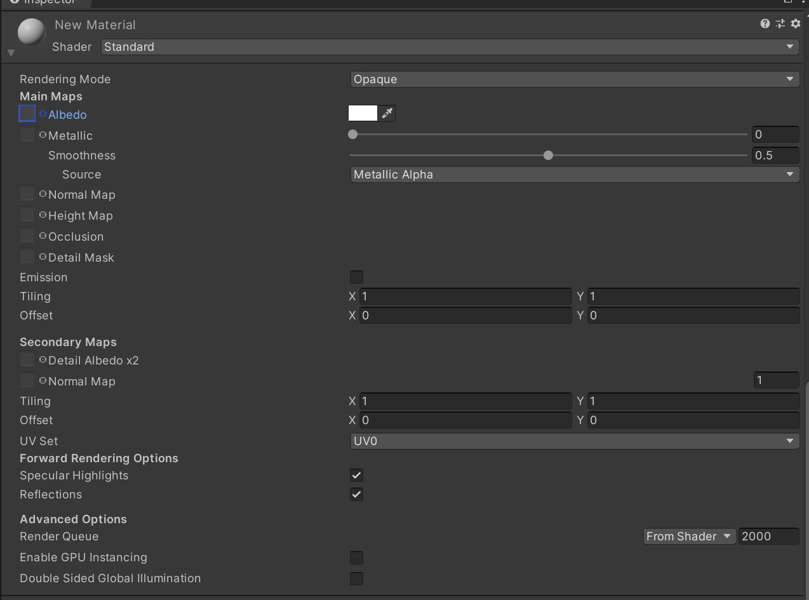
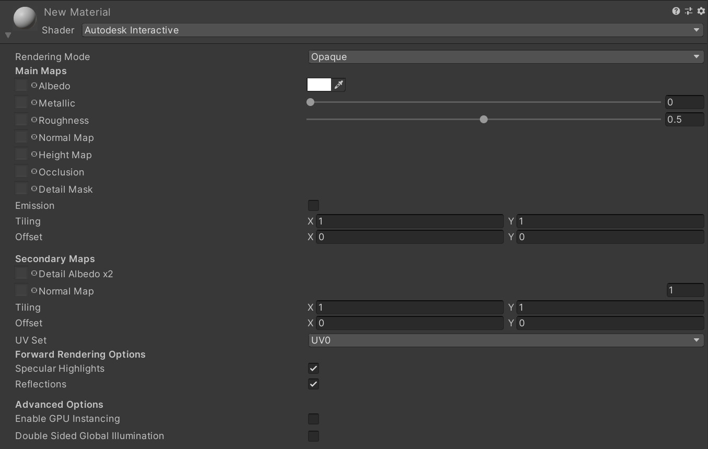
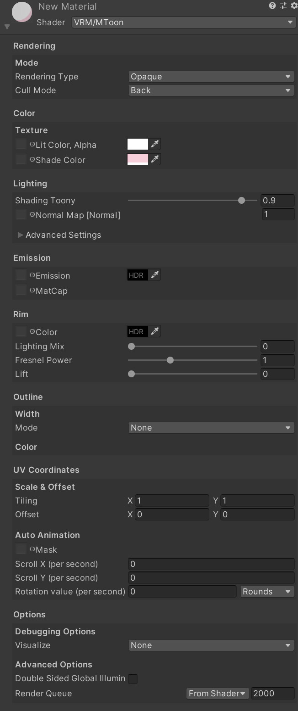
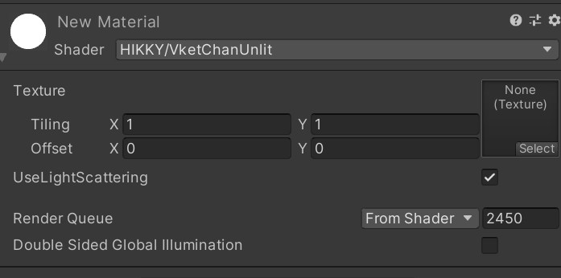
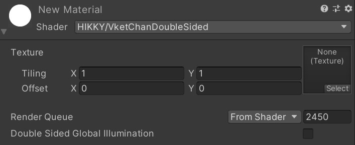
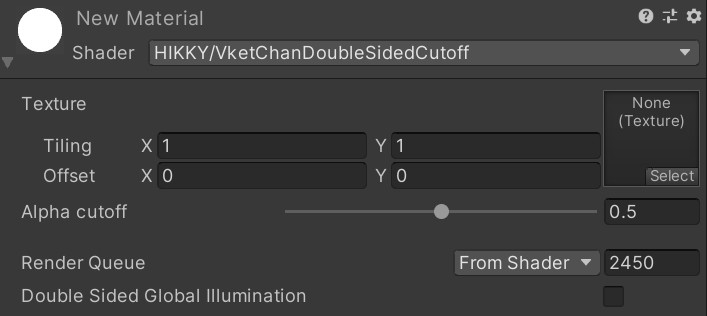
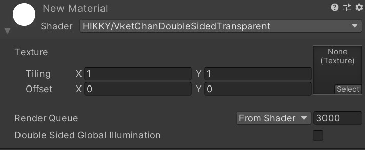

# シェーダー対応項目一覧

SDKでは、すべての設定ではないですが、以下シェーダーに対応しております。

-   [Standard](#standard)
-   [Autodesk Interactive](#autodesk-interactive)
-   [MToon](#mtoon)
-   [Unlit](#unlit)
-   [UnlitWF（両面表示等のみ対応）](#unlitwf)
-   [Vket Cloud SDKに含まれるVketChanDoubleSided系のシェーダー](#vket cloud sdkvketchandoublesided)
    -   [VketChanDoubleSided](#vketchandoublesided)
    -   [VketChanDoubleSidedCutoff](#vketchandoublesidedcutoff)
    -   [VketChanDoubleSidedTransparent](#vketchandoublesidedtransparent)

## Standard

| 項目                        | 小項目                              | SDK対応可否 |
|---------------------------|----------------------------------|-----------|
| Rendering Mode            | Rendering Mode                   | ○         |
| Main Maps                 | Albedo                           | ○         |
|                           | Metallic                         | ○         |
|                           | Normal Map                       | ○         |
|                           | Height Map                       | X         |
|                           | Occlusion                        | X         |
|                           | Detail Mask                      | X         |
|                           | Emission                         | ○         |
|                           | Tiling                           | ○         |
|                           | Offset                           | ○         |
| Secondary Maps            | Detail Albedo x2                 | X         |
|                           | Normal Map                       | X         |
|                           | Tiling                           | X         |
|                           | Offset                           | X         |
|                           | UV Set                           | X         |
| Forward Rendering Options | Specular Highlights              | X         |
|                           | Reflections                      | X         |
| Advanced Options          | Render Queue                     | X         |
|                           | Enable GPU Instancing            | X         |
|                           | Double Sided Global Illumination | X         |

## Autodesk Interactive

| 項目                        | 小項目                              | SDK対応可否 |
|---------------------------|----------------------------------|-----------|
| Rendering Mode            | Rendering Mode                   | ○         |
| Main Maps                 | Albedo                           | ○         |
|                           | Albedo Texture                   | ○         |
|                           | Metallic                         | ○         |
|                           | Metallic Texture                 | X         |
|                           | Roughness                        | ○         |
|                           | Roughness Texture                | ○         |
|                           | Normal Map                       | ○         |
|                           | Normal Map Texture               | ○         |
|                           | Height Map                       | X         |
|                           | Height Map Texture               | X         |
|                           | Occlusion                        | X         |
|                           | Occlusion Texture                | X         |
|                           | Detail Mask                      | X         |
|                           | Detail Mask Texture              | X         |
|                           | Emission                         | ○         |
|                           | Emission Texture                 | ○         |
|                           | Tiling                           | X         |
|                           | Offset                           | X         |
| Secondary Maps            | Detail Albedo x2                 | X         |
|                           | Normal Map                       | X         |
|                           | Tiling                           | X         |
|                           | Offset                           | X         |
|                           | UV Set                           | X         |
| Forward Rendering Options | Specular Highlights              | X         |
|                           | Reflections                      | X         |
| Advanced Options          | Enable GPU Instancing            | X         |
|                           | Double Sided Global Illumination | X         |

## MToon

| 項目             | 中項目                | 小項目                               | SDK対応可否 |
|----------------|--------------------|-----------------------------------|-----------|
| Rendering      | Mode               | Rendering Type                    | ○         |
|                |                    | Cull Mode                         | ○         |
| Color          | Texture            | Lit Color, Alpha                  | ○         |
|                |                    | Shade Color                       | ○         |
| Lighting       | Lighting           | Shading Toony                     | ○         |
|                |                    | Normal Map                        | ○         |
|                | Advanced Option    | Shading Shift                     | ○         |
|                |                    | Shadow Receive Multiplier         | X         |
|                |                    | Lit &amp; Shade Mixing Multiplier | X         |
|                |                    | Light Color Attenuation           | X         |
|                |                    | GI Intensity                      | X         |
| Emission       | Emission           | Emission                          | ○         |
|                |                    | MatCap                            | ○         |
| Rim            | Rim                | Color                             | ○         |
|                |                    | Lighting Mix                      | ○         |
|                |                    | Fresnel Power                     | ○         |
|                |                    | Lift                              | ○         |
| Outline        | Width              | Mode                              | ○         |
|                |                    | Color                             | ○         |
| UVCoordinates  | Scale &amp; Offset | Tiling                            | X         |
|                |                    | Offset                            | X         |
| Auto Animation | Auto Animation     | Mask                              | X         |
|                |                    | Scroll X (per second)             | ○         |
|                |                    | Scroll Y (per second)             | ○         |
| Options        | Debugging Options  | Visualize                         | X         |
|                | Advanced Options   | Double Sided Global Illumination  | X         |
|                |                    | Render Queue                      | X         |

## Unlit

| 項目                               | 小項目                              | SDK対応可否 |
|----------------------------------|----------------------------------|-----------|
| Texture                          | Texture                          | ○         |
|                                  | Tiling                           | ○         |
|                                  | Offset                           | ○         |
| Use LightScattering              | Use LightScattering              | ○         |
| Render Queue                     | RenderQueue                      | ○         |
| Double Sided Global Illumination | Double Sided Global Illumination | ○         |

## UnlitWF（両面表示等のみ対応）

[UnlitWFの共通設定 | whiteflare's vpm-repos](https://whiteflare.github.io/vpm-repos/docs/unlitwf/Manual-Common){target=_blank}

## Vket Cloud SDKに含まれるVketChanDoubleSided系のシェーダー

### VketChanDoubleSided

| 項目                               | 小項目                              | SDK対応可否 |
|----------------------------------|----------------------------------|-----------|
| Texture                          | Texture                          | ○         |
|                                  | Tiling                           | ○         |
|                                  | Offset                           | ○         |
| Render Queue                     | RenderQueue                      | ○         |
| Double Sided Global Illumination | Double Sided Global Illumination | ○         |

### VketChanDoubleSidedCutoff

| 項目                               | 小項目                              | SDK対応可否 |
|----------------------------------|----------------------------------|-----------|
| Texture                          | Texture                          | ○         |
|                                  | Tiling                           | ○         |
|                                  | Offset                           | ○         |
| Alpha cutoff                     | Alpha cutoff                     | ○         |
| Render Queue                     | RenderQueue                      | ○         |
| Double Sided Global Illumination | Double Sided Global Illumination | ○         |

### VketChanDoubleSidedTransparent

| 項目                               | 小項目                              | SDK対応可否 |
|----------------------------------|----------------------------------|-----------|
| Texture                          | Texture                          | ○         |
|                                  | Tiling                           | ○         |
|                                  | Offset                           | ○         |
| Render Queue                     | RenderQueue                      | ○         |
| Double Sided Global Illumination | Double Sided Global Illumination | ○         |
