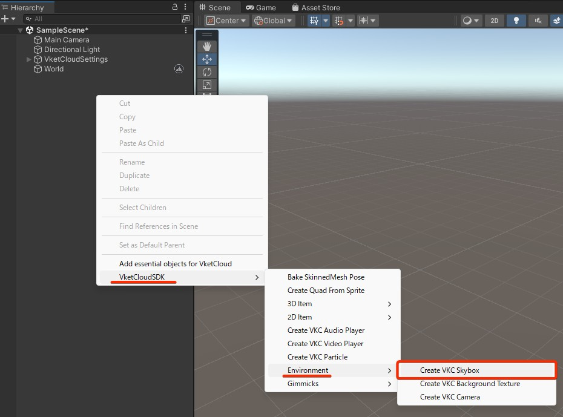
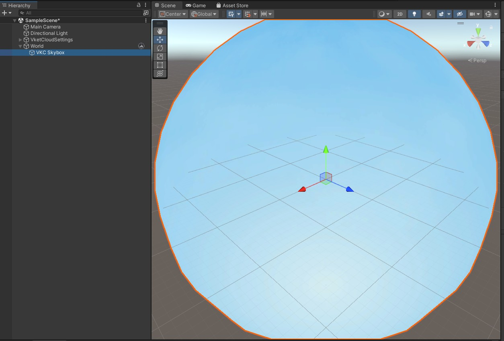

# スカイボックス設定

Vket Cloud SDKでは、UnityのSkyboxを出力することは出来ません。そのため、BoxまたはSphereの法線を反転させたオブジェクトを配置して、擬似的なSkyboxとして出力することで代用します。

法線が反転されたオブジェクトはBlenderなどの3Dモデリングソフトを使用して用意する必要がありますが、SDKに内蔵されたチュートリアルシーンにおけるSkyboxオブジェクトを使用し、テクスチャを貼り替えることも可能です。

## 背景の設定方法

!!! note "クイックメニューによるSkybox Prefab及びBackgroundTextureの追加"
    Ver12.3にて、Skybox及びBackground Textureがシーンに簡単に追加できるクイックメニューが追加されました。 
    詳しくは[Vket Cloudオブジェクト追加のためのクイックメニュー](../WorldEditingTips/QuickMenu.md)をご参照ください。

### クイックメニューから追加する方法

1. Hierarchy上で右クリックし、「VketCloudSDK > Environment > Create VKC Skybox」を選択します。

2. 「VKC Skybox」という名前でスカイボックスが生成されます。

---

### Tutorialから追加する方法

1. Vket Cloud SDKメニュー > Tutorials > Tutorial -Basic-を選択してチュートリアルシーン（Basic）をインストールすると、チュートリアルシーンと使用されているアセットがダウンロードされます。
    

2. チュートリアルシーンにて使用されているSkyboxオブジェクトは「Assets > Samples > Vket Cloud SDK > [現在のSDKバージョン] > Tutorial -basic- > Used Files > Models」に格納されています。
    Modelsファイル内のSky_Sphereを選択し、ドラッグ＆ドロップによって制作中のシーンに配置します。

    

3. Sky_SphereのスケールはInspectorから変更できます。また、別のテクスチャを割り当てたい場合はInspector中のSkyboxマテリアルから差し替えることができます。
    

4. Build & Runを行い、Skyboxの反映を確認します。
    

## Tips

マテリアルのシェーダーは「Unlit/Texture」を選択すると、陰が出来ずに綺麗に出力できます。

!!! note "VKC Item Background Textureについて"
    背景を実装する別の方法として、どのカメラ角度からも同じ画像を表示させ、2Dゲームの背景などを作る際に便利な[VKC Item Background Texture](../VKCComponents/VKCItemBackgroundTexture.md)があります。

    
