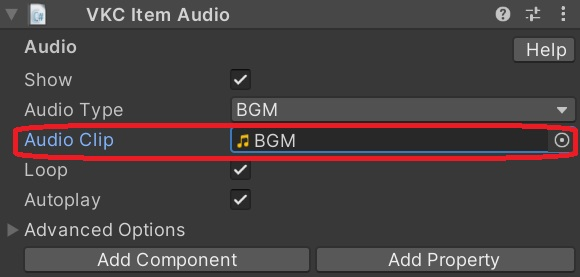
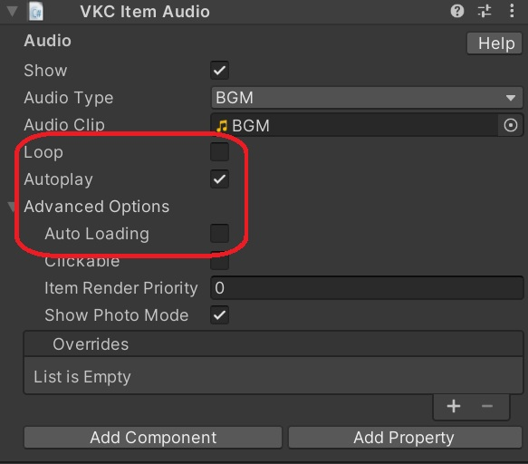
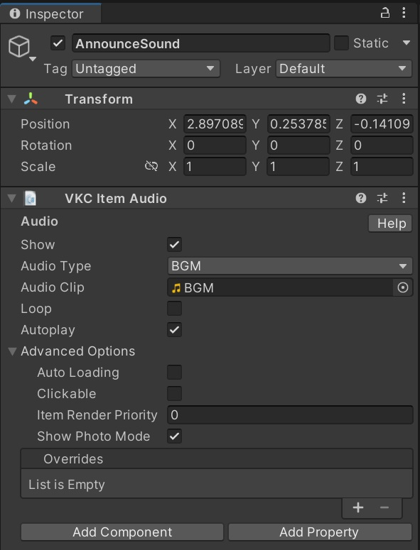
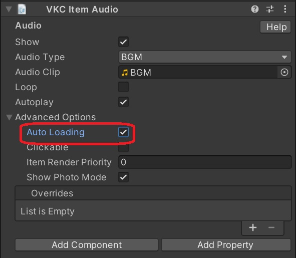

# Playing Entrance Sound Effects Only Under Specific Conditions

This explains how to play entrance sound effects under specific conditions.

The requirement to play the sound during an operation might be a drawback.

!!! info "Test Environment"
    SDK Version: 13.7.7<br>
    OS: Windows 10<br>
    Unity: 2019.4.31.f1<br>
    Browser: Chrome

## ① Set the audio file to an Audio Clip



## ② Set the parameters of other VKC Item Audio



A. Set loop to false

B. Set auto-play of the sound effect to true

C. Set dynamic loading (AutoLoading) of the sound effect to false

## ③ Load the corresponding Item in the constructor

## Sample

Ensure that the settings and GameObject are set to "AnnounceSound"



- There are multiple spawn points (divided by the spaceindex URL query)
- Play the station announcement sound effect only when spawning at the station (when spaceindex is 0 or not present)

### HeliScript

Although this is an old implementation, it is now recommended to use the method to retrieve query parameters with HeliScript.

```csharp
void SetAnnounceSound() // Load the announcement sound
{
    //hsSystemWriteLine("SetAnnounceSound");
    Item announceItem = hsItemGet("AnnounceSound");
    ReturnType result = hsLoadReturnType(heliport.v3.api.routers.getCurrentUrl());
    if (!result.IsValid())
    { 
        return; 
    }
    string url = result.data.GetStr();
    int spaceIndexIndex = url.IndexOf("spaceindex");
    if (spaceIndexIndex != -1) // If spaceindex is present
    {
        //hsSystemWriteLine(spaceIndexIndex.String());
        if (url.IndexOf("spaceindex=0") != -1) // If spaceindex is 0
        {
            // hsSystemWriteLine("AnnounceSound Load");
            announceItem.Load();
        }
    }
    else
    {
        // hsSystemWriteLine("AnnounceSound Load");
        announceItem.Load();
    }
}

### Additional Insights

It seems that the sound effect will play even if Auto Loading is set to true and UnLoad() is called in the constructor.


