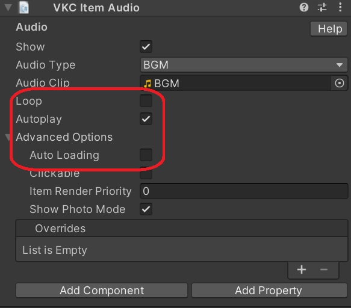
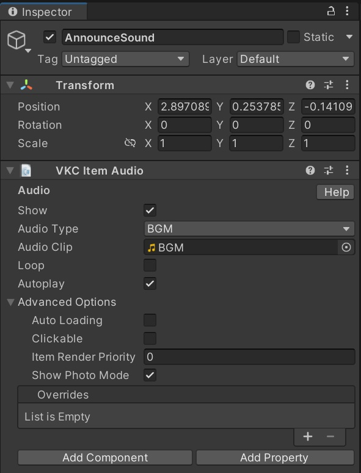

# 特定の条件下でのみ入場時効果音を鳴らす

下記に限らず特定の条件の場合に入室時効果音を鳴らす方法を説明します。

操作時に鳴らすという制約を満たす必要があるのがネックになると思います。

!!! info "検証環境"
    SDKバージョン : 13.7.7<br>
    OS : Windows 10<br>
    Unity : 2019.4.31.f1<br>
    ブラウザ : Chrome

## ①オーディオファイルをAudio Clipに設定する


## ②他のVKC Item Audioのパラメータを設定する




A. ループ設定をfalseにする

B. 効果音の自動再生をtrueにする

C. 効果音の動的ローディング(AutoLoading)をfalseにする

## ③コンストラクタで該当ItemをLoad()する

## サンプル

以下設定やGameObjectが"AnnounceSound"になっていることを確認する



- スポーン地点が複数ある(spaceindexのURLクエリで分ける)
- 駅にスポーンしたときのみ駅のアナウンス効果音を鳴らす(spaceindexが0またはないとき)

### HeliScript

古い実装ですが、今はHeliScriptでクエリパラメータを取得できるのでその方法を使うべきだと思います。

```csharp
void SetAnnounceSound()//アナウンス音のロード
{
    //hsSystemWriteLine("SetAnnounceSound");
    Item announceItem = hsItemGet("AnnounceSound");
    ReturnType result = hsLoadReturnType(heliport.v3.api.routers.getCurrentUrl());
    if (!result.IsValid())
    { 
        return; 
    }
    string url = result.data.GetStr();
    int spaceIndexIndex = url.IndexOf("spaceindex");
    if (spaceIndexIndex != -1)//SpaceIndexがある場合
    {
        //hsSystemWriteLine(spaceIndexIndex.String());
        if (url.IndexOf("spaceindex=0") != -1)//SpaceIndexが0の場合
        {
            // hsSystemWriteLine("AnnounceSound Load");
            announceItem.Load();
        }
    }
    else
    {
        // hsSystemWriteLine("AnnounceSound Load");
        announceItem.Load();
    }
}
```

## その他知見

Auto Loadingをtrueにして、コンストラクタでUnLoad()しても効果音は鳴るみたいです。


