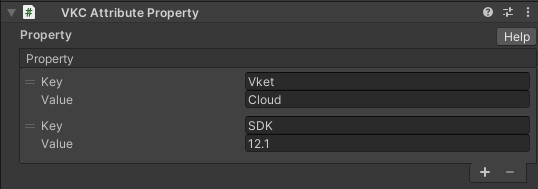

# HEOProperty(Vket Cloudのプロパティ機能)の使い方


## 概要

SDK9以降で登場したVKC Attribute Propertyを使うことで、Vket Cloudのプロパティ機能を設定することができます。

プロパティ機能はItemに対してキーと値を持たせる方法で、コンポーネント間の値渡しやUnityエディタ上での動作カスタマイズといった使用方法が可能です。

本ページでは、何かと便利なVKC Attribute PropertyとVket Cloudのプロパティ機能について紹介します。

## VKC Attribute Property実装手順

### 1. アイテムとなるオブジェクトにアタッチ


[VKC Item Field](../VKCComponents/VKCItemField.md)、 [VKC Item Object](../VKCComponents/VKCItemObject.md)、 [VKC Item Activity](../VKCComponents/VKCItemActivity.md)など、ビルド時にアイテムとなるオブジェクトに対しVKC Attribute Propertyをアタッチします。

### 2. VKC Attribute PropertyにKeyとValueを入力

Listの「+」ボタンを押すことで、KeyとValueの入力欄が表示されます。

!!! info "プロパティの仕組み"
    Vket Cloudのプロパティ機能は、キー(Key)に対応する値(Value)を保持する機能です。<br>
    保持した値はHeliScriptで読み込んだり、上書きしたりすることが可能です。



KeyおよびValueはいずれもString型として保持されます。

これで、VKC Attribute Propertyの設定が完了です。


ビルド後のScene.jsonのproperties項目に入力内容が反映されています。

---

## HeliScriptでの使い方

設定したプロパティはHeliScriptで使うことができます。

ここでは、

```c#
Key：Vket　Value：Cloud
Key：SDK　Value：12.1
```

と設定されたアイテムGameObjectを例に紹介します。

### 1. GetProperty

`Item.GetProperty(string Key)`では、アイテムが持つプロパティのKeyに対応するValueを取得します。

```C#
// サンプルコード(コンポーネント構造無視)

Item m_Item;
m_Item = hsItemGet("GameObject");

string Value;
Value = m_Item.GetProperty("Vket");
hsSystemWriteLine("%s" % Value); //「Cloud」と出力される

```

### 2. SetProperty

`Item.SetProperty(string Key)`では、アイテムが持つプロパティのKeyに対応するValueを変更します。

```c#

// サンプルコード(コンポーネント構造無視)

Item m_Item;
m_Item = hsItemGet("GameObject");

m_Item.SetProperty("Vket","Chan");

string Value;
Value = m_Item.GetProperty("Vket");
hsSystemWriteLine("%s" % Value); //「Chan」と出力される

```

### 3. OnChangedProperty

`OnChangedProperty(string Key, string Value)`は、プロパティの変更が発生した際に実行されるコールバックです。<br>
SetPropertyで特定のキーに対し同一の値が入力され変更が発生しなかった場合には実行されません。

```c#

// サンプルコード(コンポーネント構造無視)

Item m_Item;
m_Item = hsItemGet("GameObject");

m_Item.SetProperty("SDK","12.1");
m_Item.SetProperty("Vket","Chan");
m_Item.SetProperty("SDK","12.2");
m_Item.SetProperty("Vket","Chan");

public void OnChangedProperty(string Key, string Value){
  hsSystemWriteLine("Changed %s, %s" % Key % Value);
  if(Key == "Vket"){
    hsSystemWriteLine("Vket Changed");  
  }
}

// 上記の場合、
// 6行目　SDKは初期Valueが12.1のためコールバック実行なし
// 7行目　Vketは初期ValueがCloudのためコールバック実行
// 8行目　SDKはValueが12.1のためコールバック実行
// 9行目　Vketは7行目でValueがChanとなっているためコールバック実行なし
// となり、
// Changed Vket, Chan
// Vket Changed
// Changed SDK, 12.2
// が出力される

```

HeliScriptでは、以上の3通りの関数が用意されています。

---

## 活用方法

VKC Attribute Propertyの活用例を紹介します。

### 1. アクティビティへの値渡し

!!! tip "アクティビティにおけるプロパティ定義について"
    以前のバージョンとは異なり、アクティビティにプロパティを設定して値渡しを行うには、VKCAttributePropertyを使用せずにアクティビティのjsonファイルにて定義を行うのがおすすめです。<br>
    詳しくは[VKC Activity Exporter: Activity / Propertyの設定について](../SDKTools/VKCActivityExporter.md#activity-property)をご参照ください。

### 2. コンポーネント間の値渡し

コンポーネント間で値渡しをする際、以下のようにVKC Attribute Propertyを使用できます。<br>  
※値を変更する関数を用意して、`hsCallComponentMethod()`を使用しても同じことができます。

```c#
// exampleA exampleBの2つのコンポーネントとKey:status, Value:aliveを持つアイテム「Monster」があり、
// exampleAがもつ変数HPの値が0以下になった際、exampleBで動作が発生する場合

component exampleA{

  int HP;
  Item m_Item;

  public exampleA{
    HP = 20;
    m_Item = hsItemGet("Monster");
  }
  
  public void damage(){
    HP--;
    if(HP<=0){
      m_Item.SetProperty("status","death");
    }
  }
}

component exampleB{

  int status;

  public exampleB{
    status = 1;
  }

  public void OnChangedProperty(string Key, string Value){
    if(Key == "status"){
      switch(Value){
        case: "alive"
          hsSystemWriteLine("モンスターが　あらわれた！");
          status = 1;
          break;
        case: "poison"
          hsSystemWriteLine("モンスターが　どくを　あびた！");
          status = 2;
          break;
        case: "death"
          hsSystemWriteLine("モンスターを　やっつけた！");
          status = -1;
          break;
      }
    }
  }
}
```

### 3. Unityの\[SerializeField\]属性的運用

「2. コンポーネントへの値渡し」と同様に、VKC Attribute Propertyから変数の中身を定義するように設定しておくことで、Unityエディタ上でパラメータ設定を行うことができるようになります。

ただし、KeyおよびValueはすべてstring値であることは注意が必要です。

```c#
component exampleC{
  int HP;
  int damage;
  string skill;
  Item m_Item;
  
  public exampleC{
    m_Item = hsItemGet("Monster");
    HP = m_Item.GetProperty("HP").ToInt();
    damage = m_Item.GetProperty("damage").ToInt();
    skill = m_Item.GetProperty("skill");
  }
}

//上記の設定を行い、Unity上で「Monster」オブジェクトに対しVKC Attribute Propertyを付け、
//HP:30、damage:3、skill:れんぞく斬り　とした場合、
//それぞれの入力内容がHeliScriptの変数に適用される
```

---

## 注意点

### 1. SetProperty / GetPropertyする際は対象となるアイテムに注意

アイテムごとに異なるプロパティを設定することが可能です。<br>  
HeliScript上で対象となるアイテムを間違えると、上手く動作しない場合があるので、気を付けましょう。

!!! warning "Note"
    更新：SDK12.x及び以降のバージョンでは、プロパティが存在しない際にSetPropertyを行った場合は新たにプロパティを追加するように変更されました。<br>
    SDK9.11現在、対象となるプロパティが存在しないのにSetPropertyを行おうとした場合、エラー文も出ずに他のHeliScriptの動作に影響を及ぼす場合があります。

## 2. KeyおよびValueはString型

少し上でも解説した通り、KeyおよびValueはString型となるため、String型以外の変数を扱う場合、SetPropertyやGetPropertyする際に型変換を行う必要があります。

型変換を行わずにSetPropertyやGetPropertyした場合、nullとなります。
