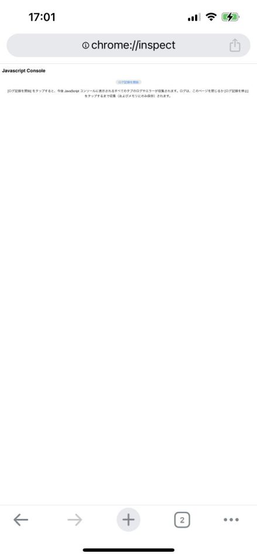
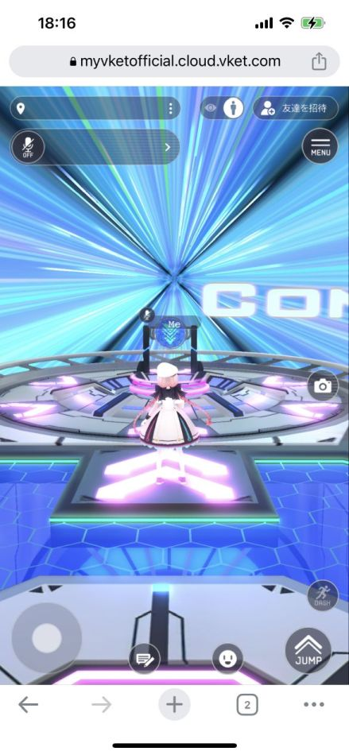
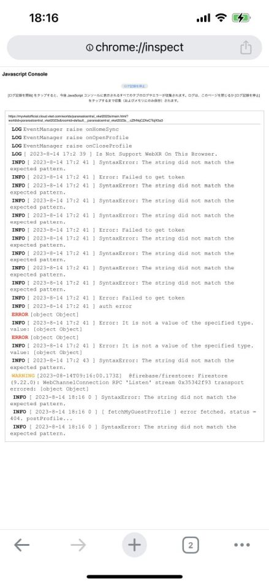

# How to check the Chrome Developer Tools console on iPhone alone

## Overview

In the mobile version of Google Chrome, there is no developer tools available, and typically, when debugging in a mobile environment, it's difficult to view the console when an error occurs.
However, by connecting to a Mac OS computer, you can access the developer tools. But it is also possible to view the console directly on the iPhone without needing to connect to a computer.
This page will introduce that method.

!!! info "Test Environment"
    OS : iOS 16.5.1
    Browser : Google Chrome(App)

## Steps

### 1.Open a new tab and enter "chrome://inspect" in the URL bar

By entering "chrome://inspect," the screen shown on the left will appear.

This screen allows you to view JavaScript logs and provides a console interface equivalent to the developer tools console

### 2. Tap "Start Logging"

By tapping "Start Logging," the logging process will begin.

The button text will change to "Stop Logging."

With this active, you can run VketCloud in another tab, and the console output from that tab will be displayed in chrome://inspect.

While logging, you can open and interact with VketCloud in another tab as usual.

### 3.Check the Log Results

By returning to the tab where chrome://inspect is open, you can view the logged output.

If an issue arises during mobile operation testing, refer to these logs to identify the cause.

Additionally, if a reload occurs during the testing, you can view logs from both the page before the reload and after the reload.

Detailed logs cannot be viewed here. If you need to see more detailed logs, it is recommended to connect to a Mac PC and use that method.

## Other informations

This method also works in Private Browsing mode.

It can also be used on Android devices using the same steps.