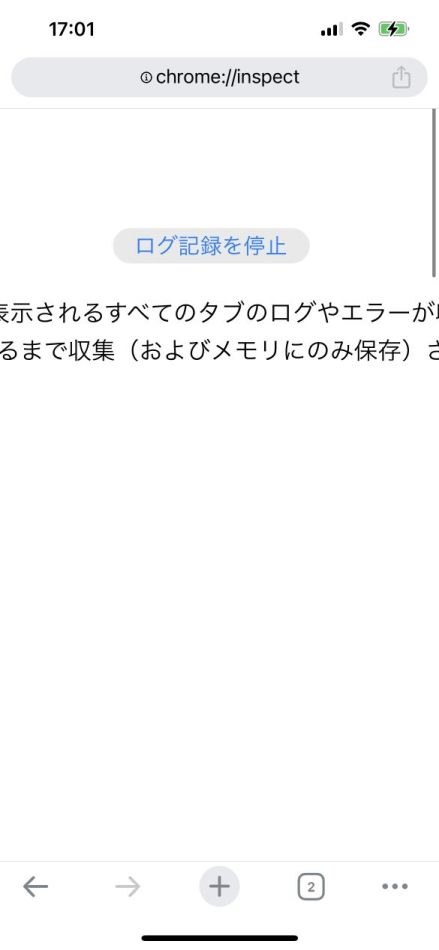

# iPhone単体でChromeのデベロッパーツールのコンソールを確認する方法

## 概要

スマホ版のGoogle Chromeではデベロッパーツールがなく、通常だとスマホ環境でデバッグを行う際、エラーが発生した際のコンソールが確認できないといったことがあります。  
MacのOSのパソコンと接続することで、デベロッパーツールを表示することができますが、iPhone単体でもコンソール表示は確認することが可能です。  
本ページではその手法を紹介します。

!!! info "検証環境"
    OS : iOS 16.5.1
    ブラウザ : Google Chrome(アプリ版)

## 手順

### ①新しいタブを開き、URL入力欄にchrome://inspectと入れる

chrome://inspectと入力することにより、

左のような画面が立ち上がります。

この画面では、JavaScriptのログを確認することができ、

所謂デベロッパーツールのコンソール画面と同等のものが見れます。

### ②「ログ記録を開始」をタップ

「ログ記録を開始」をタップすることでログの記録が始まります。

ボタンの文字は「ログ記録を停止」になります。

この状態で別のタブにてVketCloudを動作させることで、

そのタブでのコンソール出力がchrome://inspectに記載されます。

ログ記録中は別タブでこのようにVketCloudを開いて通常通り操作します。

### ③ログ結果を確認

chrome://inspectを開いたタブに戻ることで、出力されたログを確認することができます。

スマホ動作チェックで問題が発生した場合は、こちらのログを参照して原因を特定しましょう。

また、動作チェック中にリロードが発生してしまった場合でも、リロード前のページのログとリロード後のページのログを確認することができます。

各ログの詳細は確認することができません。詳細なログを確認したい場合は、Mac PCに接続して使用する方法を使うことを推奨します。

## その他知見

プライベートウィンドウでも使用可能です。

Android端末でも同じ方法が使用できます。