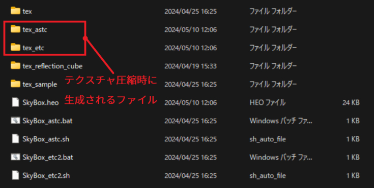
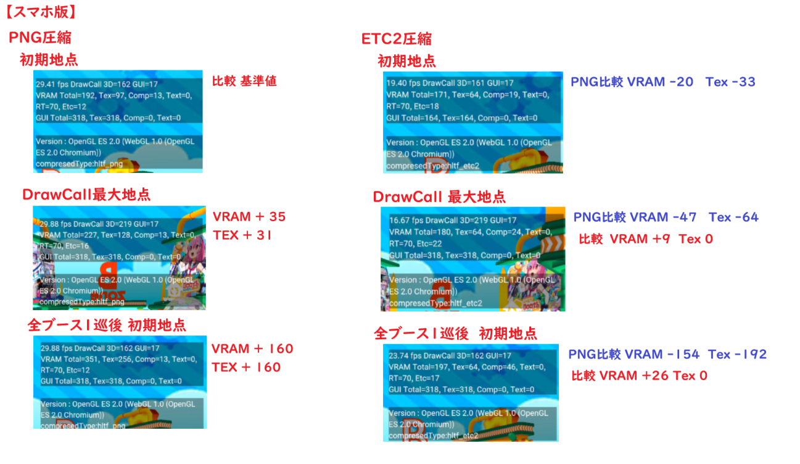

# What are ASTC and ETC2?

## Overview

The texture compression formats ASTC and ETC2 are supported depending on the device.

- PC: Neither is supported.
- iOS: Primarily ETC2, occasionally ASTC.
- Android: Primarily ETC2, occasionally ASTC.

### Where They Are Actually Used

The area within the HEO files located under `release/data/Field/`.

!!! info "How the generated `tex_xxx` folders are used"
    The `.heo` file retrieves the model's polygon data, and **depending on the compression format supported by each device, either `tex_astc` or `tex_etc` is selected**.

## Differences Before and After Applying

Additionally, dynamically loaded data is also reduced in size, which lightens both the initial and continuous load.
