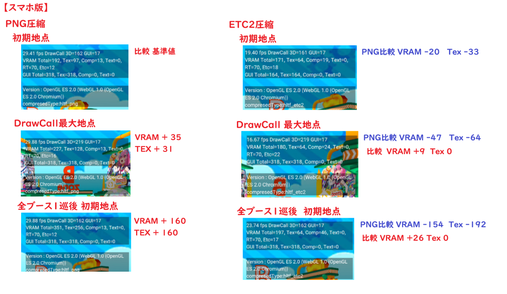

# ASTCとETC2とは

## 概要

テクスチャ圧縮フォーマットのASTCとETC2は端末によって使えるフォーマットが決まっています。

- PC: 両方とも非対応
- iOS: 基本的にETC2でたまにAST
- Android: 基本的にETC2でたまにASTC

### 実際に使われている場所

release/data/Field/以下にあるHEOファイルのエリア

!!! info 生成されたtex_xxxフォルダの使われ方について
    .heoでモデルのポリゴンデータを取得して、各デバイスで **対応している圧縮フォーマットに応じて、tex_astcやtex_etcを選ぶ形** です。

## 適応する前とした後の違い

さらに、動的に読み込むデータも軽量化されるので、初期負荷と継続負荷ダブルで軽くなります。

