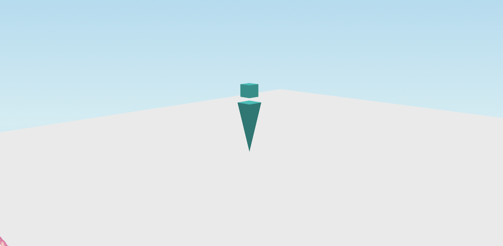

# スマートフォンのためのワールド軽量化

Vket Cloudは究極にはウェブブラウザが開けて、[端末スペック](../AboutVketCloudSDK/OperatingEnvironment.md)を満たすデバイスであればPC / スマートフォン / タブレット等端末の大小を問わずにアクセスできるメタバースを構築することができます。

しかし一方で、各ワールドにおける動作の快適さやストレスの少なさを実現するためにワールドの軽量化は必須であり、ワールド制作者は可能な限り動作の快適性に気を配る必要があります。 
特に、スマートフォンなどPCと比べてスペックが弱めの端末にて遜色のない動作体験を作るには、PC以上に軽量化を意識した制作が重要といえます。

以下にスマートフォン向けの対応を考える際にワールドとして気を付けるべきポイントを述べます。

## アバターの制限について

Vket Cloudにて、プレイヤーは自分の[マイアバター](../AboutVketCloudSDK/SetupAvatar.md)もしくはワールド付属の[プリセットアバター](../WorldMakingGuide/PresetAvatar.md)の二択から自身のアバターを選択できます。 
これによって幅広いアバターの選択肢が生まれる一方で、大人数が集まるようなワールドではアバターの描画がデバイスにとって負荷となる場合があります。

アバターによる描画負荷の対策として、ワールド側の対策として[HEOWorldSetting / MyAvatar](../HEOComponents/HEOWorldSetting.md#_5)においてワールド内で使用できるアバターの最大ポリゴン数、あるいはマイアバターの使用に制限を設けることができます。 
デフォルトでは50,000ポリゴンを上限としていますが、例として大人数が集まる場合は20,000ポリゴンまで下げる、といった設定が考えられます。

この時、ポリゴン上限を超えたポリゴン数のアバターは、ワールドにて設定された[ダミーアバター](../HEOComponents/HEOWorldSetting.md#_4)に変更されます。 
ダミーアバターの見た目は[heoファイル](../WorldMakingGuide/HEOExporter_Tutorial.md)の出力と[アバター設定](../HEOComponents/HEOWorldSetting.md#_4)での差し替えによって変えることができます。

SDKデフォルトのダミーアバター：

また、マイアバターを持っていない/利用が制限されている、あるいは未ログインのユーザーはワールド入場時に自動的に[プリセットアバター](../WorldMakingGuide/PresetAvatar.md)の1番目のアバターが割り当てられます。 

アバター自体の軽量化の方法としては、外部モデリングツールによるポリゴン数の削減と、テクスチャ容量の圧縮が考えられます。 

テクスチャの圧縮方法については[テクスチャ圧縮](./TextureCompression.md)をご参照ください。

## ロード時間の短縮のために

## テクスチャのフォーマッティング

## ワールド内動作の改善とワールドの導線設計
