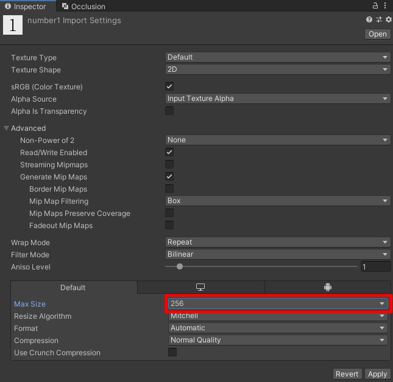

# Texture Compression

On Vket Cloud, the initial load time can be optimized by compressing the texture size used by world objects and avatars.

As future updates may involve automatic compression/formatting by server, the world creator should consider optimizing their texture to enable better performance on diverse PC/smartphone environments.

## How to do a texture compression

### Texture Import Viewer

!!! bug "Texture Import Viewer malfunction on SDK Ver9.11"
    On SDK Ver9.11, the Texture Import Viewer is recognized to be malfunctioning. 
    To use this feature, please consider [updating your SDK](../AboutVketCloudSDK/SetupSDK_external.md#installing-a-specified-version-updating-an-existing-sdk) to Ver12.x and later versions.

[Texture Import Viewer](../SDKTools/TextureImportViewer.md) is a SDK Tool dedicated to view the project's texture import settings and compressed size as a list.

On the Viewer, the texture can be sorted by size, name, etc., which import settings can be edited / exported by once. 
This allows the texture settings to be reformatted at once, which can either be saved or exported/replaced by same procedure as [Export Compressed Texture](../SDKTools/ExportCompressedTexture.md).

Therefore, this tool is handy when multiple texture files needs reformatting.

For instructions, refer to [Texture Import Viewer](../SDKTools/TextureImportViewer.md).

### Export Compressed Texture

VketCloudSDK has a texture compression/formatting tool named as [Export Compressed Texture](../SDKTools/ExportCompressedTexture.md).

This tool will generate a compressed texture image according to the [MaxSize](https://docs.unity3d.com/ja/2019.4/Manual/class-TextureImporter.html){target=_blank} set on the texture settings.

If the image is a non-png format or width-height size is not set to power of 2, it will be reformatted. Optionally, if the original image is referenced by materials, it can be replaced automatically to the generated image.

For instructions, refer to [Export Compressed Texture](../SDKTools/ExportCompressedTexture.md).

Alternative compression methods are also considered, such as using free png-compression tools (e.g. [PNGGauntlet](https://pnggauntlet.com/){target=_blank}), or editing the image on Photoshop and other editing softwares.

Feel free to use your own tools!
